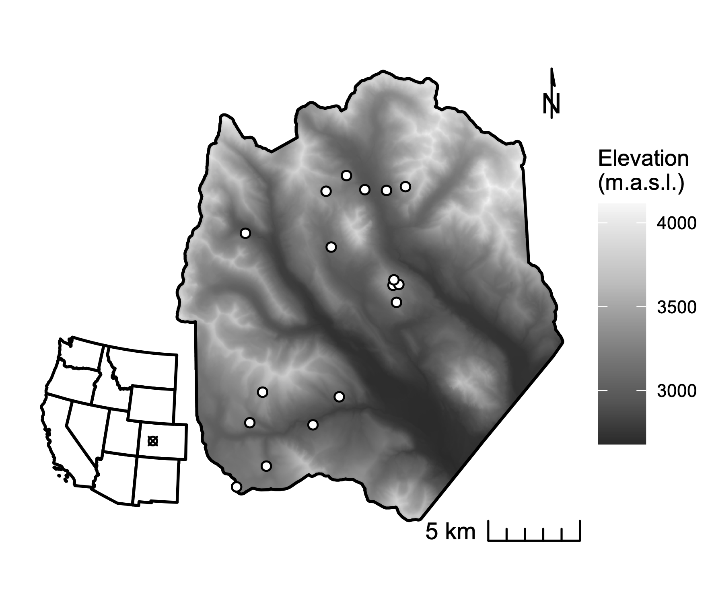
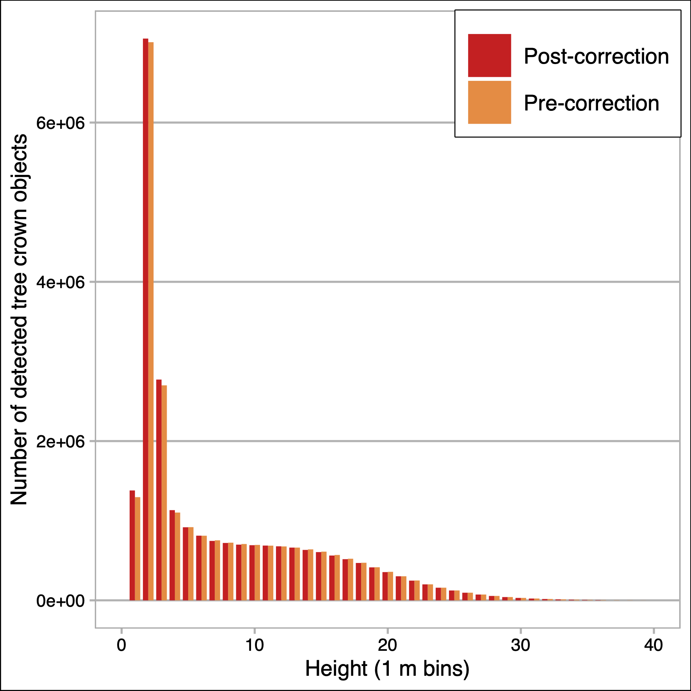
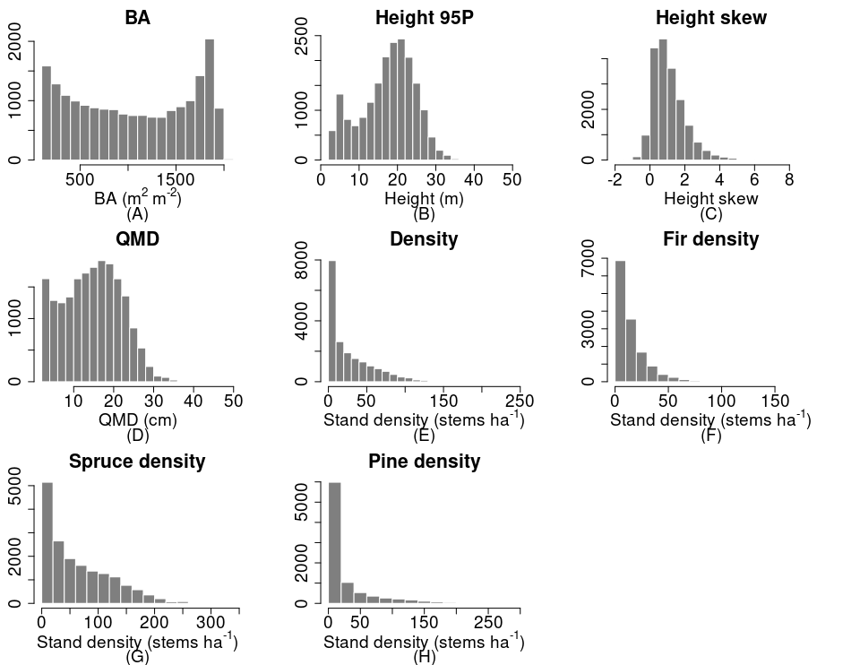
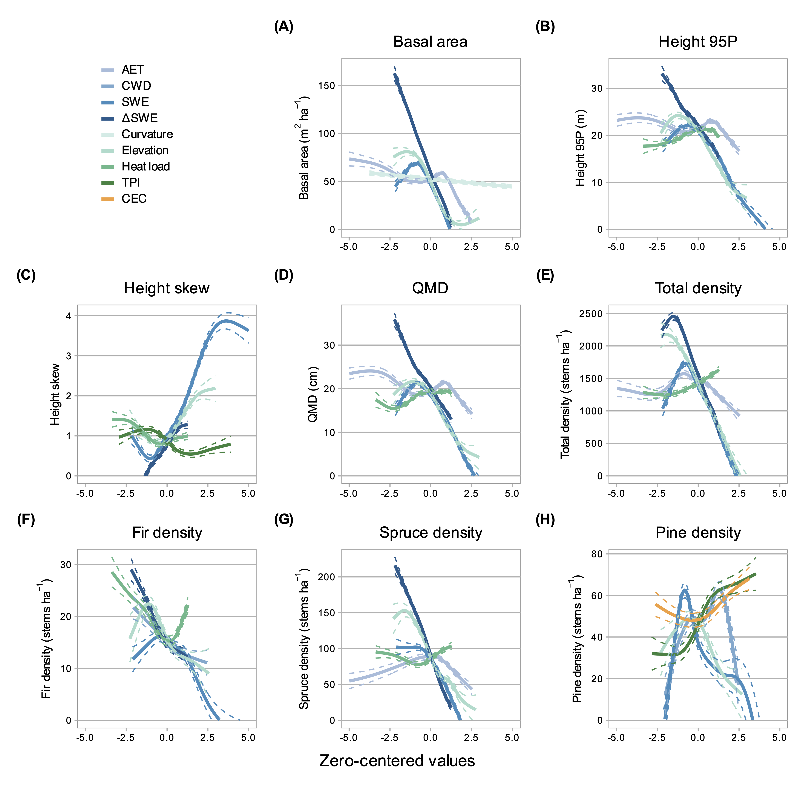
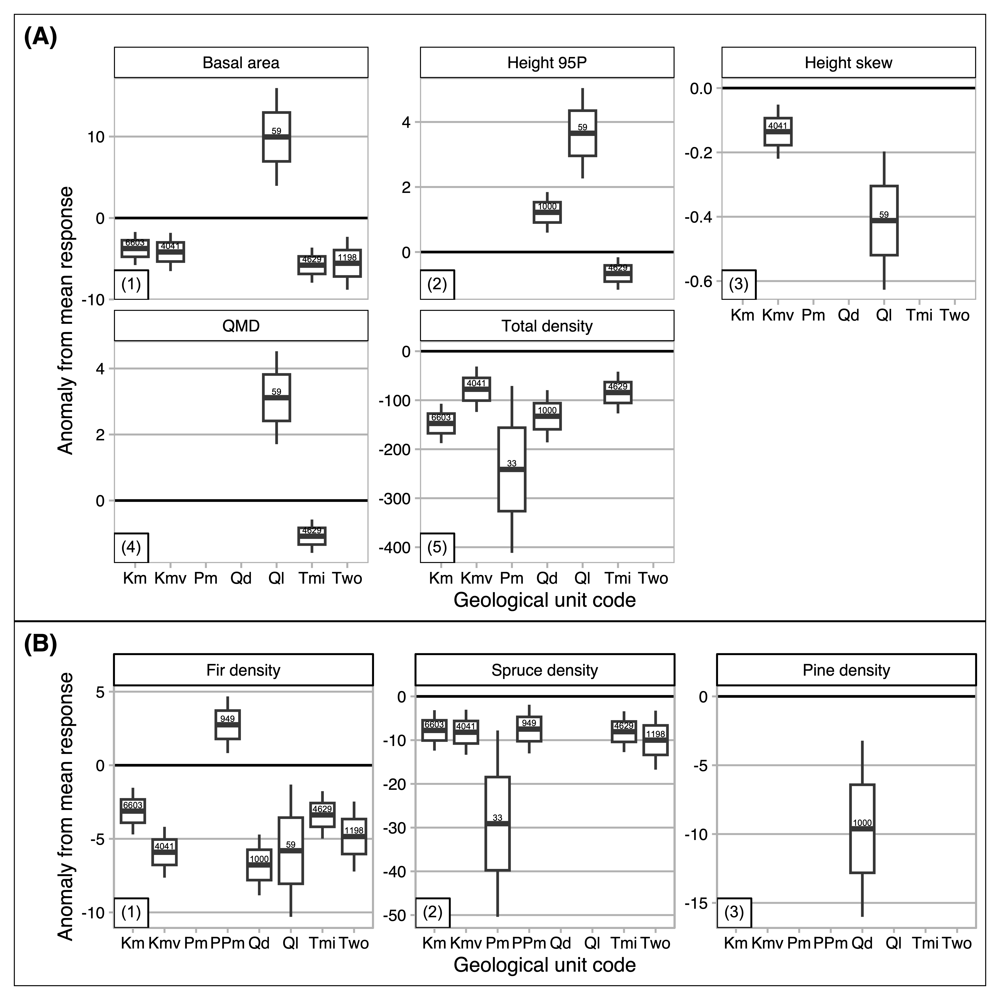

e# East River Forest Structure Paper Outline

# Introduction
## A. Big-picture intro ¶
- State factors regulate terrestrial ecosystem development
	- Topography
	- Parent material
	- Climate
	- Organisms
	- Time
- Forest stand structure and composition are two key emergent properties of ecosystem development can be measured in terms of continuous variables at a given point in time
	- Provides fixed-in-time snapshot of forest ecosystem development
- Quantifying relative importance of state factors in regulating ecosystem structure and function is a fundamental question for ecology and biogeochemistry
	- Indeed, a well established tradition in ecology of using gradient analyses to infer the role of environmental factors in governing state properties of ecosystems (Vitousek and Matson 1991). 
- But, gaps:
	- Studies quantifying relative importance of state factors are few
	- Few quantify interactions of state variables
	- The regional dimension: few studies in subalpine forest domain
	- Few studies using continuous estimates of stand structure, capturing full range of variability including end-members
		- Difficult in high-elevation complex terrain, because end-members on topographic and climate gradients are often inaccessible for field measurement
	- In contrast to species abundance and biomass, more granular measures of forest structure (vertical, horizontal heterogeneity) have not been well quantified relative to state variables 
- So, while general relationships between topographic, edaphic, lithologic, and climate state variables, on the one hand, and mature forest structure, on the other, are acknowledged, structural variability across landscape positions has rarely been quantified. 
- Several studies of spatial variability of stand density, size distribution, and species distribution in montane and subalpine forests have produced inconsistent results (e.g. Underwood et al. 2010, Lyderson and North 2012 [TODO: other citations]). 
- This suggests that at least some of the inferences made about these relationships reflect an insufficient reckoning of how state factors interact to affect the hydrologic and energetic conditions in which plants grow (Lookingbill and Urban 2004). 
- Until recently, a major limitation in assessing these relationships has been the lack of spatially continuous data for characterizing forest structure. This limitation may now be partially overcome with active remote sensing technologies like light detection and ranging (LiDAR) ([TODO: CITATION]).
- [TODO] What is the importance of quantifying these relationships?	
	- 
- Objective: identify relationships between state-factor gradients and structure and composition in mixed conifer forests spanning montane and subalpine zones

## B. Variability in forest structure and composition
### 1. Structure ~ topography
- Topographic properties such as elevation, slope, hillslope position, curvature, and aspect substantially influence local microclimate and soil moisture variability (Dobrowski 2011). 
	- As a result, they directly and indirectly constrain trees’ growing environments, influencing demographic rates and exposure to disturbance, and ultimately shaping stand structure, composition, and function (Lyderson and North 2012, Kane et al. 2015). 
	- Even in low-diversity forests, physiognomy can vary dramatically with small changes in position. 
	- This variability is often especially pronounced in mountainous terrain, owing to the potential for large changes in elevation, slope, and aspect over small horizontal distances (Dobrowski 2011).
- In complex terrain, pronounced gradients across space in insolation, precipitation input, and subsurface distribution of water influence plant demographic processes
	- Productivity
	- Biomass accumulation
	- Plant recruitment
	- Mortality
	- Nutrient and gas fluxes
- Topography can also influence disturbance frequency and magnitude, drought and temperature stress, wind exposure >> in turn influencing biotic structure and composition
- General trends assumed (McNab 1989, McNab 1993), *but quantitative reporting limited in the literature* [TODO: verify]
- Generalities:
	- topographic factors are important determinants of forest structure and composition, and that elevation, aspect, and hillslope position matter most. (However, see Kane et al. 2015, where topography explained little of the variance in forest structure in a domain with a frequent fire return interval). 
	- Stem diameter, basal area, growth rates decrease from cove to ridge and from polar to equatorial exposures (Tajchman et al. 1997, Tajchman et al. 1998, Bolstad et al. 1998)
		- "Authors have speculated that lower growth is due to drier soils from cove to ridges and higher vapor pressure deficit or drier soils from northeast to southwest exposures" (Bolstad 2018)
	- Same factors decline with elevation
	- Height growth correlated with a range of topographic properties, including aspect, terrain slope, slope length and position, and curvature (McNab 1989, 1993)

- Problematizing the generalities: 
	- While it is often thought that upper slopes and ridges support stands of lower density and size than convergent sites, this pattern appears to vary across watersheds and landscapes (Kelsey et al. 2018).
	- Lyderson and North (2012) reported contrary findings in a Sierra Nevada mixed conifer forest, where upper slopes had both the highest quadratic mean diameter (QMD) and the tallest trees. 
	- Kane et al. 2015, where topography explained little of the variance in forest structure in a domain with a frequent fire return interval

### 2. Composition ~ topography
- Topography also in part controls species mix (Rowe and Sheard 1981; Barnes et al. 1982; Bailey 1988)
	- "Often affinities for specific landscape positions thought to be attributable to functional trait assemblages (strategies), suggesting adaptation to radiative (Monin et al. 2007, White and Millet 2008) and moisture gradients (Whittaker 1956, Bahari et al. 1986, Day and Monk 1988, Elliott 1999, Denslow et al. 2010, Hawthorne and Miniat 2018)"
- In subalpine forests of the southern Rocky Mountains (SRM), clear topography-driven moisture controls on species occurrence
	- Hadley (1994) reported that ponderosa pine (Pinus ponderosa) dominated xeric sites in the Colorado Front Range, including low-elevation south-facing slopes and steep north-facing slopes. 
	- Douglas fir (Pseudotsuga menziesii) dominated mesic sites, including north-facing toe-slopes and high-elevation south-facing slopes. 
	- Lodgepole pine (Pinus contorta) also occurs on dry upper slopes in the lower range of the subalpine zone (2700–3000 m a.s.l.) (Veblen 1986). 
	- Engelmann spruce (Picea engelmannii) and subalpine fir (Abies lasiocarpa) tend to co-occur throughout the subalpine zone. 
		- At middle and high elevations up to treeline, the longer-lived spruce is often the canopy dominant (~70 percent of canopy basal area), while fir may occupy up to the same proportion of the understory (Alexander et al. 1984). 
		- Near treeline, pure spruce stands are common, while fir often dominate the canopy in the lower end of the subalpine zone, particularly in xeric topographic positions (Alexander 1987). 

### 3. Structure ~ soil
- Soil properties also matter for structural development
	- Parent material in the top 10 cm of soil explaineda greater share of variation in the abundance of trees across global bioms than any other single factor, including climate and topography (Delgado-Baquerizo et al. 2020)
	- Also a significant expaliner of ecosystem productivity
- [TODO: more on soils from conifer forests in montane, subalpine zones]

### 4. Composition ~ soil 
- [TODO: more on soils from conifer forests in montane, subalpine zones]

### 5. Structure and composition ~ climate
- In forest ecosystems, gradient analysis has consistently identified temperature and water balance as the strongest abiotic factors explaining vegetation species distributions and emergent properties such as canopy structure and carbon density (Veblen 1986, Urban et al. 2000, Hessberg et al. 2007, Holden and Jolly 2011). 
	- Factors strongly controlled by regional and local climate conditions, mediated by topography and soil properties
- Lapse rate assumed to have the strongest control
	- Conifer height tends to decline with temperature and with precipitation (Swensen and Weiser, Hulshof et al. 2015)
- Temperature and precipitation extremely heterogeneous in mountain domains with high topographic relief
	- Site's radiation environment not only regulated by topography via exposure angle, shading by adjacent landforms, but also the origin and distribution of precipitation
	- Orogenic precipitation decouples local precipitation regime from regional patterns ([TODO: citation])
	- Variability in wind exposure leads to snow redistirbution, leads to drifting and patterns of accumulation that may differ from patterns of snowfall ([TODO: citation, see ASO, Deems et al])
- [TODO: more on structural, compositional relationships with climate]

## C. Weaknesses of prior studies
- Many gradient studies have used elevation and convergence as proxies for temperature and soil moisture (Stephenson 1998)
	- Others have developed more complex metrics that combine factors such as elevation, hillslope position, aspect, and slope into climate-proxy indices (Lyderson and North 2012). 
	- A smaller body of work has examined forest structure–topography relationships using suites of quasi-independent measures of topography (see, for example, Hadley 1994, Urban et al. 2000, Underwood et al. 2010, Kane et al. 2015). 
	- Urban and colleagues (2000) used elevation, slope aspect, topographic convergence, and soil depth to model a “physical template” describing the light, temperature, and soil moisture regime of a Sierra Nevada domain, and then examined the sensitivity of modeled forest stand basal area, fuel loading, and canopy depth to the topographic inputs. 
	- Underwood and colleagues (2010) used elevation, slope, aspect, solar radiation, and topographic wetness to divide a Sierra Nevada domain into “landscape management units” representing nine clusters of topographic variability, and examined variation in stem and species density across those units. Their effort relied on data collected in situ from 164 transects. 
	- Ng et al. (2020), similarly, used forest plot data to examine variation in canopy spatial patterns across three hillslope positions (valley, ridge, mid-slope). 
	- [TODO: what exactly is the argument here? Basically, aside from the claim about plot/transect approaches, that these proxy measures may not be enough, or don't fully proxy temperature and soil moisture, or that T/SM proxies aren't enough, don't explain enough of the variance, or insufficiently capture interactions]
- First, while plot- and transect-based data can provide reliable estimates of aboveground forest structure and composition when scaled up to a stand, these data are by nature limited in spatial extent and do not represent the full range of state-factor variability that may constrain the distribution of vegetation across a landscape (Hurtt et al. 2004, Antonarakis et al. 2011, Lyderson and North 2012, Antonarakis et al. 2014). 
- Even within mature, close-canopied forests, characteristics such as stand density, age-class distribution, allometry, species composition, and species dominance can have wide variance and efforts to scale these properties up to a watershed from plot observations alone can yield substantial error terms. 
- Therefore, prior work may have failed to capture important dimensions of co-variability. Kane et al. (2015) and Bolstad et al. (2018) are the only studies we have identified that relate quasi-independent measures of topography to spatially continuous measures of forest structure, although more results have been reported from tropical forests (e.g. Chadwick and Asner 2015, Jucker et al. 2018). 
- A further concern is that the statistical modeling strategies used in prior studies are unable to quantify potential interactions among topographic variables. 
	- Factors such as elevation, hillslope, and curvature work together to define a site’s edaphic, radiative, and moisture environments
	- Also, feedbacks between soil development and moisture conditions 
	- Failing to account for these interactions may amount to a significant oversight. 
-**In part because of these limitations, ecology still lacks a complete accounting of how forest physiognomy co-varies with state factors.**

## D. LiDAR to the rescue
1. LiDAR integrated with field sampling and hyperspectral remote sensing holds promise for overcoming some of these limitations
2. Difficulty of getting subcanopy structure with discrete-point LiDAR
3. One way to mitigate: continuous estimates of properties
	- Limitations
4. Tree-centric approach is redeemable
	- Using full waveform
	- Using recent segmentation algorithms
[TODO: add flesh and citations]

## E. Importance of this work
- Quantifying the drivers of fine-scale heterogeneity in the structure, composition, and function of montane and subalpine forests is important for several reasons. 
	- First, understanding the factors that shape landscape vegetation patterns remains a foundational question in ecology and conservation (Waring and Running 1998, Turner and Gardner 2015). 
	- Second, as in most systems that face the imminent prospect of novel drought and disturbance regimes, there is a need for reference data against which scientists and managers can observe change (Millar et al. 2007).
	- Third, understanding the drivers of heterogeneity is essential for forecasting how mountain forests will respond to regional environmental change, and for devising conservation and management strategies that promote forest resilience. 
	- Fourth, there is a need for both data and inferential analyses that can be used to initialize and benchmark terrestrial ecosystem models used to predict vegetation and flux responses to perturbations (Antonarakis et al. 2011, Antonarakis et al. 2014)

## F. $$ paragraph
- While previous studies have identified general state-factor responses in forest structure and composition, to our knowledge:
	- no study accounts for topo/litho/edapho/climate influences on multiple stand structural and compositional properties all together
	- few directly address microclimatic heterogeneity in high-elevation complex terrain
	- none account for state-variable interactions
	- none does the above on a spatially continuous basis, incorporating end-members on the major radiative and moisture gradients along which forest stands grow
- Our primary objective in this study was to:
	- Quantify relationships between forest structure/composition and environmental attributes that account for the main factors driving stand structural development in subalpine forests broadly representative of low-diversity forests across the Southern Rocky Mountains
		- Proxies for gradients in temperature, radiation, soil moisture 
- We integrated a full-waveform LiDAR dataset acquired over Colorado’s East River watershed with a species classification map derived from imaging spectrometry and field inventory measurements of 7000+ trees to quantify the spatial variability of forest canopy structure through the vertical profile, as well as stand structure and composition. We then used inferential modeling techniques to evaluate the topographic and edaphic regulation of forest stand structure and composition, as estimated at a single point and time.
- We addressed the following questions: 
	1.	To what extent are tree stem height and diameter distributions influenced by the elevation, slope, hillslope position, solar radiation, aspect, and topographic wetness of a site?
	2.	To what extent are total number density, basal area, and species composition controlled by the same topographic factors?
	3.	How do the specified topographic factors interact to mediate these relationships?
- Hypotheses:
	1. the interaction between elevation and topographic wetness is a stronger explainer of total stem density and basal area than any single topographic variable, and that both density and basal area will vary inversely with the two-way interactions. 
	2. We expected a clear division between pine and spruce-fir distributions, explained by the interactions between elevation, aspect, and hillslope. In general, we expected pine to dominate lower-elevation and south-facing slopes and spruce-fir to dominate north-facing slopes and higher elevation positions. However, we anticipated that the interaction between elevation and hillslope position would complicate this general trend somewhat, because of cool-air pooling that allows lower minimum temperatures and lower evaporative demand to persist in valley bottoms, even at low elevations where pine would otherwise be expected (Dobrowksi 2011).
	3. Spruce and fir total stem density to diverge, with spruce density increasing with elevation and fir density reaching a peak at mid-elevations. 

# Data and methods
## A. Study area
- The domain for this project comprises subalpine conifer and aspen forest stands in Colorado’s East River watershed (38°55’ N, 106°56’ W; Fig. 1). The East River is a headwater tributary of the Colorado River, the principal freshwater source for one in 10 people in the U.S. (U.S. Department of the Interior Bureau of Reclamation 2012). The ~750 km2 catchment comprises six major drainages with perennial snowmelt-fed streams. It also has significant topographic heterogeneity: 1420 m of elevational relief, multiple peaks extending above treeline, and pronounced gradients in slope, aspect, insolation, and hillslope position. Mean annual temperature measured at a SNOTEL site (736-Schofield) situated at 3261 m in the watershed is 1.8 º C, with maximum and minimum of 8.3 º C and –28.4 º C respectively. Mean annual precipitation is ~1200 mm y–1; approximately 70 percent falls as snow and 30 percent falls as rain. Maximum air temperatures are depressed by wind at high elevations and minimum air temperatures by cold air downwelling at low elevations. Precipitation is also strongly influenced by elevation, with snow accumulation generally increasing upgradient. 
- The system is driven by seasonal temperature and precipitation regimes that impose important controls on vegetation phenology. Winter snows arrive as early as September, and storms may persist into early June at the highest elevations. Snowmelt typically begins in April and continues through June, concurrently with leaf-out and growth onset. A seasonal drydown occurs in late June and July, characterized by sparse rainfall and soil desiccation as evaporative demand rises with summer temperatures (Harte et al. 1995). In most years, this seasonal moisture deficit is partially mitigated by a July–August monsoon. The driest phase occurs over August–September and can drive severe soil moisture deficits in years when the monsoon fails, as it did in 2018. In addition to these broad patterns, the domain’s stark relief and topographic complexity coordinate to produce highly variable local climatic conditions.
- The domain spans lower montane to alpine ecosystems (2700 m to 3500 m). The dominant tree species are P. engelmannii, A. lasiocarpa, P. contorta, and Populus tremuloides, with occasional P. menziesii at mid-elevations.
- [TODO: add soil, climate and species details]

## B. Data summary
- Primary data included:
	- Field demography data from 17 permanent mixed-conifer inventory plots, each 0.16 ha in area
	- June 2018 leaf-on NEON AOP full waveform LiDAR acquisition
	- Species-level classification map developed form a simultaneous NEON hyperspectral acquisition (Falco et al. 2022)
	- Digital elevation model (DEM) interpolated from NEON LiDAR ground return points

## C. Data collection and processing
1. Field inventory
	- Between 2018 and 2022, we established 25 long-term forest monitoring plots in the watershed. The sites were stratified across six topographic gradients. Approximately 68 sites were preselected through geospatial analysis of topographic variables derived from the USGS 1/3-arc second digital elevation model (DEM) (citation TK). The gradients are described in Table 1. The distribution of plots along those gradients and correlation statistics for topographic variable pairs appear in Appendix A.
	- Square 40x40 m plots were installed by staking one corner and running a metric tape in a straight line to a point 40 m away to form one edge of the plot. The cardinal orientation and slope angle between points were measured with a digital compass and laser hypsometer, respectively, and the approximate location of the next corner was sighted at an angle of 90º and distance of 40 m from the first. A second tape was run to the approximate corner, and adjusted to achieve the exact distance and angle. This process was repeated for the four edges. The cardinal orientation and slope angle between corners were then remeasured and the distance between corners was adjusted using trigonometric corrections, to approximate a projected flat-surface area of 1600 m. 
	- We then conducted a field inventory of [6700] trees in 17 plots that lay within the acquisition footprint of a 2018 NEON Airborne Observation Platform (AOP) campaign. All trees of any species with a diameter at breast height (DBH, measured at 1.3 m) >1.0 cm were tagged with an aluminum tag affixed with a nail if the specimen was >10cm DBH and with an expanding collar if the specimen was <10cm DBH. Measurements taken from each tree are summarized in Table 2. Measurements were taken from more than 6000 conifers for training and validating models developed in the remote sensing analysis.

2. Waveform LiDAR processing
	- Between June 12 and 26, 2018, the National Ecological Observatory Network's Airborne Observation Platform (NEON AOP; Kampe et al. 2009) conducted a survey of approximately 330 km2 of the watershed, including 10 of our forest inventory plots (Chadwick et al. 2020, Fig. 1). The AOP collected high-fidelity VSWIR spectrometry at 1 m resolution using an AVRIS-NG visible and infrared imaging spectrometer. The platform also collected LiDAR using an Optech Gemini discrete LiDAR sensor and waveform digitizer. The LiDAR sensor’s pulse repetition frequency varied between 33 and 100 kHz. The spectrometer and LiDAR platforms were co-aligned with an onboard GPS/IMU system. Validation was conducted using in situ data at 437 sites representing a range of vegetative and built land cover types. 
	- Discrete-return point density in the post-processed dataset ranged between 1 and 9 returns m-2, which was insufficient for characterizing subcanopy structure. I have therefore elected to use the full waveforms, which have a nominal density between 1 and 4 pulses m-2. The full-waveform pulses contain considerably more information than discrete points and can be exploited to develop more complete characterizations of stand and canopy structure. 

3. Tree segmentation and cross-validation
	- Generated both an individual tree crown (ITC) map of conifer and aspen forest and continuous gridded estimates of forest structure (as in Dalponte and Coombes 2016). The former comprise a map of individual tree crowns in mixed-conifer forest stands describing species, height, crown area, and stem diameter of each crown, along with estimates of detection error. The latter comprises a continuous map of forest structure metrics at 1m, 40m, 100m, and 1km grid scales. 
	- For returns intersecting each field plot boundary, I used a spectral deconvolution procedure to isolate the target-response signal from its interactions with the outgoing pulse, atmospheric scattering, and sensor-system noise (Zhou et al. 2017). I then applied an adaptive Gaussian decomposition, which fits one or more Gaussian models to the waveform components based on Equation 1: 
	$$f(x,θ) = \Sigma_(i=1)^n A_i exp(〖(x-μ_i)〗^λ/(2σ_i^2 ))$$			(1)

	- $A_i$ is the amplitude of waveform component $i$, $μ$ is the bin location of $i$ (measured as a point in time, ns), $σ$ is the standard deviation of $i$, and $λ$ is a rate parameter that minimizes the model residual over a specified number of iterations. I used the implementation of this algorithm in the waveformlidar package in the R statistical environment (Zhou et al. 2018). The algorithm first identifies potential peaks in the waveform, then iteratively fits models to the data centered on each peak, selecting the model that minimizes root mean square error between the raw waveform and the model and excluding models that produce physically meaningless parameters (such as a negative A). Where multiple peaks exist, the algorithm fits a separate model to each and expresses the final fit as the sum of n Gaussian functions.

	- After processing the waveforms, I geolocated the Gaussian peaks and extracted characteristic metrics from the fitted waveforms. These included the peaks’ location in three-dimensional space, their amplitude and width, front slope, and time to median intensity. I then used the R package lidR to discretize this information, creating an array of information-enriched points overlying the boundaries of each forest plot. I normalized the points to the earth’s surface by kriging the ground returns and subtracting z values from the interpolated surface (Fig. 3).
	- As a next step, the field data from each of our mixed-conifer plots and equivalent data from a subset of aspen plots inventoried by Ben Blonder’s research group, will be applied to parameterize and validate the ITC model through fitting linear and Gaussian process models. The field data will be split into training (80%) and validation (20%) sets, with the validation set reserved for final error estimation and the training set iteratively resampled using k-fold cross-validation. The ITC procedure will be iteratively re-parameterized by adjusting window size, maximum allowed crown diameter, and vertical and horizontal search coefficients until cross-validation produces suitable crown detection rate scores across size classes.
	- Next, the ITC objects will be fused with a 1 m resolution forest species classification dataset, developed through a support vector machine classifier on 2018 NEON AOP hyperspectral imagery (Falco 2020). Each object will be assigned to a given tree species according to the majority rule, i.e., if 50% or more of the pixels intersecting the object are classified to that species (Dalponte et al. 2019). For trees where <50% of pixels belong to a single species, the object will be labeled “unknown.”
	- To estimate the stem diameters of each delineated object, I will use an ensemble regression approach trained on ITC height and crown area and field-measured diameters assigned to objects in plots, using 10-fold cross-validation. The classification will again be cross-validated with geolocation, height, diameter, and species records from field data. This cross-validation and reparameterization process is required because allometric relationships between height, tree diameter, and crown area can vary widely with elevation, exposure, and other factors. 
	- I will use the optimized parameters to run the ITC procedure on all of the waveforms, and validate on the 20% of data reserved in the initial training-validation split. From the full ITC model, I plan compute continuous area-based structural and compositional metrics, including total number density, species density, basal area, and canopy cover, and max and mean diameter will by summarizing object-level predictions at specified grid scales across the watershed. The metrics will include total tree number density, size class density, basal area, canopy cover, and maximum and mean diameter. They will also include species-explicit estimates including species composition (proportion of pixel area occupied by each species), species density (number of individuals of each species per pixel), and species dominance (majority species per pixel). 

4. Inferential modeling
	- I will use these structure and composition data layers along with topographic features derived from a digital elevation model, all at 100m resolution, to evaluate the effects of topographic position on species composition and forest structure. The proposed explanatory and response variables are summarized in Table 3.

# Results

# Discussion

## Relationships with biological processes
- [TODO: FIND ANALOGUE] "Yellow-poplar is a mesophytic species that responds in height growth mainly to physical properties that affect the capacity of the soil to supply moisture and somewhat to soil chemical properties (McNab 1989: Beck and Della-Bianca 1981)"
	- height correlated with depth of organic matter?
	- height correlated with leaf litter?
	- wind-caused redeposition of forest litter and nutrient-loaded dust?
- How are soil organic matter, soil depth correlated with concavity, convexity?
- [TODO: FIND ANALOGUE] "differential rates of litter accumulation and decomposition, and its subsequent effects on soil physical properties, may be a contributing cause of the differences in growth of yellow-poplar on microsites with various land surface shapes" (McNab 1989)
- "minor landforms may be a more important source of areal site variation within stands... than previously recognized" (McNab 1989)

## Limitations
- We don't account for:
	- Disturbance
	- Individual life histories
	- Anthropogenic development and logging legacy
	- Non-woody vegetation
	- Subsurface ecology--micorrhizal networks, microbiome, which exert control on tree productivity and composition through association

## Future work

# Conclusions

# Figures and tables

## Figure 1

Figure 1. Study domain: the East River watershed in western Colorado.

## Table 1
Table 1. Description and units of topographic variables used for field plot selection.

| Variable | Description | Units | 
| -------- | ----------- | ----- |
| Elevation | Elevation above sea level	| m |
| Slope	| dy/dx computed in a 30 m window | degrees |
| Folded aspect	| Index of cardinal aspect adjusted for higher incident radiation on SW slopes | unitless index |
| Heat load	| Potential heat load calculated according to Eq. 3 in McCune and Keon (2002) | unitless index |
| Topographic position index (1000 m) | Index of hillslope position (summit, shoulder, backslope, footslope, and toeslope) computed in 1000 m window | unitless index |
| Topographic wetness index	| Terrain-driven balance of upslope water supply and local drainage (a function of local slope and upslope contributing area per unit contour length) | unitless index |

## Table 2
Table 2. Measurements taken in field inventory with their units and a summary of methods.

| Measurement | Units | Method |
| ----------- | ----- | ------ |
| Species | NA | Visual identification |
| Stem height | m | Nikon Forestry Pro II hypsometer, metric tape |
| DBH | cm | Diameter tape, calipers |
| Stem geolocation | decimal degrees | Trimble GEO-7X GPS unit held against stem |
| Crown illumination | unitless index | Visual determination |
| Beetle damage | unitless index | Visual inspection for boreholes, sap, red/grey needles |
| Life status | NA | Visual inspection for living/dead status |
| Health status | NA | Visual inspection for signs of infection, decay, browning, wilting |

## Figure 2

Figure 2. Diameter and height distributions of trees measured in inventory plots across all sites (A), and by species (B, C).

## Figure 3

Figure 3. Raw waveforms were deconvolved with the outgoing ALS pulse and instrument impulse response using the Gold algorithm, and then decomposed into a sum of fitted Gaussian functions over time. Panel A shows the raw (dashed black) waveform function and the resulting deconvolved (dark blue) and decomposed (light blue) time series, all over a trimmed 100 ns support. Waveform peaks and a random sample of values along peak slopes were selected to generate a point cloud with a mean density of 24 points m2-1 across the acquisition area. An example of this high-density point cloud at one inventory plot (SG-SWR1) with a 10 m buffer is shown in panel B. The result of individual tree segmentation at the same plot, with buffer removed, appears in panel C. 

## Figure 4

Figure 4. Maps of forest structure metrics at 100 m grid resolution.

## Figure 5

Figure 5. Total number of trees measured in plots (“Observed”—dark blue) and detected in segmentation of the ALS point cloud (“Predicted”—light blue), by height class, in 1 m increments.

## Figure 6

Figure 5. Variable interaction plots demonstrate the strong, nonlinear elevational control on density. Stand density was at a maximum at 3000 m, on ridgetops and at southwest-facing aspects.

## Table 3
[TODO: Make Table 3]
Table 3. Explanatory and response variables
| A | B | C |
| --- | --- | --- |
| TK | TK | TK 

## Figure 7

Figure 6. Stand density increased with soil organic matter and was at minimum with soil total depth = 50 cm, but other soil properties had little correlation with stand density. 

## Figure 8

Figure 7. Snow-water equivalent (SWE) mediated the elevational control on density, 90th percentile height, and quadratic mean diameter. SWE has an overall flattening effect on the elevation-density curve. Where SWE is high and elevation is high, density is also at a maximum. Where SWE is high but elevation is low, this has a substantial dampening effect on all three structural parameters.

## Figure 9

Figure 8. Elevation accounted for differences in the shape of allometric curves describing the relationship between tree DBH and height. Curves are fitted to census data according to the function height = A(DBHb) (A). The coefficient A in the equation declines with elevation, indicating that, as elevation increases, height growth diminishes per unit growth in girth (B). 

# References
Adams, Thomas, Peter Beets, and Christopher Parrish. 2011. “Another
Dimension from LiDAR–Obtaining Foliage Density from Full Waveform Data.”
*Center for Coastal and Ocean Mapping*, no. Watson: 12.

Ahongshangbam, Joyson, Alexander Röll, Florian Ellsäßer, Hendrayanto,
and Dirk Hölscher. 2020. “Airborne Tree Crown Detection for Predicting
Spatial Heterogeneity of Canopy Transpiration in a Tropical Rainforest.”
*Remote Sensing* 12 (4). <https://doi.org/10.3390/rs12040651>.

Alexander, Robert R. 1987. “Ecology, Silviculture, and Management of the
Engelmann Spruce–Subalpine Fir Type in the Central and Southern Rocky
Mountains.” *United States Department of Agriculture: Forest Service*
No. 659 (659): 144.

American Forests. 2015. “Measuring Guidelines Handbook.”

Anderson, Jeanne E., Lucie C. Plourde, Mary E. Martin, Bobby H.
Braswell, Marie Louise Smith, Ralph O. Dubayah, Michelle A. Hofton, and
J. Bryan Blair. 2008. “Integrating Waveform Lidar with Hyperspectral
Imagery for Inventory of a Northern Temperate Forest.” *Remote Sensing
of Environment* 112 (4): 1856–70.
<https://doi.org/10.1016/j.rse.2007.09.009>.

Anderson, Karen, Steven Hancock, Mathias Disney, and Kevin J. Gaston.
2016. “Is Waveform Worth It? A Comparison of LiDAR Approaches for
Vegetation and Landscape Characterization.” *Remote Sensing in Ecology
and Conservation* 2 (1): 5–15. <https://doi.org/10.1002/rse2.8>.

Antonarakis, A. S., J. W. Munger, and P. R. Moorcroft. 2014. “Imaging
Spectroscopy- and Lidar-Derived Estimates of Canopy Composition and
Structure to Improve Predictions of Forest Carbon Fluxes and Ecosystem
Dynamics.” *Geophysical Research Letters* 41: 2535–42.
<https://doi.org/10.1002/2013GL058373.>

Antonarakis, Alexander S., Sassan S. Saatchi, Robin L. Chazdon, and Paul
R. Moorcroft. 2011. “Using Lidar and Radar Measurements to Constrain
Predictions of Forest Ecosystem Structure and Function.” *Ecological
Applications* 21 (4): 1120–37. <https://doi.org/10.1890/10-0274.1>.

Asner, Gregory P., Roberta E. Martin, Christopher B. Anderson, Katherine
Kryston, Nicholas Vaughn, David E. Knapp, Lisa Patrick Bentley, et al.
2017. “Scale Dependence of Canopy Trait Distributions Along a Tropical
Forest Elevation Gradient.” *New Phytologist* 214 (3): 973–88.
<https://doi.org/10.1111/nph.14068>.

Asner, Gregory P., and Joseph Mascaro. 2014. “Mapping Tropical Forest
Carbon: Calibrating Plot Estimates to a Simple LiDAR Metric.” *Remote
Sensing of Environment* 140: 614–24.
<https://doi.org/10.1016/j.rse.2013.09.023>.

Bai, Xue, and Ivan J. Fernandez. 2020. “Comparing Publicly Available
Databases to Evaluate Soil Organic Carbon in Maine, USA.” *Soil Sci.
Soc. Am. J.* 84 (5): 1722–36. <https://doi.org/10.1002/saj2.20123>.

Band, Lawrence E., Pitman Patterson, Ramakrishna Nemani, and Steven W.
Running. 1993. “Forest Ecosystem Processes at the Watershed Scale:
Incorporating Hillslope Hydrology.” *Agricultural and Forest
Meteorology* 63 (1-2): 93–126.
<https://doi.org/10.1016/0168-1923(93)90024-C>.

Bolstad, Paul V., Katherine J. Elliott, and Chelcy F. Miniat. 2018.
“Forests, Shrubs, and Terrain: Top‐down and Bottom‐up Controls on Forest
Structure.” *Ecosphere* 9 (4). <https://doi.org/10.1002/ecs2.2185>.

Brown, Chloe, Doreen S. Boyd, Sofie Sjögersten, Daniel Clewley,
Stephanie L. Evers, and Paul Aplin. 2018. “Tropical Peatland Vegetation
Structure and Biomass: Optimal Exploitation of Airborne Laser Scanning.”
*Remote Sensing* 10 (5): 1–21. <https://doi.org/10.3390/rs10050671>.

Brown, Nick, Steve Jennings, Phil Wheeler, and Jacob Nabe-Nielsen. 2000.
“An Improved Method for the Rapid Assessment of Forest Understorey Light
Environments.” *Journal of Applied Ecology* 37 (6): 1044–53.
<https://doi.org/10.1046/j.1365-2664.2000.00573.x>.

Canham, Charles D., Philip T. LePage, and K. Dave Coates. 2004. “A
Neighborhood Analysis of Canopy Tree Competition: Effects of Shading
Versus Crowding.” *Canadian Journal of Forest Research* 34 (4): 778–87.
<https://doi.org/10.1139/x03-232>.

Cannon, Jeffery B., Wade T. Tinkham, Ryan K. DeAngelis, Edward M. Hill,
and Mike A. Battaglia. 2019. “Variability in Mixed Conifer Spatial
Structure Changes Understory Light Environments.” *Forests* 10 (11):
1015. <https://doi.org/10.3390/f10111015>.

Cartwright, Jennifer M., Caitlin E. Littlefield, Julia L. Michalak,
Joshua J. Lawler, and Solomon Z. Dobrowski. 2020. “Topographic, Soil,
and Climate Drivers of Drought Sensitivity in Forests and Shrublands of
the Pacific Northwest, USA.” *Sci Rep* 10 (1): 18486.
<https://doi.org/10.1038/s41598-020-75273-5>.

Chaney, Nathaniel W., Eric F. Wood, Alexander B. McBratney, Jonathan W.
Hempel, Travis W. Nauman, Colby W. Brungard, and Nathan P. Odgers. 2016.
“POLARIS: A 30-Meter Probabilistic Soil Series Map of the Contiguous
United States.” *Geoderma* 274 (July): 54–67.
<https://doi.org/10.1016/j.geoderma.2016.03.025>.

Chen, Wei, Xingbo Hu, Wen Chen, Yifeng Hong, and Minhua Yang. 2018.
“Airborne LiDAR Remote Sensing for Individual Tree Forest Inventory
Using Trunk Detection-Aided Mean Shift Clustering Techniques.” *Remote
Sensing* 10 (7): 1–25. <https://doi.org/10.3390/rs10071078>.

Clark, Deborah A., and David B. Clark. 1992. “Life History Diversity of
Canopy and Emergent Trees in a Neotropical Rain Forest.” *Ecological
Monographs* 62 (3): 315–44. <https://doi.org/10.2307/2937114>.

Clark, Matthew L., David B. Clark, and Dar A. Roberts. 2004.
“Small-Footprint Lidar Estimation of Sub-Canopy Elevation and Tree
Height in a Tropical Rain Forest Landscape.” *Remote Sensing of
Environment* 91 (1): 68–89. <https://doi.org/10.1016/j.rse.2004.02.008>.

Coburn, C. A., and A. C. B. Roberts. 2004. “A Multiscale Texture
Analysis Procedure for Improved Forest Stand Classification.”
*International Journal of Remote Sensing* 25 (20): 4287–4308.
<https://doi.org/10.1080/0143116042000192367>.

Cole, Stephen Austin. n.d. “Comparing SSURGO Data Versus Geospatial
Field Measurements to Estimate Soil Texture and Infiltration Rate
Classes in Glaciated Soils,” 34.

Condit, Richard. 1998. *Tropical Forest Census Plots*.
<https://doi.org/10.1007/978-3-662-03664-8>.

Condit, Richard, Stephen P Hubbell, James V Lafrankie, R Sukumar, Robin
B Foster, and Peter S Ashton. 2009. “Species-Area and Species-Individual
Relationships for Tropical Trees : A Comparison of Three 50-Ha Plots
Published by : British Ecological Society Stable URL :
Http://Www.jstor.org/Stable/2261477.” *Society* 84 (4): 549–62.

Coomes, David A., Michele Dalponte, Tommaso Jucker, Gregory P. Asner,
Lindsay F. Banin, David F. R. P. Burslem, Simon L. Lewis, et al. 2017.
“Area-Based Vs Tree-Centric Approaches to Mapping Forest Carbon in
Southeast Asian Forests from Airborne Laser Scanning Data.” *Remote
Sensing of Environment* 194: 77–88.
<https://doi.org/10.1016/j.rse.2017.03.017>.

Dallmeier, Francisco. 1992. “Long-Term Monitoring of Biological
Diversity in Tropical Forest Areas: Methods for Establishment and
Inventory of Permanent Plots.” Paris, France: UNESCO.

Dalponte, Michele, Lorenzo Bruzzone, and Damiano Gianelle. 2011. “A
System for the Estimation of Single-Tree Stem Diameter and Volume Using
Multireturn LIDAR Data.” *IEEE Transactions on Geoscience and Remote
Sensing* 49 (7): 2479–90. <https://doi.org/10.1109/TGRS.2011.2107744>.

Dalponte, Michele, and David A. Coomes. 2016. “Tree-Centric Mapping of
Forest Carbon Density from Airborne Laser Scanning and Hyperspectral
Data.” *Methods in Ecology and Evolution* 7 (10): 1236–45.
<https://doi.org/10.1111/2041-210X.12575>.

Dalponte, Michele, Lorenzo Frizzera, and Damiano Gianelle. 2018. “How to
Map Forest Structure from Aircraft, One Tree at a Time.” *Ecology and
Evolution* 8 (11): 5611–18. <https://doi.org/10.1002/ece3.4089>.

———. 2019. “Individual Tree Crown Delineation and Tree Species
Classification with Hyperspectral and LiDAR Data.” *PeerJ* 2019 (1).
<https://doi.org/10.7717/peerj.6227>.

Delgado-Baquerizo, Manuel, Peter B. Reich, Richard D. Bardgett, David J.
Eldridge, Hans Lambers, David A. Wardle, Sasha C. Reed, et al. 2020.
“The Influence of Soil Age on Ecosystem Structure and Function Across
Biomes.” *Nat Commun* 11 (1): 4721.
<https://doi.org/10.1038/s41467-020-18451-3>.

Domic, Alejandra I, and José M Capriles. 2009. “Allometry and Effects of
Extreme Elevation on Growth Velocity of the Andean Tree Polylepis
Tarapacana Philippi (Rosaceae).” *Plant Ecology* 205 (2): 223–34.
<https://doi.org/10.1007/s11258-009-9612-5>.

Dong, Pinliang, and Qi Chen. 2018. *LiDAR Remote Sensing and
Applications*. Boca Raton, Florida, USA: CRC Press.

Duncanson, L. I., R. O. Dubayah, B. D. Cook, J. Rosette, and G. Parker.
2015. “The Importance of Spatial Detail: Assessing the Utility of
Individual Crown Information and Scaling Approaches for Lidar-Based
Biomass Density Estimation.” *Remote Sensing of Environment* 168:
102–12. <https://doi.org/10.1016/j.rse.2015.06.021>.

Duncanson, L., O. Rourke, and R. Dubayah. 2015. “Small Sample Sizes
Yield Biased Allometric Equations in Temperate Forests.” *Scientific
Reports* 5: 1–13. <https://doi.org/10.1038/srep17153>.

Durr, Paul C., Lonna Richmond, and Christopher Eagar. n.d. “Site
Classification and Field Measurements: Methods Manual.” Science
Division, Great Smoky Mountains National Park.
<https://doi.org/10.1017/CBO9781107415324.004>.

Englhart, Sandra, Juilson Jubanski, and Florian Siegert. 2013.
“Quantifying Dynamics in Tropical Peat Swamp Forest Biomass with
Multi-Temporal LiDAR Datasets.” *Remote Sensing* 5 (5): 2368–88.
<https://doi.org/10.3390/rs5052368>.

Falco, Nicola, Jón Atli Benediktsson, and Lorenzo Bruzzone. 2015.
“Spectral and Spatial Classification of Hyperspectral Images Based on
ICA and Reduced Morphological Attribute Profiles.” *IEEE Transactions on
Geoscience and Remote Sensing* 53 (11): 6223–40.
<https://doi.org/10.1109/TGRS.2015.2436335>.

Falco, Nicola, Haruko Wainwright, Baptiste Dafflon, Emmanuel Léger, John
Peterson, Heidi Steltzer, Chelsea Wilmer, Joel C. Rowland, Kenneth H.
Williams, and Susan S. Hubbard. 2019. “Investigating Microtopographic
and Soil Controls on a Mountainous Meadow Plant Community Using
High-Resolution Remote Sensing and Surface Geophysical Data.” *Journal
of Geophysical Research: Biogeosciences* 124 (6): 1618–36.
<https://doi.org/10.1029/2018JG004394>.

Ferraz, António, Sassan Saatchi, Clément Mallet, and Victoria Meyer.
2016. “Lidar Detection of Individual Tree Size in Tropical Forests.”
*Remote Sensing of Environment* 183: 318–33.
<https://doi.org/10.1016/j.rse.2016.05.028>.

Fieber, Karolina D., Ian J. Davenport, James M. Ferryman, Robert J.
Gurney, Jeffrey P. Walker, and Jorg M. Hacker. 2013. “Analysis of
Full-Waveform LiDAR Data for Classification of an Orange Orchard Scene.”
*ISPRS Journal of Photogrammetry and Remote Sensing* 82: 63–82.
<https://doi.org/10.1016/j.isprsjprs.2013.05.002>.

Fisher, Rosie A., and Charles D. Koven. 2020. “Perspectives on the
Future of Land Surface Models and the Challenges of Representing Complex
Terrestrial Systems.” *Journal of Advances in Modeling Earth Systems* 12
(4). <https://doi.org/10.1029/2018MS001453>.

Francis, David, Seth Ex, and Chad Hoffman. 2018. “Stand Composition and
Aspect Are Related to Conifer Regeneration Densities Following Hazardous
Fuels Treatments in Colorado, USA.” *Forest Ecology and Management* 409
(February): 417–24. <https://doi.org/10.1016/j.foreco.2017.11.053>.

Freeman, Elizabeth A., Gretchen G. Moisen, John W. Coulston, and Barry
T. Wilson. 2015. “Random Forests and Stochastic Gradient Boosting for
Predicting Tree Canopy Cover: Comparing Tuning Processes and Model
Performance.” *Canadian Journal of Forest Research* 46 (3): 323–39.
<https://doi.org/10.1139/cjfr-2014-0562>.

Gadow, Klaus v., Chun Yu Zhang, Christian Wehenkel, Arne Pommerening,
Javier Corral-Rivas, Mykola Korol, Stepan Myklush, Gang Ying Hui, Andres
Kiviste, and Xiu Hai Zhao. 2012. “Forest Structure and Diversity.” In,
29–83. <https://doi.org/10.1007/978-94-007-2202-6_2>.

GAP/USGS. 2016. “LANDFIRE / GAP Land Cover Map Unit Descriptions.”

Gu, Jianyu, Heather Grybas, and Russell G. Congalton. 2020. “Individual
Tree Crown Delineation from Uas Imagery Based on Region Growing and
Growth Space Considerations.” *Remote Sensing* 12 (15).
<https://doi.org/10.3390/RS12152363>.

Hancock, Steven, John Armston, Zhan Li, Rachel Gaulton, Philip Lewis,
Mathias Disney, F. Mark Danson, et al. 2015. “Waveform Lidar over
Vegetation: An Evaluation of Inversion Methods for Estimating Return
Energy.” *Remote Sensing of Environment* 164: 208–24.
<https://doi.org/10.1016/j.rse.2015.04.013>.

Hancock, Steven, Mathias Disney, Philip Lewis Jan-peter Muller, and W C
E United. 2007. “EXPLORING THE MEASUREMENT OF FORESTS WITH FULL WAVEFORM
LIDAR THROUGH MONTE-CARLO RAY TRACING Kingdom . 2 , Mullard Space
Science Laboratory , University College London , United Kingdom .” 6–7.

Hansen, Matthew C., Peter V. Potapov, Scott J. Goetz, Svetlana
Turubanova, Alexandra Tyukavina, Alexander Krylov, Anil Kommareddy, and
Alexey Egorov. 2016. “Mapping Tree Height Distributions in Sub-Saharan
Africa Using Landsat 7 and 8 Data.” *Remote Sensing of Environment* 185:
221–32. <https://doi.org/10.1016/j.rse.2016.02.023>.

Hansen, Matthew C., Stephen V. Stehman, and Peter V. Potapov. 2010.
“Quantification of Global Gross Forest Cover Loss.” *Proceedings of the
National Academy of Sciences of the United States of America* 107 (19):
8650–55. <https://doi.org/10.1073/pnas.0912668107>.

Hastings, Jack H., Scott V. Ollinger, Andrew P. Ouimette, Rebecca
Sanders-DeMott, Michael W. Palace, Mark J. Ducey, Franklin B. Sullivan,
David Basler, and David A. Orwig. 2020. “Tree Species Traits Determine
the Success of LiDAR-Based Crown Mapping in a Mixed Temperate Forest.”
*Remote Sensing* 12 (2). <https://doi.org/10.3390/rs12020309>.

Heinzel, Johannes, and Barbara Koch. 2011. “Exploring Full-Waveform
LiDAR Parameters for Tree Species Classification.” *International
Journal of Applied Earth Observation and Geoinformation* 13 (1): 152–60.
<https://doi.org/10.1016/j.jag.2010.09.010>.

Hilker, Thomas, Michael A. Wulder, and Nicholas C. Coops. 2008. “Update
of Forest Inventory Data with Lidar and High Spatial Resolution
Satellite Imagery.” *Canadian Journal of Remote Sensing* 34 (1): 5–12.
<https://doi.org/10.5589/m08-004>.

Hojati, Majid, and Marzieh Mokarram. 2016. “Determination of a
Topographic Wetness Index Using High Resolution Digital Elevation
Models.” *European Journal of Geography* 7 (4): 41–52.

Holmgren, Johan, and Eva Lindberg. 2019. “Tree Crown Segmentation Based
on a Tree Crown Density Model Derived from Airborne Laser Scanning.”
*Remote Sensing Letters* 10 (12): 1143–52.
<https://doi.org/10.1080/2150704X.2019.1658237>.

Huang, Hongyu, Xu Li, and Chongcheng Chen. 2018. “Individual Tree Crown
Detection and Delineation from Very-High-Resolution UAV Images Based on
Bias Field and Marker-Controlled Watershed Segmentation Algorithms.”
*IEEE Journal of Selected Topics in Applied Earth Observations and
Remote Sensing* 11 (7): 2253–62.
<https://doi.org/10.1109/JSTARS.2018.2830410>.

Hudson, Berman D. 1992. “The Soil Survey as Paradigm-Based Science.”
*Soil Science Society of America Journal* 56 (3): 836–41.
<https://doi.org/10.2136/sssaj1992.03615995005600030027x>.

Hulshof, Catherine M., Nathan G. Swenson, and Michael D. Weiser. 2015.
“Tree Height-Diameter Allometry Across the United States.” *Ecology and
Evolution* 5 (6): 1193–1204. <https://doi.org/10.1002/ece3.1328>.

Hurtt, George C., Ralph Dubayah, Jason Drake, Paul R. Moorcroft, Stephen
W. Pacala, J. Bryan Blair, and Matthew G. Fearon. 2004. “Beyond
Potential Vegetation: Combining Lidar Data and a Height-Structured Model
for Carbon Studies.” *Ecological Applications* 14 (3): 873–83.
<https://doi.org/10.1890/02-5317>.

Isenburg, Martin. 2013. “Recent Advances in Full Waveform Lidar
Aquisition and Processing via the PulseWaves Format and API.”

Jakubowski, Marek K., Qinghua Guo, Brandon Collins, Scott Stephens, and
Maggi Kelly. 2013. “Predicting Surface Fuel Models and Fuel Metrics
Using Lidar and CIR Imagery in a Dense, Mountainous Forest.”
*Photogrammetric Engineering and Remote Sensing* 79 (1): 37–49.
<https://doi.org/10.14358/PERS.79.1.37>.

Jakubowski, Marek K., Wenkai Li, Qinghua Guo, and Maggi Kelly. 2013.
“Delineating Individual Trees from Lidar Data: A Comparison of Vector-
and Raster-Based Segmentation Approaches.” *Remote Sensing* 5 (9):
4163–86. <https://doi.org/10.3390/rs5094163>.

Jenness, Jeff. 2007. “Some Thoughts on Analyzing Topographic Habitat
Characteristics Surface Area.”

Jucker, Tommaso, John Caspersen, Jérôme Chave, Cécile Antin, Nicolas
Barbier, Frans Bongers, Michele Dalponte, et al. 2017. “Allometric
Equations for Integrating Remote Sensing Imagery into Forest Monitoring
Programmes.” *Global Change Biology* 23 (1): 177–90.
<https://doi.org/10.1111/gcb.13388>.

Kandare, Kaja, Michele Dalponte, Hans Ole Ørka, Lorenzo Frizzera, and
Erik Næsset. 2017. “Prediction of Species-Specific Volume Using
Different Inventory Approaches by Fusing Airborne Laser Scanning and
Hyperspectral Data.” *Remote Sensing* 9 (5): 1–19.
<https://doi.org/10.3390/rs9050400>.

Kandare, Kaja, Hans Ole Ørka, Jonathan Cheung Wai Chan, and Michele
Dalponte. 2016. “Effects of Forest Structure and Airborne Laser Scanning
Point Cloud Density on 3d Delineation of Individual Tree Crowns.”
*European Journal of Remote Sensing* 49: 337–59.
<https://doi.org/10.5721/EuJRS20164919>.

Keeling, Helen C., and Oliver L. Phillips. 2007. “A Calibration Method
for the Crown Illumination Index for Assessing Forest Light
Environments.” *Forest Ecology and Management* 242 (2-3): 431–37.
<https://doi.org/10.1016/j.foreco.2007.01.060>.

Krebs, Charles J. 2016. *Ecological Methodology*. Addison-Wesley
Educational Publishers, Inc.
<https://doi.org/10.3726/978-3-653-01100-5/2>.

Leckie, Don, François Gougeon, David Hill, Rick Quinn, Lynne Armstrong,
and Roger Shreenan. 2003. “Combined High-Density Lidar and Multispectral
Imagery for Individual Tree Crown Analysis.” *Canadian Journal of Remote
Sensing* 29 (5): 633–49. <https://doi.org/10.5589/m03-024>.

Ledo, Alicia, Thomas Cornulier, Janine B. Illian, Yoshiko Iida, Abdul
Rahman Kassim, and David F. R. P. Burslem. 2016. “Re-Evaluation of
Individual Diameter : Height Allometric Models to Improve Biomass
Estimation of Tropical Trees.” *Ecol Appl* 26 (8): 2376–82.
<https://doi.org/10.1002/eap.1450>.

Lefsky, Michael A., Warren B. Cohen, Geoffrey G. Parker, and David J.
Harding. 2002. “Lidar Remote Sensing for Ecosystem Studies.”
*BioScience* 52 (1): 19–30.
[https://doi.org/10.1641/0006-3568(2002)052\[0019:LRSFES\]2.0.CO;2](https://doi.org/10.1641/0006-3568(2002)052[0019:LRSFES]2.0.CO;2).

Li, Wenkai, Qinghua Guo, Marek K. Jakubowski, and Maggi Kelly. 2012. “A
New Method for Segmenting Individual Trees from the Lidar Point Cloud.”
*Photogrammetric Engineering and Remote Sensing* 78 (1): 75–84.
<https://doi.org/10.14358/PERS.78.1.75>.

Libohova, Z., C. Seybold, K. Adhikari, S. Wills, D. Beaudette, S.
Peaslee, D. Lindbo, and P. R. Owens. 2019. “The Anatomy of Uncertainty
for Soil pH Measurements and Predictions:
Implications for Modellers and Practitioners: Soil pH Measurements and Predictions.” *Eur J Soil Sci*
70 (1): 185–99. <https://doi.org/10.1111/ejss.12770>.

Lim, Kevin Sheng-Wei. 2006. “LiDAR Remote Sensing of Forest Canopy and
Stand Structure.” PhD thesis, Queens University.

Lim, Kevin, Paul Treitz, Michael Wulder, Benoît St-Ongé, and Martin
Flood. 2003. “LiDAR Remote Sensing of Forest Structure.” *Progress in
Physical Geography* 27 (1): 88–106.
<https://doi.org/10.1191/0309133303pp360ra>.

Luo, Laiping, Qiuping Zhai, Yanjun Su, Qin Ma, Maggi Kelly, and Qinghua
Guo. 2018. “Simple Method for Direct Crown Base Height Estimation of
Individual Conifer Trees Using Airborne LiDAR Data.” *Optics Express* 26
(10): A562. <https://doi.org/10.1364/oe.26.00a562>.

Lutz, James A. 2015. “The Evolution of Long-Term Data for Forestry:
Large Temperate Research Plots in an Era of Global Change.” *Northwest
Science* 89 (3): 255–69. <https://doi.org/10.3955/046.089.0306>.

Lutz, James A., Andrew J. Larson, Tucker J. Furniss, Daniel C. Donato,
James A. Freund, Mark E. Swanson, Kenneth J. Bible, Jiquan Chen, and
Jerry F. Franklin. 2014. “Spatially Nonrandom Tree Mortality and
Ingrowth Maintain Equilibrium Pattern in an Old-Growth Pseudotsuga –
Tsuga Forest R Eports.” *Ecology* 95 (8): 2047–54.
https://doi.org/<https://doi.org/10.1890/14-0157.1>.

Lydersen, Jamie, and Malcolm North. 2012. “Topographic Variation in
Structure of Mixed-Conifer Forests Under an Active-Fire Regime.”
*Ecosystems* 15 (7): 1134–46.
<https://doi.org/10.1007/s10021-012-9573-8>.

Mandlburger, Gottfried, Norbert Pfeifer, Camillo Ressl, and Christian
Briese. 2010. “Algorithms and Tools for Airborne LiDAR Data Processing
from a Scientific Perspective’.” In *Proceedings of the ELMF World Forum
2010, November 30 – December 1, 2010, The Hague, Netherlands*, 1–12.
[http://scholar.google.com/scholar?hl=en&btnG=Search&q=intitle:Algorithms+and+tools+for+Airborne+LiDAR+data+processing+from+a+scientific+perspective\#0%0Afile:///D:/Research\_Articles/PDF/Mandlburger\_et\_al\_2010\_Algorithms and tools for Airborne LiDAR data pr](http://scholar.google.com/scholar?hl=en&btnG=Search&q=intitle:Algorithms+and+tools+for+Airborne+LiDAR+data+processing+from+a+scientific+perspective#0%0Afile:///D:/Research_Articles/PDF/Mandlburger_et_al_2010_Algorithms and tools for Airborne LiDAR data pr).

Matasci, Giona, Txomin Hermosilla, Michael A. Wulder, Joanne C. White,
Nicholas C. Coops, Geordie W. Hobart, and Harold S. J. Zald. 2018.
“Large-Area Mapping of Canadian Boreal Forest Cover, Height, Biomass and
Other Structural Attributes Using Landsat Composites and Lidar Plots.”
*Remote Sensing of Environment* 209 (June 2017): 90–106.
<https://doi.org/10.1016/j.rse.2017.12.020>.

McBratney, A. B, M. L Mendonça Santos, and B Minasny. 2003. “On Digital
Soil Mapping.” *Geoderma* 117 (1-2): 3–52.
<https://doi.org/10.1016/S0016-7061(03)00223-4>.

McNab, W. Henry. 1989. “Terrain Shape Index: Quantifying Effect of Minor
Landforms on Tree Height.” *Forest Science* 35 (1): 91–104.
<https://doi.org/10.1093/forestscience/35.1.91>.

———. 1993. “A Topographic Index to Quantify the Effect of Mesoscale
Landform on Site Productivity.” *Can. J. For. Res.* 23 (6): 1100–1107.
<https://doi.org/10.1139/x93-140>.

Medvigy, D., S. C. Wofsy, J. W. Munger, D. Y. Hollinger, and P. R.
Moorcroft. 2009. “Mechanistic Scaling of Ecosystem Function and Dynamics
in Space and Time: Ecosystem Demography Model Version 2.” *Journal of
Geophysical Research: Biogeosciences* 114 (1): 1–21.
<https://doi.org/10.1029/2008JG000812>.

Millikan, Pedro Henrique Karantino, Carlos Alberto Silva, Luiz Carlos
Estraviz Rodriguez, Tupiara Mergen de Oliveira, Mariana Peres de Lima
Chaves E Carvalho, and Samuel de Pádua Chaves E Carvalho. 2019.
“Automated Individual Tree Detection in Amazon Tropical Forest from
Airborne Laser Scanning Data.” *Cerne* 25 (3): 273–82.
<https://doi.org/10.1590/01047760201925032630>.

Nature Conservancy, The. 1994. “Field Methods for Vegetation Mapping.”
*Field Methods for Vegetation Mapping*, 112.

Ohmann, Janet L., and Matthew J. Gregory. 2002. “Predictive Mapping of
Forest Composition and Structure with Direct Gradient Analysis and
Nearest-Neighbor Imputation in Coastal Oregon, U.S.A.” *Canadian Journal
of Forest Research* 32 (4): 725–41. <https://doi.org/10.1139/x02-011>.

Peng, Xing, Xinwu Li, Changcheng Wang, Jianjun Zhu, Lei Liang, Haiqiang
Fu, Yanan Du, Zefa Yang, and Qinghua Xie. 2019. “SPICE-Based SAR
Tomography over Forest Areas Using a Small Number of P-Band Airborne
F-SAR Images Characterized by Non-Uniformly Distributed Baselines.”
*Remote Sensing* 11 (8). <https://doi.org/10.3390/rs11080908>.

Peters, Matthew P., Louis R. Iverson, Anantha M. Prasad, and Steve N.
Matthews. 2013. “Integrating Fine-Scale Soil Data into Species
Distribution Models: Preparing Soil Survey Geographic (SSURGO) Data from
Multiple Counties.” NRS-GTR-122. Newtown Square, PA: U.S. Department of
Agriculture, Forest Service, Northern Research Station.
<https://doi.org/10.2737/NRS-GTR-122>.

Pirotti, F. 2011. “Analysis of Full-Waveform LiDAR Data for Forestry
Applications: A Review of Investigations and Methods.” *IForest* 4:
100–106. <https://doi.org/10.3832/ifor0562-004>.

Powell, David C. 2013. “Field Guide to Forest Plants of South-Central
Colorado.” Lakewood, CO, USA: USDA Forest Service Rocky Mountain Region.

Rahmani, Shams R., Jason P. Ackerson, Darrell Schulze, Kabindra
Adhikari, and Zamir Libohova. 2022. “Digital Mapping of Soil Organic
Matter and Cation Exchange Capacity in a Low Relief Landscape Using
LiDAR Data.” *Agronomy* 12 (6): 1338.
<https://doi.org/10.3390/agronomy12061338>.

Ramirez-Reyes, Carlos, Kate A. Brauman, Rebecca Chaplin-Kramer, Gillian
L. Galford, Susana B. Adamo, Christopher B. Anderson, Clarissa Anderson,
et al. 2019. “Reimagining the Potential of Earth Observations for
Ecosystem Service Assessments.” *Science of the Total Environment* 665:
1053–63. <https://doi.org/10.1016/j.scitotenv.2019.02.150>.

Reitberger, J., Cl Schnörr, P. Krzystek, and U. Stilla. 2009. “3d
Segmentation of Single Trees Exploiting Full Waveform LIDAR Data.”
*ISPRS Journal of Photogrammetry and Remote Sensing* 64 (6): 561–74.
<https://doi.org/10.1016/j.isprsjprs.2009.04.002>.

Riegl. 2015. “Datasheet: Riegl LMS-Q780 Full Waveform Digitizing
Airborne Laser Scanner for Wide Area Mapping.”
<http://www.riegl.com/nc/products/airborne-scanning/produktdetail/product/scanner/34/>.

Rixen, Christian, Toke Thomas Høye, Petr Macek, Rien Aerts, Juha M.
Alatalo, Jill T. Anderson, Pieter A. Arnold, et al. 2022. “Winters Are
Changing: Snow Effects on Arctic and Alpine Tundra Ecosystems.” *Arctic
Science* 8 (3): 572–608. <https://doi.org/10.1139/as-2020-0058>.

Schneider, Fabian D, Daniel Kükenbrink, Michael E Schaepman, David S
Schimel, and Felix Morsdorf. 2019. “Quantifying 3d Structure and
Occlusion in Dense Tropical and Temperate Forests Using Close-Range
LiDAR.” *Agricultural and Forest Meteorology* 268: 249–57.
https://doi.org/<https://doi.org/10.1016/j.agrformet.2019.01.033>.

Shan, Jie, and Juha Hyyppä. 2018. *Advances in Airborne Lidar Systems
and Data Processing*. Edited by Jie Shan and Juha (eds.) Hyyppä. Basel,
Switzerland: MDPI. <https://doi.org/10.3390/books978-3-03842-674-5>.

Siegert, C. M., D. F. Levia, S. A. Hudson, A. L. Dowtin, F. Zhang, and
M. J. Mitchell. 2016. “Small-Scale Topographic Variability Influences
Tree Species Distribution and Canopy Throughfall Partitioning in a
Temperate Deciduous Forest.” *Forest Ecology and Management* 359:
109–17. <https://doi.org/10.1016/j.foreco.2015.09.028>.

Silva, Carlos A., Andrew T. Hudak, Lee A. Vierling, E. Louise
Loudermilk, Joseph J. O’Brien, J. Kevin Hiers, Steve B. Jack, et al.
2016. “Imputation of Individual Longleaf Pine (Pinus Palustris Mill.)
Tree Attributes from Field and LiDAR Data.” *Canadian Journal of Remote
Sensing* 42 (5): 554–73.
<https://doi.org/10.1080/07038992.2016.1196582>.

Strîmbu, Victor F., and Bogdan M. Strîmbu. 2015. “A Graph-Based
Segmentation Algorithm for Tree Crown Extraction Using Airborne LiDAR
Data.” *ISPRS Journal of Photogrammetry and Remote Sensing* 104: 30–43.
<https://doi.org/10.1016/j.isprsjprs.2015.01.018>.

Sumnall, Matthew J., Ross A. Hill, and Shelley A. Hinsley. 2016.
“Comparison of Small-Footprint Discrete Return and Full Waveform
Airborne Lidar Data for Estimating Multiple Forest Variables.” *Remote
Sensing of Environment* 173: 214–23.
<https://doi.org/10.1016/j.rse.2015.07.027>.

Sweitzer, Rick, Craig Thompson, Kathryn Purcell, and Reginald Barrett.
2015. “Sierra Nevada Adaptive Management Project (SNAMP) Appendix D:
Spatial Team Final Report,” 1–41.

Swenson, Nathan G., and Michael D. Weiser. 2010. “Plant Geography Upon
the Basis of Functional Traits: An Example from Eastern North American
Trees.” *Ecology* 91 (8): 2234–41. <https://doi.org/10.1890/09-1743.1>.

Tao, Shengli, Fangfang Wu, Qinghua Guo, Yongcai Wang, Wenkai Li, Baolin
Xue, Xueyang Hu, et al. 2015. “Segmenting Tree Crowns from Terrestrial
and Mobile LiDAR Data by Exploring Ecological Theories.” *ISPRS Journal
of Photogrammetry and Remote Sensing* 110: 66–76.
<https://doi.org/10.1016/j.isprsjprs.2015.10.007>.

Uhlemann, S, B Dafflon, H M Wainwright, K H Williams, B J Minsley, K D
Zamudio, B Carr, N Falco, C Ulrich, and S S Hubbard. n.d. “Revealing
Covariance of Below and Above-Ground Variability Across a Mountainous
Watershed Using Machine Learning and Airborne EM Data.” *Science
Advances*, 27.

Vastaranta, Mikko, Ville Kankare, Markus Holopainen, Xiaowei Yu, Juha
Hyyppä, and Hannu Hyyppä. 2012. “Combination of Individual Tree
Detection and Area-Based Approach in Imputation of Forest Variables
Using Airborne Laser Data.” *ISPRS Journal of Photogrammetry and Remote
Sensing* 67 (1): 73–79.
<https://doi.org/10.1016/j.isprsjprs.2011.10.006>.

Vega, C., A. Hamrouni, S. El Mokhtari, J. Morel, J. Bock, J.-P. Renaud,
M. Bouvier, and S. Durrieu. 2014. “PTrees: A Point-Based Approach to
Forest Tree Extraction from Lidar Data.” *International Journal of
Applied Earth Observation and Geoinformation* 33 (December): 98–108.
<https://doi.org/10.1016/j.jag.2014.05.001>.

Wang, Cheng, Shezhou Luo, Xiaohuan Xi, Sheng Nie, Dan Ma, and Youju
Huang. 2020. “Influence of Voxel Size on Forest Canopy Height Estimates
Using Full-Waveform Airborne LiDAR Data.” *Forest Ecosystems* 7 (1).
<https://doi.org/10.1186/s40663-020-00243-2>.

Wardle, David A., Lawrence R. Walker, and Richard D. Bardgett. 2004.
“Ecosystem Properties and Forest Decline in Contrasting Long-Term
Chronosequences.” *Science* 305 (5683): 509–13.
<https://doi.org/10.1126/science.1098778>.

Welles, Jon M., and Shabtai Cohen. 1996. “Canopy Structure Measurement
by Gap Fraction Analysis Using Commercial Instrumentation.” *Journal of
Experimental Botany* 47 (302): 1335–42.
<https://doi.org/10.1093/jxb/47.9.1335>.

White, Joanne C., Nicholas C. Coops, Michael A. Wulder, Mikko
Vastaranta, Thomas Hilker, and Piotr Tompalski. 2016. “Remote Sensing
Technologies for Enhancing Forest Inventories: A Review.” *Canadian
Journal of Remote Sensing* 42 (5): 619–41.
<https://doi.org/10.1080/07038992.2016.1207484>.

Yang, Qiuli, Yanjun Su, Shichao Jin, Maggi Kelly, Tianyu Hu, Qin Ma,
Yumei Li, et al. 2019. “The Influence of Vegetation Characteristics on
Individual Tree Segmentation Methods with Airborne LiDAR Data.” *Remote
Sensing* 11 (23): 1–18. <https://doi.org/10.3390/rs11232880>.

Zhao, Feng, Qinghua Guo, and Maggi Kelly. 2012. “Allometric Equation
Choice Impacts Lidar-Based Forest Biomass Estimates: A Case Study from
the Sierra National Forest, CA.” *Agricultural and Forest Meteorology*
165: 64–72. <https://doi.org/10.1016/j.agrformet.2012.05.019>.

Zhao, Kaiguang, Sorin Popescu, and Ross Nelson. 2009. “Lidar Remote
Sensing of Forest Biomass: A Scale-Invariant Estimation Approach Using
Airborne Lasers.” *Remote Sensing of Environment* 113 (1): 182–96.
<https://doi.org/10.1016/j.rse.2008.09.009>.

Zhou, Tan, and Sorin Popescu. 2019. “Waveformlidar: An R Package for
Waveform LiDAR Processing and Analysis.” *Remote Sensing* 11 (21): 1–19.
<https://doi.org/10.3390/rs11212552>.

Zhou, Tan, Sorin C. Popescu, Keith Krause, Ryan D. Sheridan, and Eric
Putman. 2017. “Gold – A Novel Deconvolution Algorithm with Optimization
for Waveform LiDAR Processing.” *ISPRS Journal of Photogrammetry and
Remote Sensing* 129: 131–50.
<https://doi.org/10.1016/j.isprsjprs.2017.04.021>.

Zhu, Rong, Yong Pang, Zhongjun Zhang, and Guangcai Xu. 2010.
“Application of the Deconvolution Method in the Processing of
Full-Waveform Lidar Data.” *Proceedings - 3rd International Congress on
Image and Signal Processing, CISP 2010*, 2975–79.
<https://doi.org/10.1109/CISP.2010.5646165>.
