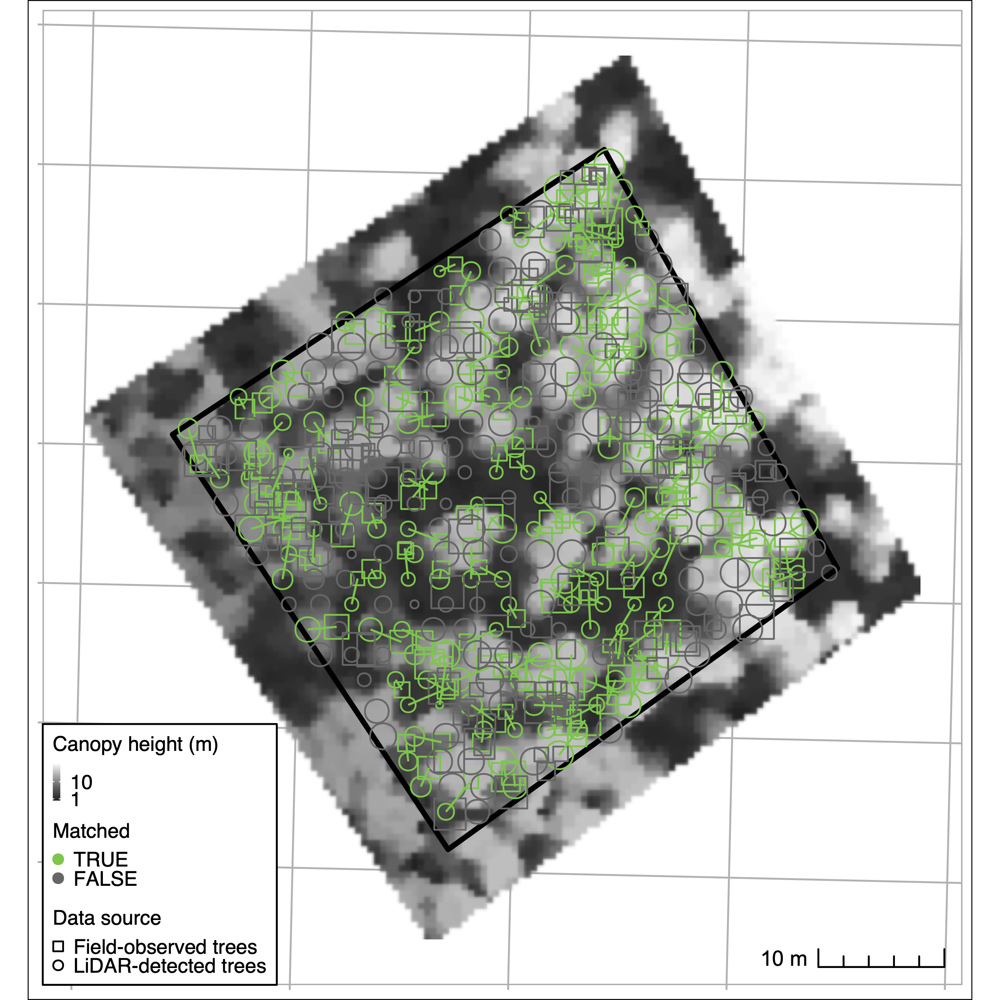
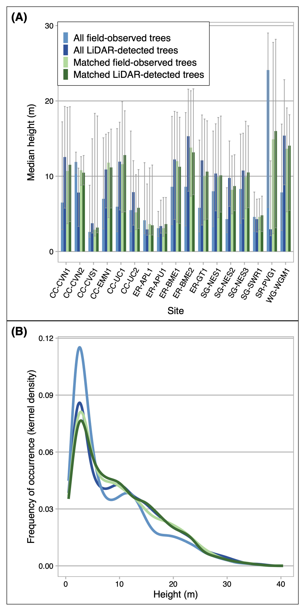
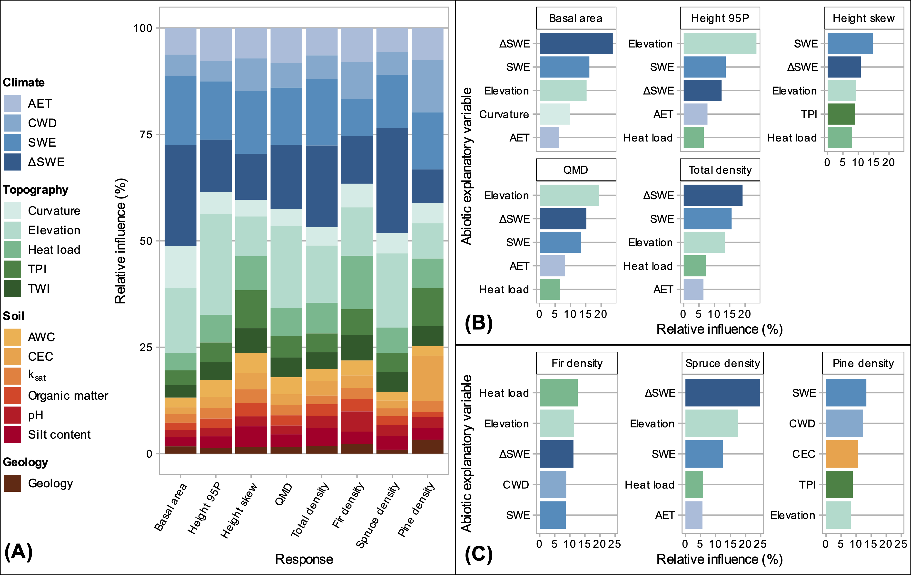

# 1. Introduction

One strain of thinking in ecology holds that ecosystem development is a function of five state factors: topography, parent material, climate, organisms, and time [@jenny_derivation_1961; @amundson_state_1997]. Forest stand structure and composition are two emergent properties of ecosystem development that can be evaluated in terms of continuous variables observed at a given point in time. Quantifying the relationships between an ecosystem's structure and composition and its underlying state factors is a fundamental concern for ecology and biochemistry [Vitousek and Matson 1991 [TODO: fix cite]]. While general relationships are acknowledged between (on the one hand) topographic, edaphic, lithologic, and climate state variables and (on the other) mature forest structure and composition, few studies have quantified the relative importance of state factors to stand structure and composition, or their potential interactive effects, particularly in subalpine domains. Several studies of the spatial variability of stand density, size distribution, and species composition in montane and subalpine forests have produced inconsistent results [e.g. Underwood et al. 2010; @lydersen_topographic_2012 [TODO: other citations]]. These inconsistencies suggest that at least some inferences about these relationships reflect an insufficient reckoning of how state factors interact to affect the hydrologic and energetic conditions in which plants grow [@lookingbill_empirical_2004]. Moreover, only a handful of papers have used spatially continuous estimates of stand structure to capture the full range of variability in either state factors or emergent ecosystem properties. This has been especially difficult to achieve in high-elevation, mountainous terrain because end-members on topographic and climate gradients are often inaccessible for field measurement. This limitation may now be partially overcome with active remote sensing technologies, such as light detection and ranging (LiDAR) ([TODO: cite]). Because biogeochemical fluxes between forests and the atmosphere are influenced by stand structure and composition, measuring these characteristics and their underlying environmental drivers is a central objective for forest ecology, conservation, and management [Waring and Running 1998].

## 1.1 Variability in forest structure and composition

### 1.1.1 Forest structure and topography

Topographic properties such as elevation, slope, hillslope position, curvature, and aspect substantially influence local microclimate and soil moisture variability [Dobrowski 2011].  As a result, they directly and indirectly constrain trees’ growing environments, influencing demographic rates and exposure to disturbance, and ultimately shaping stand structure, composition, and function [@kane_water_2015]. Even in low-diversity forests, physiognomy can vary dramatically with small changes in position. This variability is often especially pronounced in mountainous terrain, owing to the potential for large changes in elevation, slope, and aspect over small horizontal distances [Dobrowski 2011].

In complex terrain, pronounced gradients of insolation, precipitation input, and subsurface water distribution influence plant demographic processes, including productivity, biomass accumulation, and recruitment and mortality. Topography can also influence disturbance frequency and magnitude, drought and temperature stress, wind exposure, in turn influencing biotic structure and composition. General trends are assumed [@mcnab_terrain_1989; @mcnab_topographic_1993], *but quantitative reporting is limited in the literature* [TODO: verify]. In general, topographic factors can  be important determinants of forest structure and composition, and elevation, aspect, and position on the hillslope matter most. Stem diameter, basal, area, and growth rates decline with elevation, with temperature as the key limiting control. The same properties also decline from valley to ridge positions, and from polar to equatorial exposures, perhaps as a result of these factors' influence on soil moisture and vapor pressure deficit [@mcnab_terrain_1989; @mcnab_topographic_1993; @bolstad_forests_2018]. 

While these patterns may describe general relationships, there is evidence that they can vary in both magnitude and direction across watersheds and landscapes [Kelsey et al. 2018 [TODO: fix cite]]. @lydersen_topographic_2012 reported contrary findings in a Sierra Nevada mixed conifer forest, where upper slopes had both the highest quadratic mean diameter (QMD) and the tallest trees. @kane_water_2015, furthermore, found that topography explained little variance in forest structure in a domain with a frequent fire return interval.

### 1.1.2. Forest composition and topography
Topography may also exert control on species mix [Rowe and Sheard 1981; Barnes et al. 1982; Bailey 1988 [TODO: fix cites]]. Species affinities for certain topographic positions may be attributable to functional strategies developed in response to variability in radiative (Monin et al. 2007; White and Millet 2008) and hydrologic [Whittaker 1956, Day and Monk 1988; Hawthorne and Miniaat 2018 [TODO: fix cites]] regimes. In subalpine forests of the southern Rocky Mountains (SRM), some clear topography-driven controls on species occurrence exist. Engelmann spruce (*Picea engelmannii*) and subalpine fir (*Abies lasiocarpa*) tend to co-occur in high densities throughout the subalpine zone (~2700–-3000 m a.s.l.) and only sparsely in the upper montane zone (~1850--2900 m a.s.l.). At middle and high elevations up to treeline, the longer-lived spruce is often the canopy dominant (~70 percent of canopy basal area), while fir may occupy up to the same proportion of the understory (Alexander et al. 1984). Near treeline, pure spruce stands are common, while fir often dominate the canopy in the lower end of the subalpine zone, particularly in xeric topographic positions (Alexander 1987). Douglas fir (*Pseudotsuga menziesii*) tend to dominate mesic sites, including north-facing toe-slopes and high-elevation south-facing slopes. Lodgepole pine (*Pinus contorta*) also occurs on dry, southerly upper slopes in the lower range of the subalpine zone, and abundantly throughout the montane zone, particularly on south-facing slopes and steep slopes of all aspects (Veblen 1986). 

### 1.1.3. Forest structure and soil
Soil properties also matter for structural development. Parent material in the top 10 cm of soil explained a greater share of variation in the abundance of trees across global biomes than any other single factor, including climate and topography (Delgado-Baquerizo et al. 2020). Parent material is also a significant explainer of ecosystem productivity. [TODO: more on soil and forest structure from conifer forests in montane, subalpine zones].

### 1.1.4. Forest composition and soil 
[TODO: more on soils from conifer forests in montane, subalpine zones, focusing on soil composition, available water capacity, organic matter]

### 1.1.5. Forest structure, composition, and climate
In forest ecosystems, gradient analysis has consistently identified temperature and water balance as the strongest abiotic factors explaining vegetation species distributions and emergent properties such as canopy structure and carbon density (Veblen 1986, Urban et al. 2000, Hessberg et al. 2007, Holden and Jolly 2011). Elevation-driven lapse rate is assumed to exert the strongest control on tree growth and stature, as well as biomass accummulation. Conifer height tends to decline with temperature and with precipitation (Swensen and Weiser, Hulshof et al. 2015). Yet, temperature and precipitation can be extremely heterogeneous in mountain domains with high topographic relief, and do not uniformly track elevation. A site's temperature and radiation regimes may be further regulated by exposure angle and shading by adjacent landforms, while its precipitation regime may be regulated by orogenic cloud formation, which can decouple local precipitation patterns from regional patterns [TODO: cite]. Moreover, variability in wind exposure leads to snow redistribution, yielding patterns of accumulation and melt that may differ from snowfall patterns ([TODO: citation, see ASO, Deems et al.]). [TODO: more on compositional relationships with climate].

## 1.2 Gaps and motivations
The majority of gradient analyses use elevation, convergence, or landscape position as proxies for temperature and soil moisture (Stephenson 1998; Ng et al. 2020). A smaller subset of studies have deployed more complex metrics that combine factors such as elevation, hillslope position, aspect, and slope into quasi-independent climate-proxy variables. Urban and colleagues (2000) used elevation, slope aspect, topographic convergence, and soil depth to model a “physical template” describing the light, temperature, and soil moisture regime of a Sierra Nevada domain, and then examined the sensitivity of model-estimated forest stand basal area, fuel loading, and canopy depth to the topographic inputs. Underwood and colleagues (2010) used elevation, slope, aspect, solar radiation, and topographic wetness to divide a Sierra Nevada domain into “landscape management units” representing nine clusters of topographic variability, and examined variation in stem and species density across those units. Their effort relied on data collected *in situ* from 164 transects. 

First, while plot- and transect-based data can provide reliable estimates of aboveground forest structure and composition when scaled up to a stand, these data are by nature limited in spatial extent and do not represent the full range of state-factor variability that may constrain the distribution of vegetation across a landscape (Hurtt et al. 2004, Antonarakis et al. 2011, @lydersen_topographic_2012, Antonarakis et al. 2014). Even within mature, close-canopied forests, characteristics such as stand density, age-class distribution, allometry, species composition, and species dominance can have wide variance. Efforts to scale these properties up to a watershed from plot observations (or plot-benchmarked models) alone can yield substantial error terms. Therefore, prior work may have failed to capture important dimensions of co-variability. Kane et al. (2015) and Bolstad et al. (2018) are the only studies we have identified that evaluate spatially continuous measures of topography and forest structure, although more results have been reported from tropical forests (e.g. Chadwick and Asner 2015, Jucker et al. 2018). 

A further concern is that the statistical modeling strategies used in prior studies are unable to quantify potential interactions among topographic variables. Factors such as elevation, hillslope, and curvature work together to define a site’s edaphic, radiative, and moisture environments. Failing to account for these interactions may amount to a significant oversight. In part because of these limitations, ecology still lacks a complete accounting of how forest physiognomy co-varies with state factors.

LiDAR integrated with field sampling [and hyperspectral remote sensing] holds promise for overcoming some of these limitations. Advances in active remote sensing, including in Light Detection and Ranging (LiDAR), have opened up new opportunities for characterizing forest structure on a continuous basis for a wide array of scientific and management applications (Mallet and Bretar 2009). In particular, over the past five years a profusion of full waveform LiDAR datasets from aerial and satellite platforms, and emerging open-source libraries for cleaning and processing the data, has enabled more accurate estimates of forest structure than those from discrete-return acquisitions (Zhou and Popescu 2017). Like discrete-return points, waveform data can be used to delineate individual canopy trees and to estimate individual-scale characteristics such as stem diameter, stem height, stem volume, and crown volume (Dalponte et al. 2011, Jucker et al. 2017). Waveforms can also be processed to generate continuous estimates of forest structure parameters at the pixel-grid scale; these parameters include aboveground biomass, leaf-area index, total number density, and diameter-class distribution. While some researchers have eschewed individual tree object--based approaches because of the difficulty of characterizing subcanopy structure with dicrete-return data, a profusion of new algorithms aimed at waveform and hyper-dense point clouds has made it increasingly possible to achieve individual-based structure estimates. Using the full waveforms appears to improve the accuracy of both object-oriented and continuous-estimate methods over discrete-return estimates, particularly for characterizing mid-canopy and sub-canopy structure. Integrating waveforms with imaging spectrometry and calibrating remote sensing against *in situ* stem diameter and height measurements yields further accuracy improvements (Antonarakis et al. 2011, Jucker et al. 2017).

While previous studies have identified general state-factor responses in forest structure and composition, to our knowledge, no study accounts for topographic, edaphic, lithologic, and climate influences on multiple stand structural and compositional properties together. Few studies directly address microclimatic heterogeneity in high-elevation complex terrain, and none account for state-variable interactions. None does the above on a spatially continuous basis, incorporating end-members on the radiative and moisture gradients along which forest stands grow.

Our primary objective in this study was to quantify relationships between forest structure/composition and environmental attributes representing the main state factors that drive stand structural development in subalpine forests broadly representative of low-diversity forests across the Southern Rocky Mountains. 

We addressed the following questions: 

1. To what extent are tree stem height and diameter distributions, total number density, and basal area influenced by the elevation, slope, hillslope position, solar radiation, aspect, and topographic wetness of a site?
2. To what extent are species distributions influenced by the same topographic factors?
3. How do the specified topographic factors interact to mediate these relationships?

To address these questions, we integrated a full-waveform LiDAR dataset acquired over Colorado’s East River watershed with [a species classification map derived from imaging spectrometry and] field inventory measurements of 7000+ trees to quantify the spatial variability of forest canopy structure through the vertical profile, as well as stand structure and composition. We then used inferential modeling techniques to quantify the relative importance of state-factor controls on forest stand structure and composition, as estimated at a single point and time.

<!-- Hypotheses: -->
<!-- 	1. the interaction between elevation and topographic wetness is a stronger explainer of total stem density and basal area than any single topographic variable, and that both density and basal area will vary inversely with the two-way interactions.  -->
<!-- 	2. We expected a clear division between pine and spruce-fir distributions, explained by the interactions between elevation, aspect, and hillslope. In general, we expected pine to dominate lower-elevation and south-facing slopes and spruce-fir to dominate north-facing slopes and higher elevation positions. However, we anticipated that the interaction between elevation and hillslope position would complicate this general trend somewhat, because of cool-air pooling that allows lower minimum temperatures and lower evaporative demand to persist in valley bottoms, even at low elevations where pine would otherwise be expected (Dobrowksi 2011). -->
<!-- 	3. Spruce and fir total stem density diverge, with spruce density increasing with elevation and fir density reaching a peak at mid-elevations.  -->


# 2. Data and methods
## 2.1. Study area
The domain for this project comprised montane-subalpine conifer forest stands in Colorado’s East River watershed (38°55’ N, 106°56’ W; Fig. 1). The East River is a headwater tributary of the Colorado River, the principal freshwater source for one in 10 people in the U.S. (U.S. Department of the Interior Bureau of Reclamation 2012). The ~750 $km^2$ catchment includes six major drainages with perennial snowmelt-fed streams. It also has significant topographic heterogeneity: 1420 m of elevational relief, multiple peaks extending above treeline, and pronounced gradients in slope, aspect, insolation, and hillslope position. Mean annual temperature measured at a SNOTEL site (736-Schofield) at 3261 m in the northern reach of the watershed is 1.8 º C, with maximum and minimum of 8.3 º C and –28.4 º C respectively. Mean annual precipitation is ~1200 mm $y^{–1}$, approximately 70 percent as snow and 30 percent as rain. Maximum air temperatures are depressed by wind at high elevations and minimum air temperatures by cold air downwelling at low elevations. Precipitation is also strongly influenced by elevation, with snow accumulation generally increasing upgradient. The system is driven by seasonal temperature and precipitation regimes that impose important controls on vegetation phenology. Winter snows arrive as early as September, and storms may persist into early June at the highest elevations. Snowmelt typically begins in April and continues through June, concurrently with initiation of vegetation growth [TODO: confirm; growth may start up before melt]. A seasonal drydown occurs in late June and July, characterized by sparse rainfall and soil desiccation as evaporative demand rises with summer temperatures (Harte et al. 1995). In most years, this seasonal moisture deficit is partially mitigated by a July–August monsoon. The driest phase occurs over August–September and can drive severe soil moisture deficits in years when the monsoon fails, as it did in 2018. In addition to these broad patterns, the domain’s stark relief and topographic complexity coordinate to produce highly variable local climatic conditions.Soils are derived from varied, primarily sedimentary material intruded by igneous laccoliths. Mancos Shale is the dominant bedrock. Heterogeneous soil composition and drainage potential drives substantial variability in plant available water. The domain spans montane to alpine ecosystems (2700 m to 3500 m). The dominant tree species are *P. engelmannii*, *A. lasiocarpa*, *P. contorta*, and *Populus tremuloides*, with occasional *P. menziesii* at mid-elevations and one known population of *Pinus longaeva* near treeline on one summit.

## 2.2 Data collection and processing
Primary data included field census data from 17 permanent mixed-conifer inventory plots, each 0.16 ha in area; a June 2018 National Ecological Observatory Network Airborne Observation Platform (NEON AOP) full-waveform LiDAR acquisition; a raster digital elevation model (DEM) interpolated from NEON LiDAR ground return points; a raster dataset of peak snow water equivalent (SWE) generated by the Airborne Snow Observatory (ASO) averaged over three years [TODO: cite]; rasters of soil properties computed from the Soil Survey Geographic Database (SSURGO) [TODO: cite]; a raster estimating mean annual precipitation generated using the Basin Characterization Model for the Upper Colorado Basin [TODO: cite]; and a raster describing the distribution of major lithologic formations from the Colorado Geological Survey (Morgan 2020).

### 2.2.1. Field census

Between 2018 and 2022, we established 25 long-term forest monitoring plots in the East River and nearby drainages. The sites were stratified across six topographic gradients (Table 1; Supplementary Material A). An initial set of 68 sites was preselected via Latin hypercube sampling on six topographic gradients derived from the USGS 1/3-arc second digital elevation model (DEM) [TODO: cite]. The final 25 sites were selected from among that group after scouting and optimizing the distribution of the set along the topographic gradients. At each site we installed a 40x40 m plot, using slope corrections to approximate a projected flat-surface area of 1600 m. To minimize edge effects, we located plots at least 100 m from forest edges, major compositional transitions, perennial streams, and ecotones.

We used a GNSS receiver (Trimble Geo 7x) to georeference all plot locations *in situ*. To establish absolute georeferencing we made a minimum of six measurements over multiple days at each plot corner and took a mean of the recorded coordinates weighted by reported horizontal precision. Estimated planimetric accuracy of plot locations was $\pm$1.2 m. 

Between 2018 and 2022 we conducted a field census of approximately 9000 trees in the 25 plots. All trees of any species with a diameter at breast height (DBH, measured at 1.3 m) $geq$3 cm were labeled with an aluminum tag. On each tree, we recorded species and measured diameter at breast height (DBH) using a standard metric forestry diameter tape (trees $\lt$ ~7 cm DBH) or calipers (stems $\geq$ ~7 cm DBH). Tree heights were measured using a Nikon LaserPro II laser hypsometer (trees $\lt$ ~5 m in height) or a rigid metric tape measure (trees $\geq$ ~5 m). To maximize precision, hypsometer measurements were repeated on each tree until measurements converged within 0.5 m. Vertical accuracy is expected $\pm$1.0 m. Stems were geolocated using either the GNSS receiver (n=TODO: confirm number) or by measuring the direction and distance from a geolocated reference tree with a compass and rigid metric tape (n=TODO: conifrm number). For those positioned with the GNSS, the receiver was positioned in contact with the side of each tree stem at 1.3 m. We enforced a maximum estimated horizontal precision threshold of 1.0 m before recording, and we recorded a minimum of 30 positional observations at a rate of 1 observation s^-1^ for each stem. Positioning data were post-processed in TerraSync (Trimble Inc.) with differential correction using the Continuously Operating Reference Stations (CORS) Network station SE01 (39.40035, -107.212101; NOAA 2020). In total, 5899 (89.4 percent) of the stems surveyed were positioned. Those without unique geolocations were less than 5 m in height and fully suppressed beneath the canopy of another tree, such that it was extremely unlikely for tree crown segmentation to differentiate the suppressed tree from the dominant. For geotagged trees, mean planimetric accuracy as recorded by the GNSS unit was 1.01 m (s.d = 0.70 m).

Seventeen of the 25 plots lay within the overflight footprint of a 2018 NEON AOP acquisition (Kampe et al. 2009). We used the observations from this subset for training and validation of models developed in the next phase of analysis. The 17 focal sites included 5828 observed trees, of which 5416 were living at the time of inventory. Median height across all species was 5.6 m (s.d. 7.2 m; Table 4 and Table 5). The large standard deviation resulted from a long tail of large-statured trees, consistent with the characteristically negative exponential shape of height frequency distribution curves. Quadratic mean diameter (Fig. 3) across all species was 18.1 cm, and mean basal area was [TODO: GET VALUE]. Median density was [TODO: GET VALUE] trees per hectare (s.d. TK). 

Past management and disturbance influence forest structure as it appears on the landscape at any given point in time. The legacies of logging, fire, avalanche, and pest-pathogen infestation that are common to Colorado's subalpine forests could well obscure the relationship between forest vital rates, emergent structure, and underlying abiotic constraints. Logging related to the mining industry occurred in some parts of the East River watershed during the 19th and early 20th centuries, with a small footprint continuing today. The watershed has large stretches of forest where little to no tree removal occurred, and stands with old trees and uneven age and size structure are well distributed. We aimed to further mitigate these effects by siting inventory plots in stands where no recent harvest or major disturbance occurred in at least the last 40 years, based on (a) visual inspection for cut stumps and remnants and (b) stability of the Normalized Difference Vegetation Index over the Landsat record (1980-present). Further, prior studies have found strong associations between forest structure and factors including water-balance and soil, even in the presence of major harvest and disturbance events (Urban et al. 2000, Lyderson and North 2012, Collins et al. 2015, Stephens et al. 2015, Kane et al. 2015). 

### 2.2.2 Waveform LiDAR processing
Between June 12 and 26, 2018, the NEON AOP surveyed approximately $330 km^2$ of the watershed (Chadwick et al. 2020; Fig. 1). The AOP collected LiDAR using an Optech Gemini discrete LiDAR sensor and waveform digitizer. The LiDAR sensor’s pulse repetition frequency varied between 33 and 100 kHz. Validation was conducted using *in situ* data at 437 sites representing a range of vegetative and built land cover types. 

Discrete-return point density in the post-processed dataset ranged between 1 and 9 returns $m^{-2}$, which was insufficient for characterizing subcanopy structure. We therefore elected to reprocess the full waveforms, which had a nominal density between 1 and 4 pulses $m^{-2}$. We were able to exploit the higher information density of full-waveform pulses to develop more complete characterizations of stand and canopy structure than would have been possible with discrete returns alone. 

### 2.2.3. Waveform processing

We generated both an individual tree crown (ITC) map and continuous gridded estimates of mixed-conifer forest structure (as in @dalponte_tree-centric_2016). The former comprises a map of individual tree crowns in mixed-conifer forest stands describing species, height, crown area, and stem diameter of each tree, along with estimates of detection error. The latter comprises a continuous map of forest structure metrics at 10m, 40m, 100m, and 1km grid scales. We pursued the following steps to produce these datasets, illustrated in Fig. 2. 

First, we used a spectral deconvolution procedure to isolate the target-response signal from its interactions with the LiDAR system's outgoing pulse, atmospheric scattering, and sensor-system noise. We used the Gold deconvolution algorithm contained in Zhou et al.'s (2017) implementation in the `waveformlidar` package in the R statistical computing environment, but refactored their implementation for parallel computing. The result of the algorithm approximates the true distribution of scattering objects along the outbound light pulse's path. 

The signal intensity of an outbound LiDAR pulse as a function of time is roughly Gaussian in shape. As the pulse interacts with physical objects along its path and is reflected back to the sensor, the returning backscatter cross-section can also be expressed approximately as a sum of Gaussian functions. Gaussian decomposition allows one to characterize the components of the returning impulse (Harding 2005). We applied an adaptive Gaussian decomposition algorithm to fit one or more Gaussian models to the return pulse components based on Equation 2: 

$$f(x,\theta) = \sum_{(i=1)}^{n} A_i exp\biggl[-\frac{(x-\mu_i)^\lambda}{(2\sigma_i^2)}\biggr]$$			(2)
where $A_i$ is the amplitude of waveform component $i$, $\mu$ is the bin location of $i$ (measured as a point in time, ns), $\sigma$ is the standard deviation of $i$, and $\lambda$ is a penalty parameter that minimizes model residual over a specified number of iterations. The algorithm (1) rescales the returns using the minimum intensity (typically around 200 (DN) for NEON data), (2) identifies potential peaks in the waveform, and (3) iteratively fits a model to each peak. It then selects the model that minimizes root mean square error between the raw waveform and fitted values, excluding models that produce physically meaningless parameters, such as a negative $A_i$. Where multiple peaks exist, the algorithm fits a separate function to each and expresses the final fit as the sum of $n$ Gaussian functions. Fitting was accomplished using the `nlsLM` in the R package `minpack.lm`.

The deconvolution and decomposition procedures were applied to the full set of waveforms ($~500\ x\ 1.4*10^9$) in parallel on 256 cores on the University of California, Berkeley's high-performance computing cluster.

After processing the waveforms, we used the geolocation matrices provided in the NEON dataset to geolocate the waveforms and extracted characteristic metrics from the fitted waveforms. These included the peaks’ location in three-dimensional space, their amplitude and width, front slope, and time to median intensity. We then used the R package `lidR` to discretize this information along with the geolocated waveform data. We normalized the discretized points to the earth surface by differencing their z-values against a DEM derived from the discrete-return point cloud included in the NEON dataset (Fig. 3). We then decimated the high-density returns, preserving all of the identified Gaussian peaks and randomly sampling non-peak intensities to obtain a point cloud with a density of 14--16 points $m^{2^-1}$ across the full domain.

### 2.2.4. Tree segmentation and cross-validation

Next, we integrated the processed LiDAR data and field data from inventory plots to train and validate an individual tree delineation (ITD) model, which we then applied to the remaining forested area to generate a tree crown map of the watershed. We used a leave-one-out cross-validation (LOOCV) strategy to optimize tree crown delineation at the field sites. This approach iterated through a range of possible parameters for each of seven ITD algorithms, then selected the best-performing algorithm and parameter set to apply to the remaining data. 

First, we extracted the discretized waveform data intersecting the boundaries of each field plot plus a 10 m buffer on all sides. At each step of cross-validation we randomly removed one plot from consideration, then attempted tree segmentation on the point data in the remaining 16 plots using algorithm $A_i$ and parameter set $\lambda_{i,j:k}$, where $i$ is the $i$th algorithm and $j:k$ are vectors of values on the parameters required for the algorithm to proceed. In each run we linked delineated trees to their nearest field-observed trees by matching nearest neighbors in the Euclidean space described by the latitude-longitude-height coordinates of modeled stems and the latitude-longitude-height coordinates of stems geotagged in the field. We then computed the loss between model and observation as

$$ loss_{i,j} = \frac{\sum_{i,j=1}^{n}\sqrt{(x_i-x_j)^2+(y_i-y_j)^2+(z_i-z_j)^2}}{p(match)}$$
where $i$ is the $i$th modeled tree and $j$ is its linked field-observed tree; $x$, $y$, and $z$ are the longitude, latitude, and height coordinates of $i$ and $j$, respectively, and $p(match)$ is the ratio of successfully matched trees to field-observed trees. This loss term is effectively the sum of Euclidean distances between pairs of matched tree summits penalized by poor match rates. For each run of $\lambda_{i,j:k}$ on $A_i$ we stored the computed loss, then selected the parameter combination corresponding to the minimum loss value across all $\lambda_{i,j:k}$. We used this parameter combination to delineate trees in the held-out plot, and computed the loss on this test set. We repeated this procedure until we had cycled through all LOOCV permutations, and averaged the 17 test loss scores. Each of these steps was then implemented for the next algorithm $A_{i}$. We ran this operation with seven ITD algorithms (described in Appendix B) and a total of [TODO: confirm number] of parameters, and selected the algorithm and parameter set that yielded the minimum average loss. 

For the remainder of the LiDAR-surveyed domain, we subset the discretized waveforms over conifer forest by finding their intersection with conifer-classified areas from a land-cover classification map derived from the NEON hyperspectral acquisition (Breckheimer 2021). We forced the optimal algorithm with this subset of LiDAR data and the optimal parameter set from training to delineate all tree crowns in the watershed's conifer stands. The result was a spatially continuous dataset of conifer tree objects describing their locations and heights. To estimate the stem diameters of each delineated object, we used an allometric function of stem height with coefficients derived from plot observations. [TODO: write functional form].

[TODO: Implement this part or cut if it doesn't pan out: The tree-crown product was fused with a 1 m resolution forest species classification dataset, developed through a support vector machine classifier on 2018 NEON AOP hyperspectral imagery (Falco 2020). Each object was assigned to a given tree species according to the majority rule, i.e., if 50 percent or more of the pixels intersecting the object were classified to that species (Dalponte et al. 2019). For trees where less than 50 percent of pixels belonged to a single species, the object was labeled “unknown.”]

From the fused dataset, we computed continuous area-based structural [and compositional] metrics by summarizing object-level predictions at specified grid scales across the watershed. Structural metrics included total number density, basal area, quadratic mean diameter, and diameter and height percentiles. Basal area was computed as 
$$\frac{\sum_{i=1}^{n}\pi (DBH/2)^2}{pixel \ area}$$ 
and expressed as the proportion of stem area per hectare. [TODO: Compositional metrics included species composition (proportion of pixel area occupied by each species), species density (number of individuals of each species per pixel), and species dominance (majority species per pixel).] 

### 2.2.5. State factor variables

We sourced and generated spatially continuous raster datasets estimating several state factor variables to use as explanatory variables for inferential modeling. A summary of the variables appears in Table 3. We generated six topographic variables from the 1 m DEM included in the NEON source data. Elevation (m) was computed at the 100 m pixel scale by aggregating the raw DEM. Slope angle (degrees) and aspect (degrees) were computed from the elevation product with the `terrain` method in the R package `terra` with 8 neighbors, using the method in Horn (1981). We then calculated aspect folded about the NE-SW (25º-205º) line. This operation translated the raw aspect values into a scale whose maximum occurs on SW slopes and minimum on NE slopes, thereby yielding a more ecologically relevant measure of aspect-constrained exposure. The fold line we selected represented the estimated angles of highest and lowest mean annual incident radiation in the domain, given the watershed's latitude and overall slope orientation. Total heat load (unitless index) was calculated from folded aspect and slope angle using the method in McCune and Keon (2002). Topographic position index (TPI) is a morphometric measure that classifies a landscape into slope position classes, from ridgetop to toeslope. We computed TPI at each pixel in the elevation raster as the difference between the elevation at the target point and the mean elevation within a neighborhood of 9 pixels (1000 m), normalized to the standard deviation of elevation in that window (Gallant and Wilson 2000; De Reu et al. 2014). TPI values are more positive the higher a target point is than its neighborhood, and more negative the lower it is. Topographic Wetness Index (TWI) is a measure of the relative capacity of an area to accumulate water through surface or subsurface flow. We selected this metric as a proxy for relative soil moisture conditions. We used the implementation in the R package `dynatopmodel`, which calculates TWI ($log(m^2/m$)) at each pixel as the log ratio between its upslope contributing area and slope angle (Quinn et al. 1995, Metcalfe et al. 2018). 

To evaluate edaphic effects on forest structure and composition, continuous estimates of soil properties were derived from the U.S. Geological Survey SSURGO database (Survey Soil Staff 2022). Spatially continuous soil properties are predictively modeled using an ensemble of regression, classification, and machine-learning operations on observations from in situ soil samples and a wide array of environmental predictor variables. Spatial and attribute data were retrieved from the Web Soil Survey using the keys for area symbols that intersected the study domain ('CO654', 'CO660', 'CO661', 'CO662'). After joining the spatial and attribute tables, we aggregated horizon-scale data to generate a unique observation per component. For horizons within a given component, we calculated horizon depth--weighted means for the following variables in the top 100 cm of soil: available water capacity ('awc_r') saturated hydraulic conductivity ($k_sat$), and soil pH ('ph1to1h2o_r'). We calculated the horizon depth--weighted mean of percent organic matter ('om_r') in the top 30 cm of soil. We took these variables to be the most biologically relevant independent estimators of soil constraints on tree growth, and the selected soil depths as those in which the selected variables had the strongest leverage on tree growth. Initial testing also included percent sand, k, and cation exchange capacity, which were highly correlated with one or more of the other variables, so they were dropped. We calculated total soil depth as the maximum horizon depth per component. These component-scale estimates were aggregated again to the map unit scale by taking the mean value weighted by the proportion of each component represented in a map unit. The map unit associated data were then converted from vector to raster using the `rasterize` function in the R package `terra`.

To estimate relative spatial patterns of snow accumulation, we retrieved snow water equivalent (SWE) data generated by the Airborne Snow Observatory from flights on March 31, 2018, April 4, 2019, and April 21, 2022. The flights occurred before the onset of snowmelt in each season. The ASO SWE product was generated from observations of snow depth, spectral albedo, and radiative forcing from a coupled imaging spectrometer and terrestrial laser scanning system, combined with snow density modeled using iSnobal. While the data may not have captured peak snow accumulation in each season, by averaging across three years we were able to approximate the spatial pattern of accumulation across the basin. Because we were less interested in absolute accumulation values and more interested in variability across space, this seemed a reasonable assumption to make. 

The underlying lithologic substrate was characterized by rasterizing the Colorado Geological Survey database R-37: Geology and Mineral Resources of Gunnison County, Colorado (Morgan 2020). The vector database was created by digitizing the original sheets used to prepare the U.S. Geological Survey MI-16 Geologic Map of Colorado (Tweto 1979). 

### 2.2.6. Inferential modeling

The final phase of the analysis evaluated relationships between these structural [and compositional] metrics to spatially continuous estimates of underlying state factors. All data were (dis-)aggregated to the 100 m pixel scale and aligned to a consistent grid. We fit generalized additive models to quantify the relationships among the explanatory and response variables. The generalized additive approach allowed us both to account for nonlinearities and to uncover variable interactions. To evaluate the questions discussed in Section above, we examined the main effects of each topographic variable, along with two-way interactions between elevation and topographic wetness and folded aspect.

# 3. Results

## 3.1 Waveform LiDAR
We processed approximately $1.4*10^9$ waveform returns. Of these, a negligible fraction (approximately 0.5 percent) either had no detectable peaks or represented backscatter records that could not be fit to a Gaussian function [TODO: show example of problematic waveform in supplementary material]. Where peaks could not be identified, the waveforms were dropped from the set. Where they could not be estimated by a Gaussian, the characteristic components (e.g, amplitude, time to median energy) were estimated from the deconvolved returns directly, without curve fitting. The final discretized, decimated point dataset represented $5.72*10^9$ points with a mean density of 15.3 points $m^-2$ across the domain.

## 3.3 Forest structure
Of the seven algorithms used in tree segmentation, LayerStacking (Ayrey et al. 2017) yielded the lowest loss across training and testing sets. Mean loss across validation folds was 252.1 (note: this number is not physically meaningful because of the penalty term but represents a relative measure of performance). [TODO: re-run this to export loss scores at each run and create a figure]. The configurable parameters in the PTrees algorithm are: (1) *k*, a vector of nearest neighbors used to identify crown apices, (2) *hmin*, the minimum height of a segmented tree, and (3) *nmax*, an upper bound of the number of combinations to consider. We used a vector of 14, 5 and 3 nearest neighbors, a minimum height of 1.3 m, and *nmax* of 7. [TODO: explain what the algorithm does, and what these parameters mean, either here or in methods]

Comparing the modeled trees to field inventory data, the algorithm extracted 4303 trees across the 17 plots [Table 4]. Of these, 50.9% were successfully matched to field trees. The mean difference in x-y dimension between matched trees was [0.04] m, and the mean difference in the z dimension between matched trees was [0.21] m. Agreement within 5 m height class bins at each site is shown in Fig. 4. The median height of modeled trees was 7.1 m (s.d. = 8.9 m). [TODO: numbers retrieved from Jan 2022 logs; re-run and confirm them.]

After we computed DBH using field-derived allometric coefficients, we found a quadratic mean diameter of modeled trees in the plots of 18.1 cm. A comparison of quadratic mean diameter in field-identified trees and modeled trees per site appears in Fig. 5 [TODO].

Applying the PTrees algorithm and parameters to areas of conifer forest across the full domain produced on the order of $12.2*10^6$ trees. The median height of modeled trees was 8.0 m (s.d. 7.2 m). Estimated quadratic mean diameter using allometric coefficients was 12.45 cm. The frequency distribution of heights and diameters of modeled trees appears in Fig. 6. 

We summarized tree-scale data to a 100 m grid to generate stand structural metrics. Images of the final raster data products appear in Fig. 7. Images of the state-factor datasets appear in Fig. 8. 

## 3.4 Relationships between stand structural metrics and state factors
Elevation dictated much of the spatial pattern of variability in forest structure, though its influence was mediated by other state factors. Elevation exerted a strong nonlinear control on stand density, 90th percentile height, quadratic mean diameter, and basal area. Fig. 9 shows interactions between the two dominant topographic explainers for each of the response variables. 
- [TODO: Table of model coefficients]
- Stand density was at a maximum at ~2800 m, on ridgetops and at southwest-facing aspects.
- Stand density decreased with SWE
- SWE mediated the elevational control on density, such that areas of low elevation and high SWE hosted the least dense stands, while areas of high elevation and low SWE hosted less dense stands than high elevation areas with high SWE
- The elevation-slope interaction had the strongest influence on the upper range of stand height (measured by the 90th percentile of height per pixel), with highest densities occuring on moderate slopes at low-to mid-elevations. Extreme steep and shallow slopes produced stands of lower overall height, though this effect was less pronounced at the extremes of elevation
- For QMD the influence of elevation was mediated strongly by soil AWC, which had an approximately bimodal nonlinear fit, with maxima around [TODO: rescale and report maxima] 
-  For basal area, the interaction between elevation and percent organic matter exerted the most influence
- Other topographic factors had smaller effects [TODO: report coefficients and curve d.f.]
- Fig. 9 [TODO: plot partial-effects for all 4 response variables]
- [TODO: report geology effects]

# Discussion
### Optimization of tree segmentation on waveform LiDAR is appropriate for continuous estimation of forest structure
The match rate between field-observed and model-identified trees of 86.8 percent was high. The strength of agreement between field-identified and modeled trees at the inventory plots suggests that it is possible to map height, location, and DBH at the ITC level accurately by optimizing tree segmentation of LiDAR data with inventory data. That we were able to capture a large proportion of true subcanopy trees with relatively low commission error underscores the advantage of full waveform over discrete point data. This is an important result because it demonstrates the possibility of predicting individual-scale tree attributes over a large domain while training on only a small proportion its trees, provided the training samples are well distributed across environmental gradients.

On average, the ITD model underestimated the number of trees in plots by 6 percent (s.d = 68 percent) [TODO: check; these are from an old run], largely because of significant overdetection in the middle height classes of lower density plots and underdetection in the lower height classes across sites. The model slightly overestimated median height across plots. Using site-derived allometric coefficients yielded underestimation of quadratic mean diameter.

### Stand structure
The nonlinearity of the elevational constraint on stand density, height, and DBH contrasts with prior findings of these structural measures' declining with elevation. The inference that taller and larger-diameter trees occur at topographic positions nearer to ridges than to toeslopes is consistent with Lydersen and North's (2012) findings. 

One interpretation of these results is straightforward: that evaluating forest structure and its state-factor covariates using spatially continuous data reveals novel and, to a certain degree, unanticipated inferences about their relationships. It may indeed be the case that plot and transect data miss important dimensions of variability in vegetation and environmental gradients, though it will be important to evaluate this claim in other subalpine mixed-conifer domains, to verify that these relationships are not specific to one drainage. 

A second interpretation inquires into the biophysical factors that may be driving these relationships. The inflection of the elevation:forest structure curves corresponds approximately to the dividing line between montane and subalpine zones, at around 27000--2900 m elevation. To a crude approximation, this suggests that there exists a zone of preferable conditions supporting stand density, basal area, and height growth occurring around this elevational range. 

- We might think of this preferable zone as sitting at the intersection of two axes of control on stand development: water limitation and temperature limitation
- Stephenson (1990, 1998) suggests thinking of moisture supply and demand as orthogonal vectors driving vegetation dynamics
- Urban et al. interpret this in the context of range limitations for conifer species in the Sierra Nevada
- The orthogonal vectors framework may also be instructive for considering controls on structure
- The zone of preference can be thought to sit between a low-elevation constraint of water limitation (droughtiness) and a high-elevation constraint of temperature limitation (coolness). 
- Both low elevation sites and high elevation sites may experience temperature limitation 
  - Minimum temperature is the growth limiter
  - Low-elevation sites in the watershed experience low minima because of inversions that cause cold-air pooling
  - Low elevation sites are further constrained by water limitation during the growing season, with warmer temperatures driving higher evaporative demand and earlier snowmelt
- Of course, tree species respond differentially to these constraints due to differences in assemblages of functional traits... [TODO: how to interpret that, without compositional data?]

# Conclusions

- [TODO: most of this section]
- Gaps we addressed
- How we addressed them
- Summary of major findings and their relation to literature
- Significance:
 - Quantifying the drivers of fine-scale heterogeneity in the structure, composition, and function of montane and subalpine forests is important for several reasons. First, understanding the factors that shape landscape vegetation patterns remains a foundational question in ecology and conservation (Waring and Running 1998, Turner and Gardner 2015). Second, as in most systems that face the imminent prospect of novel drought and disturbance regimes, there is a need for reference data against which scientists and managers can observe change (Millar et al. 2007). Third, understanding the drivers of heterogeneity is essential for forecasting how mountain forests will respond to regional environmental change, and for devising conservation and management strategies that promote forest resilience. Finally, there is a need for both data and inferential analyses that can be used to initialize and benchmark terrestrial ecosystem models used to predict vegetation and flux responses to perturbations (Antonarakis et al. 2011, Antonarakis et al. 2014)

# Acknowledgements
\clearpage

\newpage
# Figures and Tables
## Figure 1

**Figure 1.** The study domain spans the footprint of a June 2018 NEON AOP acquisition in the East River watershed in western Colorado. Dots indicate the locations of 0.16 ha conifer forest inventory plots. Shading is by elevation.
\clearpage

\newpage
## Table 1
**Table 1.** Description and units of topographic variables used for field plot selection.

| Variable | Description | Units | 
| -------- | ----------- | ----- |
| Elevation | Elevation above sea level	| m |
| Slope	| dy/dx computed in a 30 m window | degrees |
| Folded aspect	| Index of cardinal aspect adjusted for higher incident radiation on SW slopes | unitless index |
| Heat load	| Potential heat load calculated according to Eq. 3 in McCune and Keon (2002) | unitless index |
| Topographic position index (1000 m) | Index of hillslope position (summit, shoulder, backslope, footslope, and toeslope) computed in 1000 m window | unitless index |
| Topographic wetness index	| Terrain-driven balance of upslope water supply and local drainage (a function of local slope and upslope contributing area per unit contour length) | unitless index |
\clearpage

\newpage
## Table 2
**Table 2.** Measurements taken in field inventory with their units and a summary of methods.

| Measurement | Units | Method |
| ----------- | ----- | ------ |
| Species | NA | Visual identification |
| Stem height | m | Nikon Forestry Pro II hypsometer, metric tape |
| DBH | cm | Diameter tape, calipers |
| Stem geolocation | decimal degrees | Trimble GEO-7X GPS unit held against stem |
| Crown illumination | unitless index | Visual determination |
| Beetle damage | unitless index | Visual inspection for boreholes, sap, red/grey needles |
| Life status | NA | Visual inspection for living/dead status |
| Health status | NA | Visual inspection for signs of infection, decay, browning, wilting |
\clearpage

\newpage
## Figure 2

**Figure 2.** Raw waveforms were deconvolved with the outgoing ALS pulse and instrument impulse response using the Gold algorithm, and then decomposed into a sum of fitted Gaussian functions over time. Panel A shows the raw (dashed black) waveform function and the resulting deconvolved (dark blue) and decomposed (light blue) time series, all over a trimmed 100 ns support. Waveform peaks and a random sample of values along peak slopes were selected to generate a point cloud with a mean density of 24 points $m^-2$ across the acquisition area. An example of this high-density point cloud at one inventory plot (SG-SWR1) with a 10 m buffer is shown in panel B. The result of individual tree segmentation at the same plot, with buffer removed, appears in panel C. 
\clearpage

\newpage
## Table 3
**Table 3.** Response (RE) and explanatory (EX) variables used in statistical analysis.

| Type | Variable | Description | Units | Source |
| ---- | -------- | ----------- | ----- | ------ |
| RE | Total number density | Total number of ITC objects per grid cell | objects | NEON LiDAR | 
| RE | Quadratic mean diameter | Quadratic mean of stem diameters of objects per grid cell | cm | NEON LiDAR |
| RE | Basal area | Sum of cross-sectional areas of stems  | m$^2$ | NEON LiDAR |
| RE | Above-ground biomass | Estimated ABG per grid cell | kg | NEON LiDAR | 
| RE | Height percentiles | 25th, 50th, 75th, and 90th percentile of height per grid cell | m | NEON LiDAR |
| RE | Species composition | Basal area of each species as a proportion of ground area per grid cell | unitless proportion | NEON LiDAR+ spectroscopy | 
| RE | Species density | Number of stems of each species per grid cell | stems / ha | NEON LiDAR |
| EX | Elevation | Elevation above sea level	| m | NEON LiDAR |
| EX | Slope	| dy/dx computed in a 30 m window | degrees | NEON LiDAR |
| EX | Folded aspect	| Index of cardinal aspect adjusted for higher incident radiation on SW slopes | unitless index | NEON LiDAR |
| EX | Heat load	| Potential heat load calculated according to Eq. 3 in McCune and Keon (2002) | unitless index | NEON LiDAR |
| EX | Topographic position index (1000 m) | Index of hillslope position (summit, shoulder, backslope, footslope, and toeslope) computed in 1000 m window | unitless index | NEON LiDAR |
| EX | Topographic wetness index	| Terrain-driven ratio of upslope water supply to local drainage expressed as a function of local slope and upslope contributing area per unit contour length, computed on a 100 m pixel scale | unitless index | NEON LiDAR |
| EX | Soil available water capacity (AWC) | Amount of plant-available water that can be stored in an increment of soil depth, inclusive of fragments | SSURGO | 
| EX | Soil organic matter (OM) | Amount of decomposed plant and animal residue expressed as a weight percentage of the less than 2 mm soil material | weight % | SSURGO | 
| EX | Soil $k_{sat}$ | Amount of water that would move vertically through a unit area of saturated soil per unit time under unit hydraulic gradient | $\mu m/sec$ [TODO: confirm] | SSURGO | 
| EX | Soil total depth | Sum of horizon depths in a component | cm | SSURGO | 
| EX | Snow water equivalent (SWE) | Snow water equivalent derived by forcing iSnobal with 50 m snow depth data from eight Airborne Snow Observatory flights | ASO | 
| EX | Lithologic substrate | Distribution of rock formations | Colorado Geological Survey | 

\clearpage

\newpage
## Table 4
**Table 4.** Summary statistics for the best-performing runs of six individual tree delineation (ITD) algorithms. Parameters and values for each run appear in Supplementary Material. Averages and standard deviations were taken for results across plots. 

| Model | Run | Total observed trees | Total modeled trees | Mean (s.d.) extraction rate | Mean (s.d.) match rate | Mean (s.d.) accuracy | Omissions | Commissions | Precision | Recall | f |
| ----- | --- | -------------------- | ------------------- | --------------- | -------------- | ---------- | ---------------- | --------- | ----------- | --------- | ------ | -- |
| LayerStacking | 11 | 4303 | 4274 | 1.11 (0.37) | 0.51 (0.11) | 0.53 (0.10) | 0.10 | 0.11 | 0.51 (0.11) | 0.54 (0.10) | 0.51 (0.05) |

## Table 5
**Table 5.** Root mean squared difference in horizontal and vertical dimensions between field-observed and modeled trees for the best-performing runs of each ITD model tested. 

| Model | Run | RMSE_{xy} (m) | RMSE_{z} (m) | Loss | 
| ----- | --- | --------- | -------- | ---- |
| LayerStacking | 11 | 2.59 | 1.59 | 6.09 | 
| PTrees | 
| 

\clearpage

\newpage
## Figure 3

**Figure 3.** Diameter and height distributions of trees measured in inventory plots across all sites (A), and by species (B, C).

\clearpage

\newpage
## Figure 4

**Figure 4.** Total number of trees measured in plots (“Observed”—dark blue) and detected in segmentation of the ALS point cloud (“Predicted”—light blue), by height class, in 1 m increments.
\clearpage

\newpage

## Figure 5
[TODO - comparison of modeled QMD and field QMD in plots]

## Figure 6
[TODO - frequency distribution of heights and diameters of modeled trees]

## Figure 7

**Figure 7.** Maps of forest structure metrics at 100 m grid resolution.
\clearpage

\newpage
## Figure 8
[TODO - state factor maps]


## Table 4. Summary statistics by species for trees observed in field census.
```{r, echo=F, message=F, warning=F, layout="l-body-outset"}
library(dplyr)
library(knitr)
full_unq_inv <- read.csv(file.path('~', 'Repos', 'er', 'er-forest-inventory', 'data', 'processed', 'census1_collated', 'EastRiver_Census1_Data_Collated.csv'))
full_unq_inv <- full_unq_inv[full_unq_inv$Status %in% c('L', 'Live', 'LIVE'),]
full_unq_inv <- full_unq_inv[!full_unq_inv$Site_Name %in% c('XX-CAR1',
                                                           'XX-CAR2',
                                                           'XX-PLN1',
                                                           'XX-PLN2'),]
full_unq_inv <- full_unq_inv[!full_unq_inv$Sp_Code %in% c(NA, 'UNKN'),]
```

```{r, echo=F, message=F, warning=F, layout="l-body-outset"}
kable(full_unq_inv %>%
  group_by(Sp_Code) %>%
  summarise('N'=n(),
            'Median height (m)'=round(median(Height_Avg_M, na.rm=T),0),
            'Median DBH (cm)'=round(median(DBH_Avg_CM, na.rm=T),1),
            'Stem Density (stems ha^-1)'=round(n()/2.72,0),
            'Basal area (m^2 ha^-1)'=round(sum(pi*(DBH_Avg_CM/2)^2, na.rm=T)/2.72*(10^-4),1)))
```

## Table 5. Summary statistics by plot for trees observed in field census.
```{r, echo=F, message=F, warning=F, layout="l-body-outset"}
kable(full_unq_inv %>%
  group_by(Site_Name) %>%
  summarise('N'=n(),
            'N\ species'=length(unique(Sp_Code)),
            'Median height (m)'=round(median(Height_Avg_M, na.rm=T),0),
            'Median DBH (cm)'=round(median(DBH_Avg_CM, na.rm=T),1),
            'Stem Density'=round(n()/.16,0),
            'Basal area (m^2 ha^-1)'=round((sum(pi*(DBH_Avg_CM/2)^2, na.rm=T)/.16)*(10^-4),1)))
```

## Figure 9

**Figure 9.** Variable interaction plots demonstrate the strong, nonlinear elevational control on density (A), 90th percentile height (B), QMD (C), and basal area (D). Interaction plots show the two strongest explainers of each response variable. The influence of elevation is mediated by SWE, slope angle, soil AWC, and soil organic matter, respectively.
\clearpage

\newpage

## Figure 10

**Figure 10.** Stand density increased with soil organic matter and was at minimum with soil total depth = 50 cm, but other soil properties had little correlation with stand density. 
\clearpage

\newpage

# Supplementary Materials

# References
