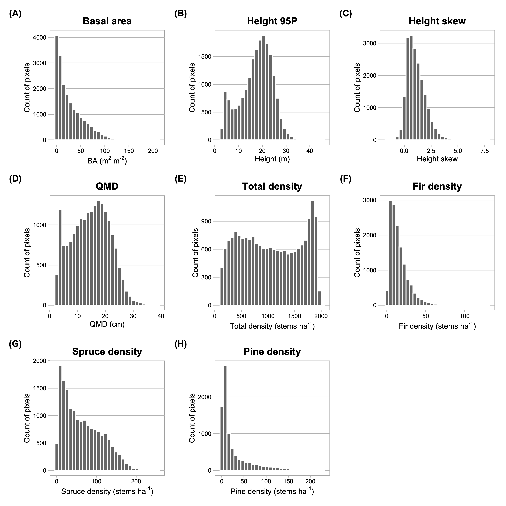

```{r setup, include=F}
config <- config::get(file=file.path('config', 'config.yml'))
devtools::load_all()
load.pkgs(config$pkgs)
```

```{r, echo=F}
#source('./inst/notebooks/LiDAR/05.10_model_selection.R')
source('./inst/ms/tables.R')
source('./inst/notebooks/regressions/00.00_plot_rasters.R')
```

# 1. Introduction

Abiotic constraints are important for explaining variability in forest structure from scales ranging from hillslope to continent. At continental to global scales, climate factors (namely, the orthogonal vectors of actual evapotranspiration AET and climatic water deficit (CWD; the difference between potential and actual ET)) consistently emerge as the strongest constraints. However, at finer scales, such as that of a watershed or basin, synoptic climate appears to have less of an influence than other locally varying factors. At landscape (~ 10^3 to 10^6 m2) and watershed scales (~ 10^2 to 10^3 m2), microtopographic variation exerts local influences that decouple site microclimates from regional climate. Indeed, local environments can influence precipitation input (via orography, wind sheltering, rain shadow effects); surface and subsurface storage, which can lag precipitation input on timescales from months to decades; and radiation, which drives atmospheric demand. Further, variability in soil properties directly drives plant-available water (parent material, depth, e.g.). Together, these modify site energy and water balance in ways that trees must respond to physiologically. 

A consensus exists on general trends in forest structure and composition and covariance with state factors. Stem diameter, basal, area, and growth rates tend to decline with elevation, with temperature as the key limiting control. The same properties also decline from valley to ridge positions, and from polar to equatorial exposures, perhaps as a result of these factors’ influence on water supply and deficit. However, Lydersen and North (2012) reported contrary findings in a Sierra Nevada mixed conifer forest, where upper slopes had both the highest quadratic mean diameter (QMD) and the tallest trees. Kane et al. (2015), furthermore, found that topography explained little variance in forest structure in a domain with a frequent fire return interval. Fricker et al. (2019) found responses in maximum tree height to topographic, edaphic, lithologic, and climate factors at landscape/watershed scale, including nonlinear elevational control on maximum tree height. They also found that CWD and mean annual precipitation (CWD and MAP) explained the most variance in maximum tree height distribution.

While previous studies have identified general state-factor responses in forest structure and composition, to our knowledge, no study accounts for topographic, edaphic, lithologic, and climate influences on multiple stand structural and compositional properties together. Few studies directly address microclimatic heterogeneity in high-elevation complex terrain, and none account for state-variable interactions. None does the above on a spatially continuous basis, incorporating end-members on the radiative and moisture gradients along which forest stands grow.

The majority of gradient analyses use elevation, convergence, or landscape position as proxies for temperature and soil moisture (Stephenson 1998; Ng et al. 2020). A smaller subset of studies have deployed more complex metrics that combine factors such as elevation, hillslope position, aspect, and slope into quasi-independent climate-proxy variables. Urban and colleagues (2000) used elevation, slope aspect, topographic convergence, and soil depth to model a “physical template” describing the light, temperature, and soil moisture regime of a Sierra Nevada domain, and then examined the sensitivity of model-estimated forest stand basal area, fuel loading, and canopy depth to the topographic inputs. Underwood and colleagues (2010) used elevation, slope, aspect, solar radiation, and topographic wetness to divide a Sierra Nevada domain into “landscape management units” representing nine clusters of topographic variability, and examined variation in stem and species density across those units. Their effort relied on data collected *in situ* from 164 transects. 

While plot- and transect-based data can provide reliable estimates of aboveground forest structure and composition when scaled up to a stand, these data are by nature limited in spatial extent and do not represent the full range of state-factor variability that may constrain the distribution of vegetation across a landscape (Hurtt et al. 2004, Antonarakis et al. 2011,
@lydersen_topographic_2012, Antonarakis et al. 2014). Even within mature, close-canopied forests, characteristics such as stand density, age-class distribution, allometry, species composition, and species dominance can have wide variance. Efforts to scale these properties up to a watershed from plot observations (or plot-benchmarked models) alone can yield substantial error terms. Therefore, prior work may have failed to capture important dimensions of co-variability. Kane et al. (2015) and Bolstad et al. (2018) are the only studies we have identified that evaluate spatially continuous measures of topography and forest structure, although more results have been reported from tropical forests (e.g. Chadwick and Asner 2015, Jucker et al. 2018). 

LiDAR integrated with field sampling [and hyperspectral remote sensing] holds promise for overcoming some of these limitations. Advances in active remote sensing, including in Light Detection and Ranging (LiDAR), have opened up new opportunities for characterizing forest structure on a continuous basis for a wide array of scientific and management applications (Mallet and Bretar 2009). In particular, over the past five years a profusion of full waveform LiDAR datasets from aerial and satellite platforms, and emerging open-source libraries for cleaning and processing the data, has enabled more accurate estimates of forest structure than those from discrete-return acquisitions (Zhou and Popescu 2017). Like discrete-return points, waveform data can be used to delineate individual canopy trees and to estimate individual-scale characteristics such as stem diameter, stem height, stem volume, and crown volume (Dalponte et al. 2011, Jucker et al. 2017). Waveforms can also be processed to generate continuous estimates of forest structure parameters at the pixel-grid scale; these parameters include aboveground biomass, leaf-area index, total number density, and diameter-class distribution. While some researchers have eschewed individual tree object--based approaches because of the difficulty of characterizing subcanopy structure with dicrete-return data, a profusion of new algorithms aimed at waveform and hyper-dense point clouds has made it increasingly possible to achieve individual-based structure estimates. Using the full waveforms appears to improve the accuracy of both object-oriented and continuous-estimate methods over discrete-return estimates, particularly for characterizing mid-canopy and sub-canopy structure. Integrating waveforms with imaging spectrometry and calibrating remote sensing against *in situ* stem diameter and height measurements yields further accuracy improvements (Antonarakis et al. 2011, Jucker et al. 2017).

Our primary objective in this study was to quantify relationships between forest structure and abiotic environmental drivers of stand structural development in subalpine forests broadly representative of low-diversity forests across the Southern Rocky Mountains. 

We addressed the following questions: 

1. Which topographic, climate, and substrate variables exert the strongest influence on conifer forest stand structure?
2. To what extent do feature interactions mediate these relationships?

To address these questions, we integrated a full-waveform LiDAR dataset acquired over Colorado’s East River watershed with [a species classification map derived from imaging spectrometry and] field inventory measurements of 7000+ trees to quantify the spatial variability of forest canopy structure through the vertical profile, as well as stand structure and composition. We then used inferential modeling techniques to quantify the relative importance of state-factor controls on forest stand structure and composition, as estimated at a single point and time.

<!-- Hypotheses: -->
<!-- 	1. the interaction between elevation and topographic wetness is a stronger explainer of total stem density and basal area than any single topographic variable, and that both density and basal area will vary inversely with the two-way interactions.  -->
<!-- 	2. We expected a clear division between pine and spruce-fir distributions, explained by the interactions between elevation, aspect, and hillslope. In general, we expected pine to dominate lower-elevation and south-facing slopes and spruce-fir to dominate north-facing slopes and higher elevation positions. However, we anticipated that the interaction between elevation and hillslope position would complicate this general trend somewhat, because of cool-air pooling that allows lower minimum temperatures and lower evaporative demand to persist in valley bottoms, even at low elevations where pine would otherwise be expected (Dobrowksi 2011). -->
<!-- 	3. Spruce and fir total stem density diverge, with spruce density increasing with elevation and fir density reaching a peak at mid-elevations.  -->


# 2. Methods
## 2.1. Study area
The domain for this project comprised upper montane-subalpine conifer forest stands in Colorado’s East River watershed (38°55’ N, 106°56’ W; Fig. 1). The East River is a headwater tributary of the Colorado River, the principal freshwater source for one in 10 people in the U.S. (U.S. Department of the Interior Bureau of Reclamation 2012). The 750 km^2^ catchment includes six major drainages with perennial snowmelt-fed streams. It also has significant topographic heterogeneity: 1420 m of elevational relief, multiple peaks extending above treeline, and pronounced gradients in slope, aspect, insolation, and hillslope position. Mean annual temperature measured at a SNOTEL site (736-Schofield) at 3261 m in the northern reach of the watershed is 1.8 º C, with maximum and minimum of 8.3 º C and –28.4 º C respectively. Mean annual precipitation is 1200 mm y^–1^, approximately 70 percent snow and 30 percent rain. Maximum air temperatures are depressed at high elevations and minimum air temperatures by cold air downwelling at low elevations. Precipitation is also strongly influenced by elevation, with snow accumulation generally increasing upgradient. The system is driven by seasonal temperature and precipitation regimes that impose important controls on vegetation phenology. Winter snows arrive as early as September, and storms may persist into early June at the highest elevations. Snowmelt typically begins in April and continues through June. A seasonal drydown occurs in late June and July, characterized by sparse rainfall and soil desiccation as evaporative demand rises with summer temperatures (Harte et al. 1995). In most years, this seasonal moisture deficit is partially mitigated by a July–August monsoon. The driest phase occurs over August–September and can drive severe soil moisture deficits in years when the monsoon fails, as it did in 2018. In addition to these broad patterns, the domain’s stark relief and topographic complexity coordinate to produce highly variable local climatic conditions. Soils are derived from varied, primarily sedimentary material intruded by igneous laccoliths. Heterogeneous soil composition and drainage potential drives substantial variability in plant available water. The dominant tree species are *P. engelmannii*, *A. lasiocarpa*, *P. contorta*, and *Populus tremuloides*, with occasional *P. menziesii* at mid-elevations and one known population of *Pinus longaeva* near treeline on one peak.

<!-- Primary data included field census data from 17 permanent mixed-conifer inventory plots, each 0.16 ha in area; a June 2018 National Ecological Observatory Network Airborne Observation Platform (NEON AOP) full-waveform LiDAR acquisition; a raster digital elevation model (DEM) interpolated from NEON LiDAR ground return points; a raster dataset of peak snow water equivalent (SWE) generated by the Airborne Snow Observatory (ASO) averaged over three years [TODO: cite]; rasters of soil properties computed from the Soil Survey Geographic Database (SSURGO) [TODO: cite]; a raster estimating mean annual precipitation generated using the Basin Characterization Model for the Upper Colorado Basin [TODO: cite]; and a raster describing the distribution of major lithologic formations from the Colorado Geological Survey (Morgan 2020). -->

## 2.2 Full-waveform LiDAR
Between June 12 and 26, 2018, the NEON AOP surveyed approximately 330 km^2^ of the watershed (Chadwick et al. 2020; Fig. 1). The AOP collected LiDAR using an Optech Gemini discrete LiDAR sensor and waveform digitizer. The LiDAR sensor’s pulse repetition frequency varied between 33 and 100 kHz. Validation was conducted using *in situ* data at 437 sites representing a range of vegetative and built land cover types. 

Discrete-return point density in the post-processed dataset ranged between 1 and 9 returns $m^{-2}$, which was insufficient for characterizing subcanopy structure. We therefore elected to reprocess the full waveforms, which had a nominal density between 1 and 4 pulses $m^{-2}$. We were able to exploit the higher information density of full-waveform pulses to develop more complete characterizations of stand and canopy structure than would have been possible with discrete returns alone. 

First, we used a spectral deconvolution procedure to isolate the target-response signal from its interactions with the LiDAR system's outgoing pulse, atmospheric scattering, and sensor-system noise. We used the Gold deconvolution algorithm implemented in the `waveformlidar` package in the R statistical computing environment (Zhou et al. 2017), but refactored their implementation for parallel computing. The result of the algorithm approximates the true distribution of scattering objects along the outbound light pulse's path.

The signal intensity of an outbound LiDAR pulse as a function of time is roughly Gaussian in shape. As the pulse interacts with physical objects along its path and is reflected back to the sensor, the returning backscatter cross-section can also be expressed approximately as a sum of Gaussian functions. Gaussian decomposition, therefore, allows one to characterize the components of the returning impulse (Harding 2005). We applied an adaptive Gaussian decomposition algorithm to fit one or more Gaussian models to the return pulse components based on Equation 1: 

$$f(x,\theta) = \sum_{(i=1)}^{n} A_i exp\biggl[-\frac{(x-\mu_i)^\lambda}{(2\sigma_i^2)}\biggr]$$ {#eq:eqn1}

where $A_i$ is the amplitude of waveform component $i$, $\mu$ is the bin location of $i$ (measured as a point in time, ns), $\sigma$ is the standard deviation of $i$, and $\lambda$ is a penalty parameter that minimizes model residual over a specified number of iterations. The algorithm (1) rescales the returns using the minimum intensity (typically around 200 (DN) for NEON data), (2) identifies potential peaks in the waveform, and (3) iteratively fits a model to each peak. It then selects the model that minimizes root mean square error between the raw waveform and fitted values, excluding models that produce physically meaningless parameters, such as a negative $A_i$. Where multiple peaks exist, the algorithm fits a separate function to each and expresses the final fit as the sum of $n$ Gaussian functions. Fitting was accomplished using the function `nlsLM` in the R package `minpack.lm`.

The deconvolution and decomposition procedures were applied to the full set of waveforms in parallel on 256 cores on the University of California, Berkeley's high-performance computing cluster. In total, we processed approximately 1.4*10^9^ waveform returns. Of these, a negligible fraction (approximately 0.5 percent) either had no detectable peaks or represented backscatter records that could not be fit to a Gaussian function. Where peaks could not be identified, the waveforms were dropped from the set. Where they could not be estimated by a Gaussian, the characteristic components (e.g, amplitude, time to median energy) were estimated from the deconvolved returns directly, without curve fitting.

After processing, we used the geolocation matrices provided in the NEON dataset to geolocate the waveforms and extracted characteristic metrics from the fitted waveforms. These included the peaks’ location in three-dimensional space, their amplitude and width, front slope, and time to median intensity. We then used the R package `lidR` to discretize this information along with the geolocated waveform data. We normalized the discretized points to the earth surface by differencing their z-values against a DEM derived from the discrete-return point cloud included in the NEON dataset. We then decimated the high-density returns, preserving all of the identified peaks to obtain a discretized point cloud of 5.72*10^9^ points with an evenly distributed mean density of 15.3 points m^-2^ across the domain.

## 2.3 Field census

Between 2018 and 2022, we established 25 long-term forest monitoring plots in the East River and nearby drainages. The sites were stratified across six topographic gradients (Table 1). An initial set of 68 sites was preselected via Latin hypercube sampling on six topographic gradients derived from the USGS 1/3-arc second digital elevation model (DEM) ([TODO: cite]). The final 25 sites were selected from among that group after scouting and optimizing the distribution of the set along the topographic gradients (Fig. S1). At each site we installed a 40 m x 40 m plot, using slope corrections to approximate a projected flat-surface area of 1600 m^2^. To minimize edge effects, we located plots at least 100 m from forest edges, major compositional transitions, perennial streams, and ecotones.

We used a GNSS receiver (Trimble Geo 7X, Trimble, Inc.) to georeference all plot locations *in situ*. To establish absolute georeferencing we made a minimum of six measurements over multiple days at each plot corner and took the arithmetic mean of recorded coordinates, inversely weighted by reported horizontal uncertainty. Positioning data were post-processed in TerraSync (Trimble Inc.) with differential correction using the Continuously Operating Reference Stations (CORS) Network station SE01 (39.40035, -107.212101; NOAA 2020). Estimated planimetric accuracy of plot corner locations was $\pm$ 0.98 m.

Between 2018 and 2022 we conducted a field census of approximately 9000 trees in the 25 plots (Table 2). All trees of any species with a diameter at breast height (DBH, measured at 1.3 m above the ground) $\geq$ 1.0 cm were labeled with an aluminum tag. For each tagged tree, we recorded species and measured diameter at breast height (DBH) using a standard metric forestry diameter tape (for stems $\lt$ 7 cm DBH) or calipers ($\geq$ 7 cm). We measured stem heights with a Nikon LaserPro II laser hypsometer (for stems $\lt$ 5 m in height) or a rigid metric tape measure ($\geq$ 5 m). To maximize precision, hypsometer measurements were repeated on each tree until measurements converged within 0.5 m. Expected vertical accuracy on hypsometer measurements was $\pm$ 1.0 m. 

Stems were then geolocated using either the GNSS receiver or by measuring the direction and distance from a geolocated reference tree with a digital compass and rigid metric tape. For those positioned with the GNSS, the receiver was positioned in contact with the side of each tree stem at 1.3 m. We enforced a maximum estimated horizontal precision threshold of 1.0 m before recording, and we recorded a minimum of 30 positional observations at a rate of 1 observation s^-1^ for each stem. In total, 5899 (89.4 percent) of the stems surveyed were positioned. Those without unique geolocations were less than 5 m in height and were fully suppressed beneath the canopy of another tree, such that it was extremely unlikely for tree crown segmentation to differentiate the suppressed tree from the dominant. For geotagged trees, mean planimetric accuracy was 1.01 m (s.d = 0.70 m).

Seventeen of the 25 plots lay within the overflight footprint of a 2018 NEON AOP acquisition (Kampe et al. 2009). We used the observations from this subset for training and validation of models developed in the next phase of analysis. The 17 focal plots contained 5828 observed trees, of which 5416 were living at the time of inventory. 

Past management and disturbance influence forest structure as it manifests on the landscape at any point in time. The legacies of logging, fire, avalanche, and pest-pathogen infestation, which, among other events, are common to Colorado's montane and subalpine forests, could obscure the relationship between forest vital rates, emergent structure, and underlying abiotic constraints. Logging related to the mining industry occurred in some parts of the watershed during the 19th and early 20th centuries, with a limited footprint enduring today. This said, the watershed includes large stands where little to no tree removal occurred, and stands with old trees and uneven age and size structure are well distributed. Further, prior studies have found strong associations between forest structure and abiotic factors under consideration here, even in the presence of major harvest and disturbance events (Urban et al. 2000, Lyderson and North 2012, Collins et al. 2015, Stephens et al. 2015, Kane et al. 2015). We aimed to partially mitigate unobserved management and disturbance effects by siting inventory plots in stands where no recent harvest or major disturbance occurred in at least the last 40 years, based on (a) visual inspection for cut stumps and remnants and (b) stability of the Normalized Difference Vegetation Index over the Landsat record (1980-present). 

## 2.4. Tree crowns and stand structure

Here we detail the procedure we followed to generate an individual tree crown (ITC) map and gridded estimates of conifer forest structure (as in @dalponte_tree-centric_2016). The former comprised an object-centric map of tree crowns in conifer forest stands, with each object describing the position, height, area, and stem diameter of a tree. The latter comprised a continuous map of forest structure metrics at 10m, 40m, 100m, and 1km grid scales. To generate these products, we integrated the discretized LiDAR and inventory data to optimize and validate an individual tree delineation (ITD) model, which we then applied to delineate trees in the watershed's remaining forested area. As we detail below, this approach iterated through many permutations of possible parameters for seven ITD algorithms; computed performance metrics at each iteration; and then selected the best performing algorithm and parameter set to apply to out-of-sample data. 

First, we extracted the discretized LiDAR data intersecting the boundaries of each field plot with a 3 m buffer on all sides. We then attempted tree segmentation on the discretized data using algorithm $A_i$ and parameter set $\lambda_{j,k:l}$, where $i$ is the $i$th algorithm, $\lambda_j$ is one of several parameters taking user-specified values required for the algorithm to proceed, and $k:l$ is a vector of values on that parameter (Table S1). After each delineation attempt, the automated matching procedure described in Eysn et al. (2015) and Pang et al. (2021) was applied to link detection results to reference observations from field inventory. We opted for an automated approach because (1) the computational scale of our method (up to 2800 delineation attempts per algorithm per site) made manual interpretation infeasible, and (2) doing so enabled us to enforce clear, objective rules for reproducibility. In early testing, we also evaluated bipartite matching strategies seeking to minimize the Euclidean and Mahalanobis distances between detected and reference trees [TODO: CITE]. We ultimately selected the Eysn (2015) method based on superior inter-tree and inter-site matching performance. 

The matching process began by selecting the tallest detected tree ("target") and searching for candidates among reference trees satisfying Euclidean height (∆Z) and horizontal distance (∆XY) criteria specified in Table 3. The reference candidate with the least ∆XY was chosen as a tentative match to the target. The candidates were then queried a second time. If a candidate with greater ∆XY proved closer in height to the target, and its ∆XY was at most 2.5 m more than ∆XY of the tentative match, it was selected as the match. However, since an optimal match depends not only on the neighborhood of reference trees, but also on other nearby *detected* trees, the target was then compared against other detected neighbors. If another detected tree was closer in horizontal and vertical distance to the matched reference, the pairing was discarded. This process was repeated on all remaining detected trees in descending order of height, until all reference trees had been evaluated. Matches were then removed from the set, and the process was repeated until no further matches could be found under the search criteria. 

For each run of $\lambda_{i,j:k}$ on $A_i$ we tallied the extracted trees, true positives (TP, or successful matches) false positives (FP, or commission errors), and false negatives (FN, or omission errors). We used these values to compute the performance statistics in Table 4. The root mean squares (RMS) of all performance statistics were calculated across the 17 plots as unbiased estimators of the performance of each $A_i$ and parameter set $\lambda_{i,j:k}$.

We then selected the algorithm and parameter permutation that had yielded the maximum root mean square *F* score across all $\lambda_{i,j:k}$. *F* is a proportion representing the harmonic mean of precision (the proportion of all tree detections that were correctly matched) and recall (the proportion of all possible matches that were correctly matched). Perfect detection and match rates would yield an *F* score of 1.0, while failure would yield 0.0. It was selected as the optimization statistic over overall accuracy for its balanced sensitivity to both over- and under-detection. 

Of the eight algorithms tested, LayerStacking (Ayrey et al. 2017) yielded the highest *F* score across training and testing sets (Table 4, Table S2). The algorithm proceeds by first dividing the point cloud into stacked horizontal layers at 1-m intervals, starting at $\lambda_1$ m above ground (Table 5). A series of clustering procedures is then applied to each layer. In the lowest three layers ($\lambda_{1}+1 : \lambda_{1}+3$ m a.g.), points are clustered through Density-Based Scanning (Ester et al. 1996); points within clusters are removed as non-tree low vegetation, while those lying outside clusters are retained as sparse returns from small tree boles. Next, a canopy height model (CHM) of resolution $\lambda_2$ is computed from the point cloud. Tree tops are identified from the CHM using a local maximum filter (LMF) with a window of radius $\lambda_3$. Then, points in each layer undergo *k*-means clustering, using the local maxima as seeds, and a polygonal buffer of radius $\lambda_4$ is placed around each resulting cluster. The polygons from each layer are then flattened and rasterized to create an intermediate "overlap map." This abstraction quantifies the density of clusters, such that areas of high-density polygonal overlap represent individual trees. In conifer forests, this delineation can be improved with an additional parameter, $\lambda_5$, which enforces higher weighting for clusters near the canopy top, because these tend to be closer to a conifer's center. A second LMF is applied to the overlap map, using a window of radius $\lambda_6$, and local maxima are taken to be tree centers. Additional smoothing of the local maxima, and filtering and merging of clusters, yields a set of points representing tree tops with embedded height and position information.

For the remainder of the LiDAR-surveyed domain, we subset the discretized waveforms over conifer forest by finding their intersection with conifer regions from a land-cover classification map derived from the NEON hyperspectral acquisition (Breckheimer 2021). We forced the LayerStacking algorithm with this subset of LiDAR data and the optimal parameter permutation to delineate all tree crowns in the watershed's conifer stands. The result was a spatially continuous dataset of conifer tree objects describing their locations and heights. To estimate the stem diameters of each delineated object, we used an allometric function of stem height with coefficients derived from plot observations.

From the crown map, we computed continuous area-based structural metrics by summarizing object-level predictions at specified grid scales across the watershed (Fig S2). Structural metrics included total number density (TND), basal area (BA), quadratic mean diameter (QMD), diameter and height percentiles, and skewness of height, all computed at the level of a grid cell. TND (stems ha^-1^) was a sum of the number of trees over grid cell area. BA (m^2^) was computed as: 

$$BA = \frac{\sum_{i=1}^{n}\pi (DBH/2)^2}{area}$$ {#eq:eqn2}

and expressed as the fraction of land area occupied by tree stems. QMD was also computed as:

$$QMD = \sqrt{\frac{DBH^2}{n}}$$ {#eq:eqn3}

where $n$ was the number of trees in the cell. Skewness of height was the third moment of the distribution of stem heights. Larger positive values signified a more positive skew, with a larger proportion of trees in smaller height classes than a normal distribution. More negative skew values signified a negative skew, with a larger proportion of trees in larger height classes.

## 2.5. Abiotic explanatory variables

### 2.5.1. Topography 
We generated six topographic variables from the 1-m DEM produced in LiDAR processing (see Table 1 and Fig. S3). We prioritized factors with topoclimatic leverage, i.e., those whose variability has been shown to modify the radiation or moisture budget in trees' local growing environments (Frey et al., 2016). Elevation (m) was computed at the 100 m pixel scale by aggregating the raw DEM. Slope angle (degrees) and aspect (degrees) were computed from the elevation product with the `terrain` method in the R package `terra` with 8 neighbors, using the method in Horn (1981). We further transformed the aspect product by folding values about the 25ºNE-205ºSW line. Translating them into into a scale whose maximum occurs on SW slopes and minimum on NE slopes yields a more ecologically relevant measure of aspect-constrained exposure. The fold line we selected represented the estimated angles of highest and lowest mean annual incident radiation in the domain, given the watershed's latitude and slope orientation. Total heat load (unitless index) was calculated from folded aspect and slope angle using the method in McCune and Keon (2002). Topographic position index (TPI) is a morphometric measure that classifies a landscape into slope position classes, from ridgetop to toeslope. We computed TPI at each pixel as the difference between the elevation at the target point and the mean elevation within a neighborhood of 9 pixels (1000 m), normalized to the standard deviation of elevation in that window (Gallant and Wilson 2000; De Reu et al. 2014). TPI values are more positive the higher a target point is than its neighborhood, and more negative the lower it is. Topographic Wetness Index (TWI) is a measure of the relative capacity of an area to accumulate water through surface or subsurface flow. We selected this metric as a proxy for relative soil moisture conditions. We used the implementation in the R package `dynatopmodel`, which calculates TWI ($log(m^2/m$)) at each pixel as the log ratio between its upslope contributing area and slope angle (Quinn et al. 1995, Metcalfe et al. 2018). 

### 2.5.2. Climate
To estimate relative spatial patterns of snow accumulation (m), we retrieved snow water equivalent (SWE) data produced by the Airborne Snow Observatory from flights on March 31; 2018, April 4, 2019; and April 21, 2022. The flights occurred before the onset of snowmelt in each season. The ASO SWE product was generated from observations of snow depth, spectral albedo, and radiative forcing from a coupled imaging spectrometer and terrestrial laser scanning system, combined with snow density modeled using iSnobal ([TODO: cite]. We also produced an estimate of the relative velocity of snow disappearance (m day^-1^). In each flight year, we differenced the snow-on values and snow-free values from subsequent flights (May 24, 2018; June 10, 2019; and May 18, 2022, respectively), and divided by the day interval between paired flights. While the ASO data may not have captured peak snow depth or maximum snow-free extent in each season, averaging across three years of flights enabled us to approximate the spatial pattern of relative accumulation and disappearance across the basin. Because we were less interested in absolute accumulation values and more interested in variability across space, this seemed a justifiable decision.

We also used estimates of mean total annual actual evapotranspiration (AET) and climatic water deficit (CWD) generated through a run of the Basin Characterization Model (BCM) on the Upper Colorado Basin (Buto et al. 2017). The BCM output package is a set of gridded products that characterizes the water balance for a subject region at 270 m resolution. The model is forced with monthly data and has been widely used in ecological and management applications (Flint et al. 2013). From this dataset, AET is the depth of water (mm) evaporated from the surface or transpired by plants within each pixel. CWD is calculated as the difference between potential evapotranspiration (PET) and AET (mm), where PET is the total depth of water that can be evaporated or transpired given prevailing atmospheric conditions. Under non-limited moisture conditions, AET equals PET and CWD is 0; positive CWD values correspond to moisture deficit, or an excess of atmospheric demand relative to available water in the soil. AET and CWD in our study represent the arithmetic mean of the annual sums of their values from 1985 to 2012 (Buto et al. 2017).

### 2.5.3. Soil
To evaluate edaphic effects on forest structure and composition, continuous estimates of soil properties were derived from the U.S. Geological Survey SSURGO national soils database (Survey Soil Staff 2022). SSURGO hosts models of spatially continuous soil properties predicted via an ensemble of regression, classification, and machine-learning operations on observations from *in situ* soil samples and environmental predictor variables. Spatial and attribute data were retrieved from the Web Soil Survey using the R library `FedData`, using the keys for area symbols that intersect the study domain ('CO654', 'CO660', 'CO661', 'CO662'). After joining the spatial and attribute tables, we aggregated horizon-scale data to generate a unique observation per component. For horizons within a given component, we calculated horizon depth--weighted means for available water capacity (AWC, 'awc_r') and hydraulic conductivity (K, 'k_r') in the top 100 cm of soil. We calculated the horizon depth--weighted mean of percent organic matter (OM, 'om_r') in the top 30 cm of soil. We calculated total soil depth as the maximum horizon depth per component. We took these variables to be independent estimates of soil constraints on tree growth, and the selected soil depths to be those in which the selected variables are likely exert the strongest biophysiological effect. Initial testing also included percent sand and clay, pH, k_sat_, and cation exchange capacity. These either had sparse observations across the domain or were highly correlated with one or more of the selected variables and were dropped from modeling. These component-scale estimates were aggregated again to the map unit scale by taking their mean values weighted by the proportion of each component represented in a map unit. The map unit associated data were then converted from vector to raster format using the `rasterize` function in the R package `terra`.

### 2.5.4. Geology
The underlying geological substrate was characterized by rasterizing the Colorado Geological Survey vector database "R-37: Geology and Mineral Resources of Gunnison County, Colorado" (Morgan 2020). The vector database had been created through digitization of the original sheets used to prepare the U.S. Geological Survey MI-16 Geologic Map of Colorado (Tweto 1979).

## 2.6. Inferential modeling

To evaluate our core research questions, we quantified the relationships between our spatially continuous stand structural metrics and underlying abiotic factors. All data were first (dis-)aggregated to the 100 m pixel scale and aligned to a uniform grid using bilinear interpolation for continuous variables and nearest-neighbor resampling for categorical variables. We fit both generalized additive models (GAM) and generalized boosted models (GBM) to characterise their associations. We fit separate models for each response variable.

In the GAM approach, we estimated each structural metric as the sum of nonlinear spline functions of the explanatory variables, using the `gam` implementation in the R package `mcgv`. The generalized additive approach allowed us to account for nonlinearities and to uncover variable interactions. We examined the main effects of each explanatory variable, along with two-way interactions between a subset of variables (Table S3). In the GBM approach, we predicted stand structure from the abiotic variables using the generalized boosting implementations in R's `caret` and `gbm` libraries. This strategy yielded estimates of total variance explained by each model, as well as the relative influence of predictor variables. Relative influence describes the proportional contribution of a given variable to the model's explanatory power. It is operationalized by tallying the number of times a variable is selected for splitting and then averaging this value over all decision trees weighted by the squared increase in deviance explained at each split. Variable influence is expressed relative to the other variables in the model. 

We elected to use these two strategies in parallel because of complementary strengths of each. The GAM strategy provides insight into the functional shapes of response-explainer relationships, where the GBM is limited in this capacity. The GAM also quantifies the effect of interactions between variables, while the GBM obscures them. On the other hand, the GBM allows for comparison of feature importance, which can be difficult to attain with the GAM because of the inherent challenge in ranking coefficients on the functions $f(x_i)$ on independent variables $x$, since each function is effectively a sum of basis functions, $b_k$, where *k* is arbitrary and coefficients are found for each $b_k$. GBMs also tend to be more robust to multicollinearity and to autocorrelative structure, both of which appeared in our data. We assumed that convergence between models would give us greater confidence in the result, while divergence could provide points of departure for further investigation. 

Finally, we expected the response and explanatory variables to exhibit spatially autocorrelative structure at multiple scales. We tested model residuals for Moran's I to determine whether a latent spatially structured process could account for unexplained variance.

# 3. Results

## 3.1. LiDAR vs. field inventory
Comparing detected trees to field inventory, the optimal LayerStacking algorithm extracted 5,593 trees across the 17 plots (Table 4; see Table S2 for results for each LayerStacking parameter permutation). Of these, 57% were successfully matched to field trees. The RMS distance between matched trees was 2.48 m in the horizontal dimension and 1.42 m in the vertical dimension. Agreement between matched trees was strong across all size classes, while underdetection was most prevalent in trees below [TODO: GET NUMBER] m in height (Fig. 2).

<!---Median height across all species was [5.6] m (s.d. 7.2 m; Table 4 and Table 5). The large standard deviation resulted from a long tail of large-statured trees, consistent with the characteristically negative exponential shape of height frequency distribution curves. Quadratic mean diameter across all species was 18.1 cm, and mean basal area was [TODO: GET VALUE] (s.d. [TODO: GET VALUE]). Median density was [TODO: GET VALUE] trees per hectare (s.d. [TODO: GET VALUE]) (Table 3. [TODO: CONSIDER REMOVING REF TO TABLE 3 HERE]).--->

As for the demographics of detected trees in training, median height was 7.9 m (s.d. 8.9 m), versus 6.7 m (s.d. TK m) in the field inventory. Maximum canopy height, estimated at the 90th percentile, was more similar at 20.6 m versus 20.4 m in field inventory. We computed DBH for each detected tree using the fitted equation $D=\sqrt[0.9102]{\frac{H}{0.8849}}$ (s.e._a_=0.0209, s.e._b_=0.0070). QMD of modeled trees in the plots was 18.4 cm, versus 18.1 cm in the field inventory. We disaggregated 90th percentile height and QMD by site to evaluate performance in more detail (Fig. 3).

Applying the optimal LayerStacking algorithm and parameters to conifer forests across the full domain produced on the order of $5.1*10^7$ trees. The median height of modeled trees was [7.1] m (s.d. [6.9] m) and 90th percentile height was 18.3 m. QMD estimated with allometric coefficients was 14.6 cm. Frequency distributions of domain-wide height and diameter estimates appear in Fig. 4. 
## 3.2 Factors associated with forest structure
Models revealed three distinct patterns of relationship. 
(1) Density was explained primarily by factors connected to snow input and soil water storage.
(2) 90th percentile height, QMD, and basal area were also primarily explained by snow and soil moisture factors, but showed inverse functional relationships with several explainers, compared to density.
(3) Height skew, which describes the balance of larger and smaller age classes in a stand, was less well correlated with all factors.

We show the percentage of total variance explained (%TVE) in each response by GAM along with out-of-bag and validation RMSE for GBM in Table 7. Below, we describe significant and influential explanatory relationships in GAM and the top five predictors in GBM for each model. <!---(See Table S4 for results for the full set of independent variables: intercept and linear effects coefficients, estimated degrees of freedom, and significance of the splines for GAM; relative importance for GBM).--->

All response variables but height skew were strongly associated with SWE and ∆SWE, which broadly described the snow input component of the watershed's climate (Fig. 5). Elevation and soil available water content were also high-importance predictors of stand structure. Density was more strongly associated with geologic substrate than were the other forest structural factors, which were in turn influenced more strongly by soil total depth. Geology was the least important predictor of height, QMD, and BA. Other climatic, topographic, or soil factors explained less than 5 percent of variance in any response individually, and at most TK% of cumulative variance in any response.

### 3.2.1 Climatic explainers of forest structure variability
The strongest

### 3.2.2 Topography 
Elevation exerted a negative control on stand density across the gradient, but a non-monotonic effect on height, QMD, and basal area (Fig. 6). Maximum density was found at the lowest elevation (TK m), while maxima in height, QMD, and basal area co-occurred between TK m and TK m. Minima across these four variables occurred at the highest elevations (TK - TK m). Neither modeling strategy found a strong elevational influence on height skew. Although TPI and TWI ranked low in relative influence in GBM, they had clearly differential effects on stand density and other structural factors (Fig. 6). Density increased with topographic wetness, while unimodal peaks in height, QMD, and BA appeared at TWI values near TK. Density declined with increasing TPI, indicating that sparser stands occurred on ridgetops, while denser stands occurred in foot- and toeslope positions. For other structural measures, maxima occurred on mid-slopes. Folded aspect and heat load had minimal effect on any forest structural characteristic. 

### 3.2.3 Soil
The available water content based on soil composition and structure had the greatest leverage on height, QMD, and BA. The response in all three factors was bimodal, with maximum values at [TK] and [TK], just above and below mean AWC. Density, in contrast, decreased overall with AWC but the relationship was nonlinear. The total depth of soil showed opposite relationships with density (negative) and with height, QMD, and BA (positive). K, K_sat_, and percent organic matter had less interpretable effects in the GAM, with high EDF and large amplitude at low values but no discernible trend over the spline. Together they accounte for less than TK percent of variance in any response.

### 3.3.3 Climate

	CLIMATE
	- SWE
		- Generally declines
	- Delta SWE
		- Relative velocity of snowmelt
		- Where delta SWE is highest (suggesting faster snow disappearance), height, QMD, BA lowest
	- CWD
		- height, ba, diam asymptotic , plateau near mean CWD
		- density behaves differently with a unimodal minimum near mean CWD
	- AET
		- relationships with all response to AET was less coherent than CWD

	- Height skew showed little relationship with any abiotic factor
	- Strongest were related to moisture:
		- Increased with TWI
		- Increased with SWE (more SWE, more positive skew = larger proportion of smaller trees)
		- Lower delta SWE associated with more negative skew values (longer snow residence time = higher proportion of larger-statured trees)

	GEOLOGY
	- Density: significant positive effect in Mancos shale and glacial material 
	- Not a strong explainer in GBM

	FEATURE INTERACTIONS
	- Elevation and SWE for density --> Elevation effect is strongly nonlinear, with unimodal maximum around 2800-3000 m
  - Highest density correlates with mid-elevation SW slopes
  - Greatest QMD and height appear at mid-elevation ridgetops
  - Soil factors are more important in GBM than either climate or topographic factors
		- AWC, OM, geologic substrate
		- Then climatic water deficit

# 3. Discussion

## 3.4 Relationships between stand structural metrics and state factors
Elevation dictated much of the spatial pattern of variability in forest structure, though its influence was mediated by other state factors. Elevation exerted a strong nonlinear control on stand density, 90th percentile height, quadratic mean diameter, and basal area. Fig. 9 shows interactions between the two dominant topographic explainers for each of the response variables. 
- [TODO: Table of model coefficients]
- Stand density was at a maximum at 2800 m, on ridgetops and at southwest-facing aspects.
- Stand density decreased with SWE
- SWE mediated the elevational control on density, such that areas of low elevation and high SWE hosted the least dense stands, while areas of high elevation and low SWE hosted less dense stands than high elevation areas with high SWE
- The elevation-slope interaction had the strongest influence on the upper range of stand height (measured by the 90th percentile of height per pixel), with highest densities occuring on moderate slopes at low-to mid-elevations. Extreme steep and shallow slopes produced stands of lower overall height, though this effect was less pronounced at the extremes of elevation
- For QMD the influence of elevation was mediated strongly by soil AWC, which had an approximately bimodal nonlinear fit, with maxima around [TODO: rescale and report maxima] 
-  For basal area, the interaction between elevation and percent organic matter exerted the most influence
- Other topographic factors had smaller effects [TODO: report coefficients and curve d.f.]
- Fig. 9 [TODO: plot partial-effects for all 4 response variables]
- [TODO: report geology effects]

# 4. Discussion

We have described an analysis of abiotic correlates with several measures of forest stand structure based on discretization and tree-crown detection of full-waveform LiDAR. The study quantified the relative contribution of climatic, topographic, edaphic, and geologic factors to explaining stand structure, and further described the functional behavior of individual covariates, as well as interactions between explanatory factors. In section 4.1, we discuss the efficacy of the method for estimating stand structural characteristics. Then, in section 4.2, we evaluate the inferential results in the light of prior findings and biophysical processes.

### 4.1 Optimization of tree segmentation on discretized waveform LiDAR is appropriate for continuous estimation of forest structure
Our detection and match rates between field-observed and model-detected trees compared favorably with results from prior studies using the same automated matching procedure. In their benchmarking analysis of eight delineation algorithms, Eysn (2015) reported a maximum RMS match rate of 36% and an extraction rate of 55% with 1.6 m ∆Z accuracy and 0.9 m ∆XY accuracy in a mixed-age conifer site, a substantial underdetection bias compared to our results. Pang et al. (2020) reported a match rate of 70% on an extraction rate of 103% across 10 sites of varying composition. However, their analysis used a minimum diameter threshold of 5 cm and minimum height of 4.2 m, where ours were 1.0 cm and 1.3 m, respectively. Ayrey et al. (2017) reported true-positive rates of 66%--69% and commission rates of 22--29% in their original application of the LayerStacking algorithm in dense uneven-aged conifer forest. In their case, they manually matched trees through visual observation and enforced a minimum DBH threshold of 10 cm. The strength of agreement in our study suggests that it is possible to map height, location, and DBH at the ITC level with sufficient accuracy using the ITD optimization strategy described here. Our results further support Dalponte and Coombes' (2016) conjecture that tree-centric approaches to quantifying forest characteristics are appropriate, and in some cases even advantageous compared to area-based approaches, because they allow for feature estimation at any (reasonable) spatial scale on fundamentally the same epistemological basis as a field inventory.

On average, the ITD model overestimated the number of trees in plots by 28 percent, largely because of overdetection in the middle height classes of lower density plots and underdetection in the lower height classes across sites. The higher extraction rate in our deployment of the LayerStacking algorithm suggests that we slightly overdetected trees, resulting in a high density bias and, potentially, a low QMD and BA bias, pointing to a need for further refinement of the delineation approach and/or a generalizable correction factor. The model overestimated median height by 1.2 m across plots, but overestimated maximum height by only 0.2 m. Using site-derived allometric coefficients produced a negligible overestimate of QMD (+ 0.3 cm) relative to field data. That we were able to extract and match a large proportion of true subcanopy trees with relatively low commission error underscores the advantage of full waveform over discrete point data (Anderson et al 2016). 

One novel contribution of this analysis was our workflow for optimizing tree-crown detection. One of the critical challenges in large-scale tree mapping is justifying the selection of algorithm and optimal parameters for a particular site and vegetation type. We addressed this challenge by bringing to bear an approach with roots in the machine-learning domain. Our method allowed us to robustly train, test, and validate ITD procedures while preserving interpretability of model parameters. By programatically iterating through multiple algorithms and large permuted sets of parameters, we were able to objectively and empirically justify the ITD method applied in domain-wide prediction. We note that other algorithms are available, and others among those we tested may have performed better in other domains, but we suggest that our approach offers a model for reproducible tree detection for the discipline. A further contribution of our method is that it demonstrates the possibility of predicting individual-scale tree attributes over a large domain while training on only a small proportion its trees, provided the training samples are well distributed across environmental and structural gradients.

### 4.2 Abiotic constraints on stand structure

****************
1. Results highlight strong, scale-dependent associations between maximum canopy height and water availability
  - VARIABLES: as measured by the climatic water deficit, mean annual precipitation, and topographic factors
  - SCALE: across a ~2800 m regional elevation gradient
  - MODEL PERF: Despite extensive disturbance history, models explained 70% of variance
  
2. Bearing on hypotheses:
  - Coarse-scale patterns associated with climatic variables related to water balance
  - Finer-scale patterns associated with climate, but topographic variables relating to moisture availability became relatively more influential
  - Height also associated with parent material
  
3. Climate variables
- Temperate forest structure along the elevation gradient is limited by water and energy avail
  - Dry low-elevation end of moisture: tree growth limited by moisture
  - At moist end, light competition may drive forest height
  - At higher elevations, expect height to be limited by low temps
  - OVerwhelming importance of climate variables describing water limitation in this study is consistent with prior studies
  - Also consistent with characterization of forests below ~2400 m as water-limited
  - Climate variables reflecting energy limitation also correlated with canopy height in energy-limited forests
  - CWD only accounts for moisture in top [100? 30?] cm of soil

4. Geology
  - While we did attempt to quantify both geological substrate and water avail, variables don't capture deep subsurface porosity, water holding capacity, or bedrock fracturing
  - large trees are deeply rooted in highly porous saprolite (weathered subsurface rock at the base of the soil profile) with roots reaching 10–20 m below the surface. This porous rock layer contains large volumes of subsurface water and is vital to supporting the ecosystem through the summer dry season and extended droughts (Klos et al., 2018). Having spatially-explicit maps of subsurface porous rock containing water that can be tapped by large trees would improve our ability to model maximum tree height and predict future forest distribution.

****************
Forest stand structure can be thought of as an ensemble of emergent properties of ecosystem development manifest on a landscape. Studying such an ensemble at an arbitrary point in time brings inherent limitations. Notably, it seeks to fix a dynamic system and in doing so collapses the legacies of past change, including disturbance history and individual life histories. Nevertheless, we start from the position that undertaking this sort of analysis is valuable (a) on its own as a contribution to the broader field of ecological gradient analysis, and (b) for improving understanding forest dynamics under novel climate forcings and anthropogenic land-use modification, in so far as it establishes a baseline against which to evaluate future change or provides a benchmark for mechanistic modeling of future scenarios.

Patterns of forest structure are necessarily scale-specific and depend on different covariates at different spatial scales (Wiens 1989). At broad scales (10^12^--10^14^ m^2^), gradient analyses have consistently found temperature and moisture to be strong explainers of such emergent properties as canopy structure and carbon density (Veblen 1986, Urban et al. 2000, Hessberg et al. 2007, Holden and Jolly 2011). However, Stephenson (1990, 1998) and Urban (2000) note that temperature-moisture axes may be less relevant to vegetation productivity than other components of the water and energy balance. While simple to measure or index, temperature and moisture on their own offer unreliable approximations of how much water and energy are available for plants to use. Their interdependence may also obscure more meaningful vegetation-environment interactions: temperature and moisture tend to covary closely along elevational and latitudinal gradients, but temperature also partially drives atmospheric demand and influences stomatal regulation, contributing both positive and negative feedbacks to plant-available moisture (Peters et al. 2018). This may particularly so at smaller scales, where local topoclimatic variability modifies synoptic temperature and moisture regimes (Dobrowski 2011; Adams et al. 2014; Barnard et al. 2017). More appropriate measures, in this view, are AET and CWD, more-or-less orthogonal vectors that capture both the amount of energy and water available to facilitate transpiration and C assimilation and the amount of unmet atmospheric demand. Because AET has been well correlated with net primary production (negatively, for CWD) (Rosenzweig 1968; Lieth 1975; Fritts 1976; Webb et. al 1983) and CWD with canopy height (Fricker et al. 2019), we expected AET and CWD to have the strongest associations with the five measures of forest structure. We further expected these strong climatic signals to be amplified or modulated by other local topographic and substrate properties, given these factors' importance for ecosystem development at the micro-scale (1:10^6^ m^2^) (Delcourt 1982). 

Our results did not accord precisely with these expectations. Instead, in this watershed-scale analysis, we found factors relating to soil water release (AWC) and precipitation input (SWE, ∆SWE) to exert the strongest influence. These factors, along with elevation, exerted the strongest leverage across all measures of forest structure  (51.1% -- 79.3% relative influence in GBM). AET was one of the top five explainers for only one structural measure (stand density), and it accounted for less than 10 percent of relative influence. CWD was one of the least influential factors for all responses. 

This somewhat unexpected result raised important questions for us about water and energy limitation in this high-elevation forested system. We initially assumed that because our domain spanned a 1300 m elevational gradient above 2600 m, most of the forest system would be energy-limited. At best we expected to see contrasting density and biosignals at lower range of our domain, indicating  water-energy limitation threshold lay 

outcome raises a vexing question: how does this make sense, when most of the surveyed forested area is radiation-limited rather than water limited? Why should factors relating to input and storage in the water balance predominate over factors relating to radiation budget? It is generally thought that above the water-energy limitation threshold, plant growth should be more sensitive to variability in radiation, since PET rarely exceeds AET, and the growing season is short (Hartl-Meier et al., 2014; Roebroek et al., 2020; Sánchez-Salguero et al., 2017; Stephenson, 1998; van der Maaten-Theunissen et al., 2013). 

Although several studies have identified discontinuities in tree responses to drought and to temperature across elevation gradients, the estimated elevational threshold is uncertain, reported from 800 m to 3200 m (Hartl-Meier et al., 2014; Salzer et al., 2014; van der Maaten-Theunissen et al., 2013). Pinning the threshold to temperature is also variable, with one study reporting a W-E threshold at a maximum fall/spring temperature of 8.4 º C () and others from 10 º C to 30 º C (Gantois 2022). 

One upshot: despite its high elevation, this is not an essentially energy-limited system, and variability in snow accumulation, melt rate, and available water dictate the spatial pattern of forest structure more so than variability in radiative factors. 

Another interpretation is that the water-energy limitation threshold does not map tightly to an elevational or temperature threshold but is more of a function of moisture and evaporative demand...

Soil AWC is a measure of the water available to plants per unit depth and is parameterized in the SSURGO data as the difference in volumetric water content at field capacity ($\theta$ = 0.10 bar) and at the permanent wilting point ($\theta$ = 15 bar). The associative trends diverged between AWC and density, on the one hand, and height, QMD, and BA, on the other. Density generally increased with AWC, with kinks in the middle range of AWC values. However, the distribution of other factors along AWC was non-linear, with a maximum plateau in the middle range of AWC values and declines at either extreme. This suggests a potential decoupling of stand-scale and individual-scale dynamics. While the number of trees is able to continue increasing at ever higher levels of soil available water, there may be a preferential zone of soil moisture facilitating carbon assimilation for the individual.

The importance of snow variables, SWE and ∆SWE, is consistent with findings that conifers in this region rely on stored winter precipitation and snowmelt pulses as their primary water source (Berkelhammer et al. 2020; Allen et al. 2019). Again, the relationships for density and for other structural factors were decoupled. Density was low and stable across low-to-median values on the SWE distribution, and increased toward the upper extreme. The other factors showed the opposite trend: high and stable at low-to-median SWE values and decreasing toward the upper extreme. 

The inflection of the elevation:forest structure curves corresponds approximately to the dividing line between montane and subalpine zones, at around 27000--2900 m elevation. To a crude approximation, this suggests that there exists a zone of preferable conditions supporting stand density, basal area, and height growth occurring around this elevational range. 

REVISE BELOW: 
it may be that the energy-water limitation threshold is not clearly dictated by a temperature threshold (or an elevation threshold?) but

- 8.4°C (fall/spring maximum temperature)

This said, our results may still agree in principle with Stephenson and Urban's concept of the landscape's physical template. A rough guideline is that ~2400 m in elevation marks a division between water limitation and energy limitation for mountain vegetative communities (Tague et al. 2009; Das et al. 2013; Fricker et al. 2019). Since our domain spanned a 1300 m elevational gradient above 2600 m, a reasonable assumption is that the trees under investigation here are primarily energy limited. Thus, this threshold may indeed have a thresholding effect: above it, all trees are similarly limited relative to one another, regardless of variability in the radiation budget. If factors contributing to the energy balance have less leverage on structural variability, this could allow factors that drive the water balance to predominate. 

Complicating this explanation somewhat is the apparent importance of elevation. Elevation is often used to proxy mean temperature via lapse rate. However, within an energy-limited system, minimum growing-season temperatures are the stronger constraint on vegetation growth, and elevation on its own is not necessarily a strong proxy for minimum temperature. The nonlinearity of the elevational constraint on stand density, height, QMD, and BA offers insight into this apparent contradiction. At the high and low


- Both low elevation sites and high elevation sites may experience temperature limitation 
  - Minimum temperature is the growth limiter
  - Low-elevation sites in the watershed experience low minima because of inversions that cause cold-air pooling
  - Low elevation sites are further constrained by water limitation during the growing season, with warmer temperatures driving higher evaporative demand and earlier snowmelt


Topographic position


Climate variables associated with energy limitation (AET, elevation)


The inference that taller and larger-diameter trees occur at topographic positions nearer to ridges than to toeslopes is consistent with Lydersen and North's (2012) findings. 

One interpretation of these results is straightforward: that evaluating forest structure and its state-factor covariates using spatially continuous data reveals novel and, to a certain degree, unanticipated inferences about their relationships. It may indeed be the case that plot and transect data miss important dimensions of variability in vegetation and environmental gradients, though it will be important to evaluate this claim in other subalpine mixed-conifer domains, to verify that these relationships are not specific to one drainage. 

A second interpretation inquires into the biophysical factors that may be driving these relationships. The inflection of the elevation:forest structure curves corresponds approximately to the dividing line between montane and subalpine zones, at around 27000--2900 m elevation. To a crude approximation, this suggests that there exists a zone of preferable conditions supporting stand density, basal area, and height growth occurring around this elevational range. 

- We might think of this preferable zone as sitting at the intersection of two axes of control on stand development: water limitation and temperature limitation
- Stephenson (1990, 1998) suggests thinking of moisture supply and demand as orthogonal vectors driving vegetation dynamics
- Urban et al. interpret this in the context of range limitations for conifer species in the Sierra Nevada
- The orthogonal vectors framework may also be instructive for considering controls on structure
- The zone of preference can be thought to sit between a low-elevation constraint of water limitation (droughtiness) and a high-elevation constraint of temperature limitation (coolness). 
- Of course, tree species respond differentially to these constraints due to differences in assemblages of functional traits... [TODO: how to interpret that, without compositional data?]

# Conclusions

- [TODO: most of this section]
- Gaps we addressed
- How we addressed them
- Summary of major findings and their relation to literature
- Significance:
 - Quantifying the drivers of fine-scale heterogeneity in the structure, composition, and function of montane and subalpine forests is important for several reasons. First, understanding the factors that shape landscape vegetation patterns remains a foundational question in ecology and conservation (Waring and Running 1998, Turner and Gardner 2015). Second, as in most systems that face the imminent prospect of novel drought and disturbance regimes, there is a need for reference data against which scientists and managers can observe change (Millar et al. 2007). Third, understanding the drivers of heterogeneity is essential for forecasting how mountain forests will respond to regional environmental change, and for devising conservation and management strategies that promote forest resilience. Finally, there is a need for both data and inferential analyses that can be used to initialize and benchmark terrestrial ecosystem models used to predict vegetation and flux responses to perturbations (Antonarakis et al. 2011, Antonarakis et al. 2014)

# Acknowledgements
\clearpage

\newpage
# Figures and Tables
## Figure 1


**Figure 1.** The study domain spans the footprint of a June 2018 NEON AOP acquisition in the East River watershed in western Colorado. Dots indicate the locations of 0.16 ha conifer forest inventory plots. Shading is by elevation.
\clearpage

\newpage
## Table 1
**Table 1.** Response (RE) and explanatory (EX) variables used in this study's statistical analyses. Variables listed in the "Topography" category were also used in the sampling procedure to stratify inventory plots.

```{r, echo=F}
tbl1
```

\clearpage

\newpage
## Table 2
**Table 2.** Measurements taken in field inventory with their units and a summary of methods.

```{r, echo=F}
tbl2
```

\clearpage

\newpage
## Table 3
**Table 3.** Tree height (∆Z) and horizontal (∆XY) distance criteria for candidate searching in the matching procedure (Eysn et al. 2015).

```{r}
tbl3
```

\clearpage

\newpage
## Table 4
**Table 4.** Summary statistics for the best-performing runs of six individual tree delineation (ITD) algorithms. Parameters and values for each run appear in Table S1. Root mean squares were computed for results across the 17 training plots. 


\clearpage

\newpage
## Table 5
Table 5. User-specified parameters ($\lambda_{1:7}$) applied in the LayerStacking algorithm with the optimal values found in training. 

```{r}
tbl5
```

\clearpage

\newpage
## Figure 2

**Figure 3.** Kernel density estimate of the distributions of field-observed (dark blue) and model-detected (light blue) trees across the 17 training sites. The closer the lines are for a given dimensional value, the stronger the agreement at that value.
**NOTE: THIS NEEDS TO BE UPDATED WITH A BETTER VERSION STORED ON SAVIO. THE OTHER VERSION INCLUDES LINES FOR UNMATCHED OBSERVED TREES. SAVIO'S BEEN DOWN SINCE 10/22**

\clearpage
\newpage

## Figure 3

**Figure 3.** Bar-graph comparison of height between matched trees across the 17 training sites. Light shading corresponds to detected trees, while dark shading corresponds to field-observed trees.
**NOTE: THIS NEEDS TO BE UPDATED WITH A BETTER VERSION STORED ON SAVIO. THE OTHER VERSION INCLUDES STACKED BARS FOR UNMATCHED OBSERVED TREES. SAVIO'S BEEN DOWN SINCE 10/21**

\clearpage
\newpage

## Figure 4


**Figure 4.** Frequency distribution of structural values for predicted trees across the full forested domain. 

\clearpage
\newpage

## Table 7. 
**Table 7.** Percent of total variance explained (TVE) and validation RMSE for GAM. Out-of-bag RMSE and validation RMSE for GBM.

\clearpage
\newpage

## Figure 5

**Figure 5.** Relative variable influence in GBM for all predictor variables. Variable categories are clustered by color ramp (climate=blues, soil=oranges, topography=greens, geology=grey) Shading within groups is arbitrary. Readers are referred to the digital version of the paper for color interpretation.

\clearpage
\newpage

## Figure 6


**Figure 6.** Partial effects plots

## Figure 7

**Figure 7.** Variable interaction plots demonstrate the strong, nonlinear elevational control on density (A), maximum height (B), QMD (C), and BA (D). Interaction plots show the two strongest explainers of each response variable. The influence of elevation is mediated by SWE, slope angle, soil AWC, and soil organic matter, respectively.

\clearpage
\newpage

# Supplementary Information

## Figure S1
**Figure S1.** Distributions of inventory plots along six topographic gradients.
\clearpage
\newpage

**Table S1.** Algorithms, parameters, and vectors of values applied on those parameters in ITD training and validation. 

\clearpage
\newpage

**Figure S2.** Raster images of forest structure variables with a true-color RGB composite produced from the USDA NRCS National Aerial Imaging Program imagery acquired in 2019 (bottom right). Forest struture metrics are masked to areas with conifer forest cover exceeding 100 stems ha^-1^ in density. 

\clearpage
\newpage

**Figure S3.** Raster images of abiotic explanatory variables. For geology, the numeric scale [1-9] corresponds denotes the following lithologic groups: [1] Dakota Sandstone, [2] Mancos Shale, [3] Mesa Verde Formation (Sand/Silt/Coal), [4] Gothic Formation (Sand/Shale), [5] Maroon Formation (Red Sand/Mud/Conglomerate), [6] Glacial Drift, [7] Landslide Deposits, [8] Middle-Tertiary Granodioritic Laccoliths, [9] Wasatch Formation (Claystone-Shale).

\clearpage
\newpage

**Figure S4.** 
\clearpage
\newpage

## Table X. Summary statistics by species for trees observed in field census.
```{r, echo=F, message=F, warning=F, layout="l-body-outset"}
library(dplyr)
library(knitr)
full_unq_inv <- read.csv(file.path('~', 'Repos', 'er', 'er-forest-inventory', 'data', 'processed', 'census1_collated', 'EastRiver_Census1_Data_Collated.csv'))
full_unq_inv <- full_unq_inv[full_unq_inv$Status %in% c('L', 'Live', 'LIVE'),]
full_unq_inv <- full_unq_inv[!full_unq_inv$Site_Name %in% c('XX-CAR1',
                                                           'XX-CAR2',
                                                           'XX-PLN1',
                                                           'XX-PLN2'),]
full_unq_inv <- full_unq_inv[!full_unq_inv$Sp_Code %in% c(NA, 'UNKN'),]
```

```{r, echo=F, message=F, warning=F, layout="l-body-outset"}
kable(full_unq_inv %>%
  group_by(Sp_Code) %>%
  summarise('N'=n(),
            'Median height (m)'=round(median(Height_Avg_M, na.rm=T),0),
            'Median DBH (cm)'=round(median(DBH_Avg_CM, na.rm=T),1),
            'Stem Density (stems ha^-1)'=round(n()/2.72,0),
            'Basal area (m^2 ha^-1)'=round(sum(pi*(DBH_Avg_CM/2)^2, na.rm=T)/2.72*(10^-4),1)))
```

## Table X. Summary statistics by plot for trees observed in field census.
```{r, echo=F, message=F, warning=F, layout="l-body-outset"}
kable(full_unq_inv %>%
  group_by(Site_Name) %>%
  summarise('N'=n(),
            'N\ species'=length(unique(Sp_Code)),
            'Median height (m)'=round(median(Height_Avg_M, na.rm=T),0),
            'Median DBH (cm)'=round(median(DBH_Avg_CM, na.rm=T),1),
            'Stem Density'=round(n()/.16,0),
            'Basal area (m^2 ha^-1)'=round((sum(pi*(DBH_Avg_CM/2)^2, na.rm=T)/.16)*(10^-4),1)))
```

\newpage
# References
