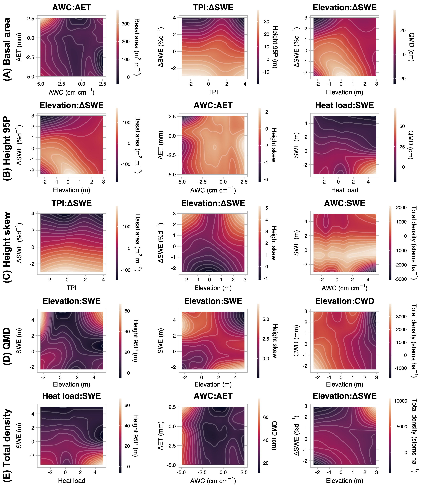

```{r setup, include=FALSE}
knitr::opts_chunk$set(echo = TRUE)
```

```{r config, include=F}
config <- config::get(file=file.path('config', 'config.yml'))
devtools::load_all()
load.pkgs(config$pkgs)
```

```{r source, echo=F, include=F}
source('./inst/ms/tables.R')
```

# Abstract
Abiotic factors dictate much of the variability in forest structure and composition. At broad scales, climatic factors such as actual evapotranspiration (AET) and climatic water deficit (CWD) are often the strongest constraints. However, at finer scales, such as that of a watershed, other locally varying topographic and edaphic factors may mediate the effects of synoptic climate. Here we quantified the effects of a range of abiotic factors on conifer stand structure and composition at watershed scale. We used full-waveform LiDAR and individual-tree detection to derive spatially continuous stand structure metrics within an upper montane--subalpine domain in the Rocky Mountains of Colorado. We fused these with a species-level classification map to estimate tree species densities. Using generalized additive and gradient boosting models, we evaluated the covariability of structural and compositional metrics with a suite of climate, topography, soil, and geologic variables. Peak snow input and snow disappearance rate, and elevation explained the majority of variability in stand density, with nonlinear relationships. Stand density was related to snow water equivalent along an approximately quadratic function, positively to snow disappearance rate and elevation along an approximately cubic function, and positively related to soil water content along a more complex polynomial function. The same factors explained most of the variation in maximum canopy height, quadratic mean diameter, and basal area, but the functional forms were inverse of those for density. Height skew, an index of the relative proportion of small and large trees in a stand, was poorly correlated with all factors. Quantifying the drivers of fine-scale heterogeneity in the structure of montane and subalpine forests is an essential foundation for understanding how these systems will respond to synoptic environmental change, for establishing a baseline against which these responses can be measured, and for devising conservation and management strategies that promote forest resilience.

# 1. Introduction

As climate warming accelerates, high-elevation forests face increasing stress exposure, which could induce long-term changes in their structure, composition, and function. Rising rates of climate-driven forest decline and mortality [@vanmantgem_climatic_2013; @higuera_fire_2014; @mcdowell_darcy_2015; @mcdowell_pervasive_2020] are likely outpacing concomitant increases in seedling establishment and range expansion [@macias-fauria_warminginduced_2013; @kueppers_warming_2017; @conlisk_declines_2017; @andrus_moisture_2018; @hankin_lethal_2024]. Because these forests regulate snow accumulation, runoff, and surface-to-atmosphere water flux, shifts in structure and composition will have large effects on the timing and quantity of water released into the major water basins of the Western U.S. [@milly_hydrologic_2011; @milly_colorado_2020; @foster_resolution_2020]. Forecasting how these systems will respond to emerging environmental pressures and devising management strategies that balance forest resilience against water-resource stability depend first upon understanding the fine-scale abiotic drivers of forest physiognomy under steady-state conditions. However, several critical gaps exist in this baseline understanding from high-elevation forests.

Forest structure and composition emerge from complex interactions between a variable abiotic environment and the trait-driven mechanisms by which biotic agents respond to and influence this environment [@prentice_concepts_1986; @prentice_pattern_1990; @mcdowell_pervasive_2020]. In the large corpus of work that has considered these interactions, climate factors (namely, radiation, moisture, or proxies thereof) frequently emerge as the dominant features. Climate is therefore widely considered the primary driver of species distributions and structural diversity, particularly at regional to global scales (e.g. [@shreve_vegetation_1915; @whittaker_consideration_1953; @delcourt_dynamic_1983; @urban_landscape_1987; @stephenson_climatic_1990; @urban_forest_2000; @swenson_ecological_2007; @moles_global_2009; @zhang_regional_2016; @fricker_more_2019]). In temperate mountain forests, structural characteristics such as stem diameter, basal area, and maximum tree height are generally thought to decline with increasing elevation, with temperature as the key limiting control [@monk_biomass_1988; @king_tree_2013]. The same properties also tend to decline from northeast-to-southwest exposures in the Northern Hemisphere, perhaps due to increasing vapor pressure deficit along the aspect gradient [@mcnab_terrain_1989; @mcnab_topographic_1993; @bolstad_forests_2018]. Climate also influences species mix, and species associations with specific sites may be attributable to functional strategies developed in response to variability in radiative [@morin_processbased_2007; @korner_worldwide_2004; @rehfeldt_empirical_2006] and hydrologic [@whittaker_vegetation_1964; @wainwright_watershed_2022] regimes. 

However, several issues complicate interpretation of these dynamics. First, temperature and moisture availability tend to covary closely along the same elevational and latitudinal gradients and so cannot be easily disentangled [@urban_forest_2000]. Such interdependence may obscure underlying vegetation-environment dynamics: e.g. temperature partially drives atmospheric demand and influences stomatal regulation, contributing both positive and negative feedbacks to plant-available moisture [@peters_contrasting_2019]. Moreover, the asynchrony of precipitation input and atmospheric demand in many regions can lead to seasonal biases in estimates of plant-available water and energy over time [@stephenson_climatic_1990; @stephenson_actual_1998; @urban_landscape_1987]. Further, recent work has challenged the primacy of climate altogether: at least one study has found that edaphic properties may explain a greater share of variation in the abundance of trees across global biomes than climate [@delgado-baquerizo_influence_2020], though this may be partially explained by connections between soil composition and available water capacity.

As difficult as it is to isolate the influence of specific abiotic drivers of emergent forest properties at broad scales, the task is perhaps even more daunting at finer scales, such as a watershed or hillslope, where microclimate, substrate, and vegetation physiognomy can vary widely with small changes in position [@dobrowski_climatic_2011; @adams_topography_2014; @barnard_topoclimate_2017]. Elevation and aspect modulate the radiative forcing at a site, as does shading by adjacent landforms, while local orographic lift or rain shadowing modulates the precipitation forcing. Slope steepness increases the risk of stem mechanical damage [@read_plant_2006; @stokes_multi_2012], while wind exposure limits attainable height [@larjavaara_maintenance_2010] and produces heterogeneous patterns of water availability via snow redistribution and ablation [@hiemstra_observing_2006]. Soil properties such as parent material, texture, pH, and depth directly constrain plant-available water and nutrients. Each of these factors and their system of interactions pose constraints to which trees must respond.

The preponderance of research describing the relationships between the abiotic environment and forest structure and composition comes from Eastern North American deciduous forests and the tropics, with much less from forests of Western North American ranges, where one might expect even more pronounced topoclimatic variability. Among the few studies that have evaluated a complement of abiotic controls on structure and composition in Western North American forests, @kane_water_2015 found that actual evapotranspiration (AET) and climatic water deficit (CWD) explained the greatest proportion of variance in canopy cover and 95th percentile height in a Sierra Nevada domain, consistent with the theory of radiation-moisture primacy. @fricker_more_2019 reported that CWD and mean annual precipitation (MAP) explained the majority of variance in the distribution of maximum tree heights across four Sierra Nevada forest types. But they also detected a strongly non-linear elevational control on canopy height, with bimodal maxima 1200 and 2300 m.a.s.l., potentially pointing to an "ameliorative" effect of radiation on the elevational lapse rate. @greenberg_limitations_2009 found a unimodal distribution of stem densities with elevation in the Sierra Nevada, with a peak around 1900 m.a.s.l. and declines toward the extremes of both low elevation/high radiation and high elevation/low radiation. 

These latter two findings point to an important constraint in evaluating high-elevation forests: trees may be limited by water in some positions and by energetics in others. Although definitions of water-energy limitation vary [@hawkins_energy_2003; @whittaker_geographical_2007; @dudney_energy_2023; @denissen_widespread_2022], here we adopt the following ecohydrological framework [@roebroek_global_2020; @dudney_energy_2023]. In water-limited locations, vegetation productivity is more sensitive to moisture than to radiation, such that a marginal increase in temperature or photosynthetically active radiation (PAR) does not yield a corresponding productivity increase. Conversely, in energy-limited locations, productivity is more sensitive to temperature and photosynthetically active radiation (PAR), such that a marginal increase in those values does yield a corresponding productivity increase. Water-limited conditions often arise in locations with high CWD, i.e. where potential evapotranspiration (PET) is much greater than available moisture and increasing radiation drives evaporative soil moisture loss. Energy-limited conditions often arise in locations with low CWD, where irradiance is insufficient to raise plant metabolic temperatures or drive photosynthesis for much of the year [@roebroek_global_2020]. Because CWD and convective temperature tend to decrease with increasing elevation, water- and energy-limitation gradients are often mapped to elevation [@korner_worldwide_2004]. But since other locally varying topographic factors also modify radiative and moisture conditions, sites at similar elevations but with, say, different slopes and aspects may experience different limitations. Mapping the mosaic of dominant ecohydrological controls on forest productivity in a landscape—accounting for the interplay between water and energy availability and their topographic modulations—has proven an elusive quarry [@greenberg_limitations_2009; @pelletier_which_2018; @roebroek_global_2020]. 

One major challenge facing these lines of inquiry has been the difficulty of acquiring representative measurements of forest structure and their environmental covariates. Most prior work in this field has relied on plot or transect observations, which likely do not represent the full ranges of either structural/compositional or abiotic gradients, particularly in complex, inaccessible terrain [@hurtt_potential_2004; @antonarakis_using_2011; @lydersen_topographic_2012; @antonarakis_imaging_2014]. Additionally, disturbance and recovery dynamics in subalpine forests operate on such long timescales that it becomes difficult to tease out the signal of population processes from the structural characteristics observed in a sampling plot: any such characterization is a snapshot in time and may or may not represent the productivity potential (or holding capacity) of a site. Even within mature, close-canopied (i.e., "climax") forests, properties such as stand density, age-class distribution, allometry, species composition, and species dominance can vary widely over space. Efforts to scale up these properties to a watershed from plot observations alone can yield substantial error terms.

Light Detection and Ranging (LiDAR) helps to overcome some of these limitations by enabling comprehensive measurements of forest structure on a spatially continuous basis [@mallet_fullwaveform_2009]. In particular, full-waveform LiDAR datasets from aerial and satellite platforms, along with new open-source libraries for cleaning and processing the data, have the potential to provide spatially rich information about forest stand characteristics [@mallet_fullwaveform_2009; @zhou_waveformlidar_2019; @zhou_gold_2017]. Like discrete-return points, waveforms can be used to delineate individual canopy trees and to estimate individual-scale characteristics such as stem diameter, stem height, stem volume, and crown volume [@jucker_allometric_2017; @zhou_waveformlidar_2019; @dalponte_system_2011]. Waveforms can also be processed to generate continuous estimates of forest structure parameters at the grid scale. Using waveforms appears to yield higher accuracy than discrete returns in both object-oriented and continuous-estimate methods, particularly for characterizing mid-canopy and sub-canopy structure [@anderson_waveform_2016; @adams_another_2011; @chauve_advanced_2009]. Calibrating remote sensing estimates against *in situ* stem diameter and height measurements yields further accuracy improvements [@antonarakis_using_2011; @jucker_allometric_2017]. In addition, imaging spectroscopy has increasingly been used to characterize species abundance and compositional patterns in forests [@plourde_estimating_2007; @anderson_integrating_2008]; Falco et al. in review. Integrating information on forest structure and species composition can improve the dimensionality and detail of ecosystem representation from remote sensing [@anderson_integrating_2008; @chadwick_integrating_2020; @marrs_machine_2019; @falco_ecoimaging_2024].

@kane_water_2015, @bolstad_forests_2018, @greenberg_limitations_2009, @fricker_more_2019, and @falco_ecoimaging_2024 are the only studies we have identified that use LiDAR to evaluate forest structure and/or composition along multiple abiotic gradients on a spatially continuous basis in North American mountainous forests. These relied on lower-density discrete LiDAR point clouds, which enabled analysis of top-of-canopy structural metrics (canopy height, canopy cover) and statistical proxies of maximum density, but not detailed characterizations of sub-canopy metrics. To our knowledge, no prior study has (a) exploited the high granularity of waveform LiDAR to estimate a suite of structural properties through the canopy profile, (b) integrated these estimates with species compositional metrics, or (c) characterized their associations with a underlying environmental gradients on a spatially continuous basis. To address this gap, we pursued two objectives: 

1. To accurately predict conifer forest stand structure and composition across a Southern Rocky Mountain landscape;
2. To quantify the relative influence of climate, topographic, edaphic, and geologic factors on conifer stand structure and composition, and describe the functional forms of these relationships and interactions between explanatory variables. 

We used a full-waveform LiDAR dataset acquired over Colorado’s East River watershed to quantify forest canopy structure through the vertical profile. We integrated these metrics with a species classification map derived from imaging spectrometry and assessed the performance of structural and compositional estimates using field inventory measurements of 4355 trees. We then used inferential modeling strategies to quantify the relative influence of individual  and interacting abiotic factors on the spatial variability of forest stand structure and composition.

<!-- Hypotheses: -->
<!-- 	1. the interaction between elevation and topographic wetness is a stronger explainer of total stem density and basal area than any single topographic variable, and that both density and basal area will vary inversely with the two-way interactions.  -->
<!-- 	2. We expected a clear division between pine and spruce-fir distributions, explained by the interactions between elevation, aspect, and hillslope. In general, we expected pine to dominate lower-elevation and south-facing slopes and spruce-fir to dominate north-facing slopes and higher elevation positions. However, we anticipated that the interaction between elevation and hillslope position would complicate this general trend somewhat, because of cool-air pooling that allows lower minimum temperatures and lower evaporative demand to persist in valley bottoms, even at low elevations where pine would otherwise be expected (Dobrowksi 2011). -->
<!-- 	3. Spruce and fir total stem density diverge, with spruce density increasing with elevation and fir density reaching a peak at mid-elevations.  -->

# 2. Methods
## 2.1. Study area
The study domain comprised upper montane-subalpine conifer forests in Colorado’s East River watershed (38°55’ N, 106°56’ W; Fig. 1). The East River is a headwater tributary of the Colorado River, the principal freshwater source for one in 10 people in the U.S. [@reclamation_colorado_2012]. The 750 km^2^ catchment includes six major drainages discharging to perennial streams. Mean annual temperature is 1.9 º C, with a mean monthly maximum and minimum of 11.2 º C and –7.1 º C respectively, measured 1980--2023 at the NOAA Crested Butte weather station (CBUC2) at 2700 m near the center of the watershed. Mean annual precipitation is 1200 mm y^–1^, approximately 70 percent arriving as winter snow and 30 percent as rain during the summer monsoon. Maximum air temperatures are depressed at high elevations and minimum air temperatures by cold air downwelling at low elevations. Precipitation is also strongly influenced by elevation, with snow accumulation generally increasing with higher elevation. 

Besides these broad patterns, the domain’s stark relief and topographic complexity coordinate to produce highly variable local climatic conditions. The watershed has 1420 m of elevational relief, multiple peaks extending above treeline, and pronounced gradients in slope, aspect, insolation, and hillslope position. Within the forested parts of the domain, slopes range from 0.5º to 49º, with a median of 17º. Aspects are approximately evenly distributed around the compass, although there are slightly more southwest-facing slopes than those facing other directions. 

Approximately 34 percent of the forested domain is underlain by the cretaceous Mancos shale formation, 24 percent by Middle-Tertiary granodioritic laccoliths, dykes, and sills, and another 21 percent by coal-bearing sandstone-silt deposits of the cretaceous Mesa Verde Formation. The remainder comprises a mixture of minor sandstone and mudstone formations as well as younger glacial and colluvial landslide deposits. Soils derived from these diverse parent materials show substantial variability in plant-available water, with estimated soil available water capacity (AWC) ranging from 0.02 to 0.19 cm H~2~O cm^-1^ soil.

Several recent studies in this watershed have investigated covariability between plant functional types/traits and abiotic properties. @wainwright_watershed_2022, for example, found that conifer stands were associated with steep, mid-elevation hillslopes with less fractured bedrock, while @uhlemann_surface_2022 showed that the bedrock properties can be estimated as a function of geomorphological features and plant functional types. @wainwright_watershed_2020 also found that elevation, aspect, and geology were key factors determining the spatial heterogeneity of plants’ sensitivity to early snowmelt and growing-season drought conditions. Further, a recent study mapping the watershed's dominant shrubland, meadow, and forest species using hyperspectral imaging has shown broad heterogeneity in species distributions, phenological dynamics, and leaf functional traits (nutrients, leaf mass per area) in forest vegetation, strongly influenced by microtopographical properties such as topographic wetness, solar insolation, and slope [@falco_ecoimaging_2024]. 

Within the watershed's forests, the dominant tree species are Engelmann spruce (*Picea engelmannii*), subalpine fir (*Abies lasiocarpa*), lodgepole pine (*Pinus contorta var. lasiocarpa*), and quaking aspen (*Populus tremuloides*), with occasional Douglas fir (*Pseudotsuga menziesii var. glauca*) at mid-elevations. A few limber pine (*Pinus flexilis*) individuals exists near treeline on one peak. Natural histories of subalpine forests elsewhere in Colorado describe species distribution patterns that largely hold in this domain. Engelmann spruce and subalpine fir tend to co-occur in high densities throughout the subalpine zone (~2700–-3000 m.a.s.l.) and only sparsely in the upper montane zone (~1850--2900 m.a.s.l.) [@alexander_ecology_1987; @falco_ecoimaging_2024]. At middle and high elevations up to treeline, the longer-lived spruce is often the canopy dominant (~70 percent of canopy basal area), while fir may occupy up to the same proportion of the understory [@alexander_ecology_1987]. Near treeline, pure spruce stands are common, while fir often dominate the canopy in the lower end of the subalpine zone, particularly in xeric topographic positions [@alexander_ecology_1987]. Douglas fir tend to dominate mesic sites, including north-facing toe-slopes and high-elevation south-facing slopes. Lodgepole pine also occur intermixed with spruce and fir on dry, southerly upper slopes in the lower range of the subalpine zone and abundantly in monospecific, even-aged stands throughout the montane zone, particularly on south-facing slopes and steep slopes of all aspects [@veblen_age_1986]. Near the lower limits of the Engelmann spruce and subalpine fir elevational range, lodgepole pine tends to establish as a pioneer post-disturbance and is later replaced by the former species [@whipple_age_1979]. 

Management and disturbance influence forest structure and could obscure relationships between forest vital rates, emergent structure/composition, and underlying abiotic constraints. Logging related to the mining industry occurred in some parts of the watershed during the 19th and early 20th centuries, with a limited footprint enduring today. This said, the watershed includes large stands where little to no tree removal occurred, and stands with old trees and uneven age and size structure are well distributed. In addition, all forested areas analyzed sit on Forest Service land, and 22 percent of these in management-restricted wilderness. We suggest that, because of its low timber value, long fire return intervals, and relative lack of recent management, this domain offers a more realistic basis for understanding abiotic drivers of stand structure in a temperate conifer forest.

## 2.2 Full-waveform LiDAR
Between June 12 and 26, 2018, the National Science Foundation National Ecological Observatory Network (NEON) Airborne Observation Platform (AOP) [@kampe_neon_2010] surveyed approximately 330 km^2^ of the watershed (Fig. 1) [@goulden_neon_2020; @chadwick_integrating_2020]. The AOP collected discrete-range and full-waveform LiDAR returns using an Optech Gemini discrete LiDAR sensor and waveform digitizer with a pulse repetition frequency between 33 and 100 kHz. Discrete-return point density in the post-processed dataset ranged between 1 and 9 returns m^-2^, which was insufficient for characterizing subcanopy structure. We therefore elected to process the full waveforms, which had a nominal density between 1 and 4 pulses m^-2^. Exploiting the higher information density of full-waveform pulses allowed us to develop more complete characterizations of stand structure than would have been possible with discrete returns alone.

We followed a standard approach for processing the waveforms into an analyzable structure. First, we used a spectral deconvolution procedure to isolate the target-response signal from its interactions with the LiDAR system's outgoing pulse, atmospheric scattering, and system noise. We used the Gold deconvolution algorithm in the `waveformlidar` package in the R statistical computing environment [@zhou_waveformlidar_2019], but refactored its implementation for parallel computing. The result of the algorithm approximates the true distribution of scattering objects along the outbound light pulse's path. We then applied an adaptive Gaussian decomposition algorithm to fit one or more Gaussian models to the return pulse components based on Equation 1: 

$$f(x,\theta) = \sum_{(i=1)}^{n} A_i \times exp\biggl[-\frac{(x-\mu_i)^\lambda}{(2\sigma_i^2)}\biggr]$${#eq:eqn1}

where $A_i$ is the amplitude of waveform component $i$, $\mu$ is the bin location of $i$ (measured as a point in time, ns), $\sigma$ is the standard deviation of $i$, and $\lambda$ is a penalty parameter that minimizes model residual over a specified number of iterations. Fitting was accomplished using the function `nlsLM` in the R package `minpack.lm`. Where multiple peaks were detected, the algorithm fit a separate function to each and expressed the final fit as the sum of $n$ Gaussian functions. 

The deconvolution and decomposition procedures were applied to the full set of waveforms in parallel on 256 cores on the University of California, Berkeley's high-performance computing cluster. In total, we processed approximately 1.4*10^9^ waveform returns. Of these, a negligible fraction (approximately 0.5 percent) either had no detectable peaks or represented backscatter records that could not be fit to a Gaussian function. Where peaks could not be identified, the waveforms were dropped from the set. Where they could not be fit to the Gaussian, the characteristic components (e.g, amplitude, time to median energy) were estimated from the deconvolved returns directly, without curve fitting.

After decomposition, we used the geolocation matrices provided with the NEON data to geolocate the waveforms and then extracted characteristic metrics from the fitted waveforms. These included the peaks’ location in three-dimensional space, their amplitude and width, front slope, and time to median intensity [@goulden_neon_2020]. We then used the R package `rlas` to discretize this information [@roussel_rlas_2023]. We normalized the discretized points to the Earth surface by differencing their z-values against a digital elevation model (DEM) derived from the discretized point cloud. We then decimated the high-density returns, preserving all of the identified peaks to obtain a discretized point cloud of 5.72*10^9^ points with a uniform density of 15.3 points m^-2^ across the domain.

## 2.3 Field census

Between 2018 and 2022, we established 25 long-term forest monitoring plots in the East River and nearby drainages. The sites were stratified across six topographic gradients (Table 1). An initial set of 68 sites was preselected via Latin hypercube sampling on six topographic gradients derived from the USGS 1/3-arc second DEM (@usgs_dem_2017). The final 25 sites were selected from among that group after scouting and optimizing the distribution of the set along the topographic gradients (Fig. S1). At each site we installed a 40 m x 40 m plot, using slope corrections to approximate a projected flat-surface area of 1600 m^2^. To minimize edge effects, we located plots at least 100 m from forest edges and major compositional transitions. We aimed to partially mitigate unobserved management and disturbance effects by siting inventory plots in stands where no recent harvest or major disturbance had occurred, based on (a) visual inspection for cut stumps and remnants and (b) stability of the Normalized Difference Vegetation Index (NDVI) over the 40-year Landsat record (1980-present).

We used a survey-grade GNSS receiver (Trimble Geo 7X, Trimble, Inc.) to georeference all plot locations *in situ*. To establish absolute georeferencing we made a minimum of six measurements over multiple days at each plot corner and took the arithmetic mean of recorded coordinates, inversely weighted by reported horizontal uncertainty. Positioning data were post-processed in TerraSync (Trimble Inc.) with differential correction using the Continuously Operating Reference Stations (CORS) Network station SE01 (39.40035, -107.212101; NOAA 2020). Estimated planimetric accuracy of plot corner locations was $\pm$ 0.35 m.

We conducted a field census of approximately 9000 trees in the 25 plots (Table 2). All trees of any species with a diameter at breast height (DBH, measured at 1.3 m above the ground) $\geq$ 1.0 cm were labeled with an aluminum tag. For each tagged tree, we recorded species and measured diameter at breast height (DBH) using a standard metric forestry diameter tape (for stems $\gt$ 7 cm DBH) or calipers ($\leq$ 7 cm). We measured stem heights with a Nikon LaserPro II laser hypsometer (for stems $\gt$ 5 m in height) or a rigid metric tape measure ($\leq$ 5 m). To maximize precision, hypsometer measurements were repeated on each tree until measurements converged within 0.5 m. Expected vertical accuracy on hypsometer measurements was $\pm$ 1.0 m. 

Stems were then geolocated using either the GNSS receiver or by measuring the direction and distance from a geolocated reference tree with a digital compass and rigid metric tape. For those positioned with the GNSS, the receiver was positioned in contact with the side of each tree stem at 1.3 m. We enforced a maximum estimated horizontal uncertainty threshold of 1.0 m during recording, and we recorded a minimum of 30 positional observations at a rate of 1 observation s^-1^ for each stem. In total, 5899 (89.4 percent) of the stems surveyed were positioned. Those without unique geolocations were less than 5 m in height and were fully suppressed beneath the canopy of another tree, such that it was extremely unlikely for tree crown segmentation to differentiate the suppressed tree from the dominant. For geotagged trees, mean planimetric accuracy was 1.01 m (s.d = 0.70 m).

Seventeen of the 25 plots lay within the overflight footprint of the 2018 NEON AOP acquisition [@goulden_neon_2020; @goulden_post_2020; @chadwick_integrating_2020]. We used the observations from this subset for training and validation of models developed in the next phase of analysis. The 17 focal plots contained 5828 observed trees, of which 4355 were living at the time of inventory. 

## 2.4. Tree crowns, species composition, and stand structure

### 2.4.1 Tree crowns
We followed the general approach in @dalponte_individual_2019 to generate an individual tree crown (ITC) map and gridded estimates of conifer forest structure and composition. The tree crown map comprised point objects describing the position, height, and stem diameter of all trees $gt$ 1.3 m height in conifer stands. The gridded data comprised continuous maps of forest structure metrics at 100m grid scale. To generate these products, we integrated the discretized LiDAR and inventory data to optimize and validate an individual tree detection (ITD) model at the field plots, which we then applied to the watershed's remaining conifer forest area. As we detail below, this approach (1) iterated through many permutations of possible parameters for seven ITD algorithms; (2) computed performance metrics at each iteration; and (3) selected the best performing algorithm and parameter set to apply to out-of-sample data. 

First, we extracted the discretized LiDAR data within a 5 m buffer around the boundaries of each field plot. We then attempted to detect tree crown objects from the discretized data using algorithm $A_i$ and parameter set $\lambda_{j,k:l}$, where $\lambda_j$ is one of a set of parameters taking user-specified values required for the algorithm to proceed, and $k:l$ is a vector of values on that parameter (Table S1). The 5 m buffer ensured that points associated with trees along plot boundaries were correctly included in the operation; however, any trees identified in the buffer zone outside of the plots were removed after each detection attempt. We then applied the automated matching procedure described in @eysn_benchmark_2015 and @pang_nystrombased_2021 to link detection results to reference observations from field inventory. In this way, we were able to evaluate the performance of each algorithm-parameter combination and compare models against each other. We opted for an automated matching approach because (1) the computational scale of our method (up to 2800 delineation attempts per algorithm per site) made manual interpretation infeasible, and (2) doing so enabled us to enforce clear, objective rules for reproducibility. In early testing, we also evaluated bipartite matching strategies seeking to minimize the Euclidean and Mahalanobis distances between detected and reference trees [@hansen_optimal_2006]. We ultimately selected the @eysn_benchmark_2015 method based on superior inter-tree and inter-site matching performance. 

The matching process began by selecting the tallest detected tree ("target") and searching for candidates among reference trees satisfying Euclidean height (∆Z) and horizontal distance (∆XY) criteria specified in Table 3. The reference candidate with the least ∆XY was chosen as a tentative match to the target. The candidates were then queried a second time. If a candidate with greater ∆XY proved closer in height to the target, and its ∆XY was at most 2.5 m more than ∆XY of the tentative match, it was selected as the match. However, since an optimal match depends not only on the neighborhood of reference trees, but also on other nearby *detected* trees, the target was then compared against other detected neighbors. If another detected tree was closer in horizontal and vertical distance to the matched reference, the pairing was discarded. This process was repeated on all remaining detected trees in descending order of height, until all reference trees had been evaluated. Matches were then removed from the set, and the process was repeated until no further matches could be found under the search criteria. 

For each run of $\lambda_{i,j:k}$ on $A_i$ we tallied the extracted trees, true positives (TP, or successful matches) false positives (FP, or commission errors), and false negatives (FN, or omission errors). We used these values to compute the performance statistics in Table 4. The root mean squares (RMS) of all performance statistics were calculated across the 17 plots as unbiased estimators of the performance of each $A_i$ and parameter set $\lambda_{i,j:k}$.

We then selected the algorithm and parameter permutation that had yielded the maximum root mean square *F* score across all $\lambda_{i,j:k}$. *F* is a proportion representing the harmonic mean of precision (the proportion of all tree detections that were correctly matched) and recall (the proportion of all possible matches that were correctly matched). Perfect detection and match rates would yield an *F* score of 1.0, while failure would yield 0.0. It was selected as the optimization statistic over overall accuracy for its balanced sensitivity to both over- and under-detection. 

Of the eight algorithms tested, Layer Stacking [@ayrey_layer_2017] yielded the highest *F* score across training and testing sets (Table 4, Table S2). The algorithm proceeds by first dividing the point cloud into stacked horizontal layers at 1-m intervals, starting at $\lambda_1$ m above ground (Table 5). A series of clustering procedures is then applied to each layer. In the lowest three layers ($\lambda_{1}+1 : \lambda_{1}+3$ m a.g.), points are clustered through Density-Based Scanning [@ester_densitybased_1996]; points within these initial clusters are removed as non-tree low vegetation, while those lying outside clusters are retained as sparse returns from small tree boles. Next, a canopy height model (CHM) of resolution $\lambda_2$ is computed from the point cloud. Tree tops are identified from the CHM using a local maximum filter (LMF) with a window of radius $\lambda_3$. Then, points in each layer undergo *k*-means clustering, using the local maxima as seeds, and a polygonal buffer of radius $\lambda_4$ is placed around each resulting cluster. The polygons from each layer are then flattened and rasterized to create an intermediate "overlap map." This abstraction quantifies the density of clusters, such that areas of high-density polygonal overlap represent individual trees. In conifer forests, this delineation can be improved with an additional parameter, $\lambda_5$, which enforces higher weighting for clusters near the canopy top, because these tend to be closer to a conifer's center. A second LMF is applied to the overlap map, using a window of radius $\lambda_6$, and local maxima are taken to be tree centers. Additional smoothing of the local maxima, and filtering and merging of clusters, yields a set of points representing tree tops with embedded height and position information.

For the remainder of the LiDAR-surveyed domain, we subset the discretized waveforms over conifer forest by finding their intersection with conifer-classified pixels from a species-level classification map derived from the NEON hyperspectral acquisition [@falco_vegetation_2024]. We forced the Layer Stacking algorithm with this subset of LiDAR data and the optimal parameter permutation to delineate all tree crowns in the watershed's conifer stands. The result was a spatially continuous dataset of conifer tree objects describing their locations and heights. To estimate the DBH of each delineated object, we estimated coefficients for an allometric function using binned plot observations, following @jucker_allometric_2017. The equation to fit was: 

$$\hat{DBH} = exp[\alpha + \beta\ log(H)] \times exp[\sigma^2/2]$$ {#eq:eqn2} 

where the H is tree height above ground and $\sigma^2$ is the mean square error of the regression. Per @jucker_allometric_2017, the last term is an approximation of theoretical model error $\epsilon$, assuming $\epsilon$ is normally distributed, and is imposed to yield an unbiased prediction of DBH. 

### 2.4.2. Species composition
The tree-crown product was fused with a forest species classification dataset, developed  at 1 m resolution through a support vector machine classifier on 2018 NEON AOP hyperspectral imagery [@falco_vegetation_2024]. From the discretized waveforms, we computed a canopy height model at 0.5 m resolution across the full domain and used this to force a marker-controlled watershed segmentation algorithm, with the identified tree crown objects as controls [@plowright_foresttools_2024]. This procedure produced polygons demarcating the estimated crown perimeters of every crown identified through Layer Stacking. Because the passive imaging spectrometer generally received reflectance signals only from light-exposed portions of tree canopies, it was necessary to filter our segmented tree crown objects to match the hyperspectral targets as nearly as possible. Attempting to align species information with mid- and subcanopy objects yielded unacceptably poor agreement. We therefore filtered the LiDAR-detected trees to the canopy top by removing all objects below the 90th percentile height. We performed the filtering independently in each cell of a 100 m grid to account for height variability across the domain. We then overlaid the remaining polygons on the classification raster and assigned each object to a single tree species according to the majority rule, i.e., if 50 percent or more of the pixels intersecting the object were classified to that species [@dalponte_individual_2019]. For objects where less than 50 percent of pixels belonged to a single species, we labeled the object "NA." 

### 2.4.3. Forest structure
From the fused product, we computed continuous area-based structural metrics by summarizing object-level predictions at specified grid scales across the watershed (Fig. 5). Structural metrics included total density, stand basal area (BA), quadratic mean diameter (QMD), diameter and height percentiles, and skewness of height, all computed at the level of a grid cell. Total density (stems ha^-1^) was a sum of the number of trees over grid cell area for all trees and per species. BA (m^2^ ha^-1^) was computed as: 

$$BA = \frac{\sum_{i=1}^{n}\pi (DBH/2)^2}{grid\ cell\ area}$$ {#eq:eqn3}

QMD (cm) was computed as:

$$QMD = \sqrt{\frac{1}{n}\sum_{i}^{n}{DBH^2}}$$ {#eq:eqn4}

where $n$ is the number of trees in the cell. Skewness of height was computed as the third central moment of the distribution of stem heights. Larger positive values signified a more positive skew, with a larger proportion of trees in smaller height classes than a normal distribution. More negative skew values signified a negative skew, with a larger proportion of trees in larger height classes. To further restrict the analysis to intact conifer forest stands (as opposed to isolated trees or mixed forest), we further masked each raster, preserving pixels where conifer total number density was greater than 100 stems ha^-1^ and removing a 100 m buffer around roads, developed areas, and the outer perimeter of the NEON AOP LiDAR acquisition. During processing, we discovered that the waveform returns from four adjacent AOP flightpaths were missing. According to the NEON post-flight report, a hardware failure on June 6, 2018 prevented the waveform digitizer from collecting GPS timing signals, which rendered the waveform data irretrievable [@goulden_post_2020]. In early testing we attempted to gap-fill this region by processing the NEON discrete-return point cloud, but ultimately abandoned the effort because of unacceptable anomalies from the higher-fidelity waveform-based estimates. This gap is visible as an empty north-south swath in the forest structure products and is excluded from analysis, along with a 100 m buffer around its perimeter to minimize edge effects.

## 2.5. Abiotic explanatory variables

### 2.5.1. Topography 
We generated six topographic variables from the NEON 1 m DEM (see Table 1 and Fig. S2). Elevation (m) was computed at the 100 m pixel scale by averaging the raw DEM. Slope angle (degrees) and aspect (degrees) were computed from the elevation product with the `terrain` method in the R package `terra` with 8 neighbors [@horn_hill_1981; @hijmans_terra_2024]. We further transformed the aspect product by folding values about the 25ºNE-205ºSW line. This transformation—onto a scale with a maximum on southwest faces and minimum on northeast faces—yields a more ecologically relevant measure of aspect-constrained exposure [@mccune_equations_2002]. The fold line we selected represented the estimated angles of highest and lowest mean annual incident radiation in the domain, given the watershed's latitude and slope orientation. Total heat load (unitless index) was calculated from folded aspect and slope angle using the method in [@mccune_equations_2002]. Topographic position index (TPI) is a morphometric measure that classifies a landscape along a gradient of slope positions, from toeslope to ridgetop. We computed TPI at each pixel as the difference between the elevation at the target point and the mean elevation within a neighborhood of 9 pixels (1000 m), normalized to the standard deviation of elevation in that window [@wilson_terrain_2000]). TPI values are more positive when a target point is higher than its neighborhood, and more negative when the target is lower. Topographic Wetness Index (TWI) ($log(m^2/m)$) is a measure of the relative capacity of an area to accumulate water through surface or subsurface flow. We selected this metric as a proxy for relative soil moisture conditions. We used the implementation in the R package `dynatopmodel`, which calculates TWI as the log ratio between a pixel's upslope contributing area and its own slope angle [@metcalfe_dynatopmodel_2018]. 

### 2.5.2. Climate
To estimate relative spatial patterns of snow accumulation (m), we retrieved snow water equivalent (SWE) data produced by Airborne Snow Observatories, Inc (formerly NASA/JPL Airborne Snow Observatory; ASO) from flights on March 31, 2018, April 4, 2019, and April 21, 2022 [@deems_lidar_2013; @painter_airborne_2016; @painter_aso_2018; see also https://data.airbornesnowobservatories.com/)]. The flights occurred before the onset of snowmelt in each season. The ASO SWE product was generated from observations of snow depth, spectral albedo, and radiative forcing from a coupled imaging spectrometer and terrestrial laser scanning system, combined with snow density modeled using iSnobal [@painter_airborne_2016]. We also produced an estimate of the relative velocity of snow disappearance (% day^-1^). In each flight year, we differenced the snow-on values and values from subsequent flights in late spring of each-year (May 24, 2018; June 10, 2019; and May 18, 2022, respectively), and normalized these to the snow-on values for a percent change. We then divided these percentages by the day interval between paired flights. While the ASO data may not have captured peak snow depth or maximum snow-free extent in each season, averaging across three years of flights enabled us to approximate dominant spatial patterns of accumulation and disappearance across the basin.

We also used estimates of annual mean total AET and CWD generated by the Basin Characterization Model (BCM) for the Upper Colorado Basin from 1985 to 2012 [@buto_catchmentflowline_2017]. The BCM output package characterizes the water balance for a subject region at 270 m resolution. The model is forced with monthly data and has been widely used in ecological and management applications [@flint_finescale_2013]. From this dataset, AET is the depth of water (mm) evaporated from the surface or transpired by plants within each pixel. CWD is calculated as the difference between potential evapotranspiration (PET) and AET (mm), where PET is the total depth of water that can be evaporated or transpired given prevailing atmospheric conditions. Under non-limited moisture conditions, AET equals PET and CWD is 0; positive CWD values correspond to moisture deficit, or an excess of atmospheric demand relative to available water in the soil [@buto_catchmentflowline_2017].

### 2.5.3. Soil
To evaluate edaphic effects on forest structure and composition, continuous estimates of soil properties were derived from the U.S. Department of Agriculture (USDA) Natural Resources Conservation Service (NRCS) Soil Survey Geographic Database (SSURGO) [@soilsurvey_ssurgo_2023]. SSURGO contains geospatial information on soil properties predicted via an ensemble of regression, classification, and machine-learning operations on observations from *in situ* soil samples and environmental predictor variables. Spatial and attribute data were retrieved from the database using the R library `FedData`, using the keys for area symbols that intersect the study domain (CO654, CO660, CO661, CO662) [@bocinsky_feddata_2024]. The hierarchical data structure contains polygons demarcating mapping units at 1:12000 scale. Each mapping unit is made up of one to three major components and potentially several minor components. A component is defined as a field-classified soil type with common characteristics. For example, the Evanston component, which appears in our study domain, occurs on side valleys and alluvial fans on slope grades from 5 to 20 percent. Evanston soils are derived from rhyolitic or sandstone alluvium, and organic content tends to be low. While components are not spatially explicit, their proportional contribution to the makeup of a map unit is stated. Further, each component is associated with detailed data from its constituent horizons. 

After joining the spatial and attribute tables, we aggregated horizon-scale data to generate a unique observation per component. For horizons within a given component, we calculated horizon depth--weighted means for available water capacity (AWC, 'awc_r') and hydraulic conductivity (k_sat_, 'k_sat_r') in the top 100 cm of soil. We calculated the horizon depth-weighted mean of percent organic matter (OM, 'om_r') in the top 30 cm of soil. We calculated total soil depth as the maximum horizon depth per component. We took these variables to be independent estimates of soil constraints on tree growth, and the selected soil depths to be those in which the selected variables likely exert the strongest biophysiological effect. These component-scale estimates were aggregated to the map unit scale, weighting mean values by the proportion of each component represented in a map unit. The spatially referenced data were converted from vector to raster format using the `rasterize` function in the R package `terra` [@hijmans_terra_2024].

### 2.5.4. Geology
The underlying geological substrate was characterized by rasterizing the Colorado Geological Survey vector database "R-37: Geology and Mineral Resources of Gunnison County, Colorado" [@streufert_geology_1999]. The vector database had been created through digitization of the original sheets used to prepare the U.S. Geological Survey MI-16 Geologic Map of Colorado [@tweto_geologic_1979].

## 2.6. Inferential modeling

We quantified relationships between our spatially continuous stand structural metrics and underlying abiotic factors using generalized additive models (GAM) and generalized boosted models (GBM), fitting separate models for each response variable. All data were first (dis-)aggregated to the 100 m pixel scale and aligned to a uniform grid using bilinear interpolation for continuous variables and nearest-neighbor resampling for categorical variables. Because of expected spatially autocorrelative structure in both response and explanatory variables, we also included a tensor product smooth of X and Y pixel coordinates in all models. 

In the GAM approach, we estimated each structural metric as the sum of nonlinear spline functions of the explanatory variables, using the `gam` implementation in the R package `mgcv` [@wood_generalized_2017]. The generalized additive approach allowed us to account for nonlinearities and to uncover variable interactions. We examined the main effects of each explanatory variable, along with two-way interactions between a subset of variables (Table S3). In the GBM approach, we modeled stand structure as a function of abiotic variables using the stochastic gradient boosting framework in R's `caret` and `gbm` libraries [@kuhn_building_2008; @ridgeway_gbm_2024]. This decision tree-based strategy yielded estimates of total variance explained in each model, as well as the relative influence of predictor variables. Variable influence is estimated by multiplying the number of times a variable is selected for splitting by the squared increase in deviance explained at each split, and then averaging this value over the ensemble of decision trees. It is expressed relative to the other variables in the model. We chose to use these two strategies in tandem because of their complementary strengths. The GAM strategy allows for interpretation of functional shapes through partial dependence and quantifies effects of interactions between variables. While partial-dependence plots can be estimated from the GBM, their interpretability is usually limited, especially when variable interactions exist, and they are often caveated as rough approximations [@friedman_multiple_2003; @elith_working_2008]. On the other hand, the GBM allows for numerical comparison of feature importance, which can be difficult to attain with the GAM. We assumed that convergence between modeling strategies would give us greater confidence in the results, while divergence could provide points of departure for further investigation. 

We initially explored a large set of potential abiotic explanatory variables and interactions and used these to estimate a preliminary run of GAMs for variable screening. We then identified pairs of variables with an absolute-value Pearson's correlation coefficient \gt 0.7 and iteratively dropped highly correlated variables from the models, computing the Akaike Information Criterion (AIC) score at each step. We preserved the feature sets that produced the lowest AIC (Table 1). GAMs were then fitted with response distributions ('family' in the `mgcv` specification) corresponding to the structure of the response variable (see Fig.4) and using the restricted maximum likelihood estimator (REML) to select smoothing parameters, because it tends to be less prone to overfitting than generalized cross-validation (GCV) (Wood et al. 2023). Double-penalty regularization was applied for feature selection, wherein an additional shrinkage penalty is constructed for each smooth and removes terms in the null space of the original REML penalty (i.e. flat, fully smoothed terms) (Marra and Wood 2011). GBMs were fitted to each response using the same response distributions and explanatory features as in GAMs (although without specifying interactions). Model parameters were estimated through a full factorial design with 10-fold repeated cross validation. The design matrix varied interaction depth (1 to 5 features), the number of trees (2000 to 10000 trees in increments of 2000), and shrinkage rate (0.1 to 0.01 in increments of 0.02). 

# 3. Results

## 3.1. LiDAR vs. field inventory
The optimal Layer Stacking algorithm extracted 4196 trees across the 17 plots (Table 4; see Table S2 for results for each Layer Stacking parameter permutation). Of these, 55 percent were successfully matched to field trees (Fig. 2). The root mean square distance between matched trees was 2.45 m in the horizontal dimension and 1.46 m in the vertical dimension, and agreement was strong across all size classes. Underdetection and undermatching were most prevalent in trees below 8 m in height, while some overdetection occurred in trees between 15 m and 20 m in height (Fig. 3).

The median height of trees detected in training was 8.8 m (s.d. 7.6 m), versus 6.7 m (s.d. 7.4 m) in the field inventory. Maximum canopy height, estimated at the 95th percentile, was more similar, at 24.4 m detected versus 23.8 m in field inventory. We computed DBH for each detected tree using the fitted allometric equation:

$$\hat{DBH} = exp[-0.1361 + 1.2082\ log(H)] \times exp(0.0105)$$ {#eq:eqn5}

where the third term is $\sigma^2/2$ of the fitted model. Estimated QMD of detected trees in the plots was 20.7 cm (s.d. 13.6 cm), versus 18.6 cm (s.d. 12.7 cm) measured in the field. We disaggregated median height by site to evaluate performance in more detail (Fig. 3). Agreement was strongest in higher-density, uneven-aged sites (i.e., where median height was smaller), and poorer in sites with lower density or a paucity of understory trees (i.e., where median height was greater).

For composition, we compared species classifications for top-of-canopy tree crown objects with their matches identified in the field and generated performance metrics from a confusion matrix. Across species, overall classification accuracy was 0.73 and Kappa was 0.40. Per species performance, summarized in Table 6, was similar to, but not as strong as the validation performance that @falco_ecoimaging_2024 achieved in generating the species classification product.

## 3.2 Domain-wide structure and composition
Applying the optimal ITD algorithm and parameters to conifer forests across the full domain produced 2.375 $\times 10^7$ individual trees, with stand densities ranging from 100 to 2041 stems ha^-1^. Based on underdetection rates among smaller size classes in training, we assumed that the total number was a modest underestimate. We applied a correction to this value by binning plot-level data into 1-m height increments and computing the difference in frequency of occurrence per bin between field-observed and LiDAR-detected trees. We performed the same binning on detected trees for the full domain and scaled the number of trees per bin in the larger dataset by the plot-level frequency differentials (Fig. 4). With this correction, we estimated the total number of conifer trees to be 2.392 $\times 10^7$. The median height of all LiDAR-detected trees in the watershed was 4.8 m (s.d. 6.8 m), and 95th percentile height was 21.7 m (s.d. 15.2 m) (Fig. 5). Height skewness ranged from -1.8 to 8.8. Allometry-estimated QMD was 17.0 cm (s.d. 8.3 cm). Basal area ranged from 0.03 to 248.8 m^2^ ha^-1^. All of the structure estimates were non-normally distributed (Fig. 6).

The spatial distributions of spruce (*P. engelmannii*) and fir (*A. lasiocarpa*) densities were similar, although their maximum densities differed by a factor of two (Fig. 5). Spruce density ranged from 2 to 336 stems ha^-1^, while fir density ranged from 2 to 172 stems ha^-1^. (N.B.: the order of magnitude difference between these values and total density is largely a result of filtering to top-of-canopy tree objects during species assignment). Pine (*P. contorta*) was concentrated almost exclusively on low-elevation slopes near the southern boundary of the domain. 
## 3.3 Abiotic factors associated with forest structure
GAMs explained a similar percentage of deviance (PDE) across the five full-forest models (61% to 64%) (Table 7). For models of species-resolved density, PDE was considerably lower, with a nadir at 22.2% for fir (*A. lasiocarpa*). All GAM models were convergent and full rank. Tests for k indicated sufficient knots in the basis functions for all parameters (Table S3), and examination of residual plots indicated low bias in model fits. In the GBMs, the cumulative importance of variables within the four broad categories (climate, topography, soil, geology) was similar across responses (Fig. 7, panel A; see optimal tuning parameters in Table S5). The five most influential variables on each response together accounted for 51.8–71.3 percent of relative variable importance (Fig. 7, panel B).

The effects of explanatory variables were generally coherent between the two modeling strategies. The top five in each GBM were also significant (p < 0.01) in corresponding GAMs and exerted high leverage on the responses based on interpretation of GAM partial-effects plots (Fig. 8). Those falling below the top five usually had slopes near zero, indicating a null relationship and/or that the smooths had been penalized into the null parameter space and were therefore selected out of the model. (GAM partial-effects plots for all explanatory variables appear in Fig. S3). In rare cases, a variable with apparent leverage in the GAM was not highly influential in GBMs. We describe these in more detail below. 

All structural metrics were strongly associated with SWE (snow-water equivalent at peak accumulation) and ∆SWE (the relative velocity of snow disappearance), and with elevation (Fig. 7). Other topoclimatic variables related to the water and energetic balance (heat load, AET, CWD, TPI) played a smaller, though still significant, role in all models. One soil factor (CEC) appeared among the top five explanatory variables in the pine (*P. contorta*) density model. Geologic substrate was among the least influential covariates in all models, with a maximum relative influence of 3.3 percent. Any variable that ranked below the top five individually had less than 8 percent of the relative influence on any response. These lower-ranked variables accounted for, at most, 49 percent of cumulative relative influence. The X-Y coordinate bivariate smooth was a significant factor in the GAMs, indicating the existence of latent spatial structure that was not otherwise measured in explanatory features. 

### 3.3.1 Forest structure and climate
SWE and ∆SWE were the most influential factors in GBMs of total stand density and BA, and they ranked among the top five for all forest structure responses except pine density, for which ∆SWE did not rank highly (Fig. 7). In GAMs, most structural factors had similar nonlinear associations with SWE, with unimodal maxima in responses occurring near 1 s.d. below mean SWE (~0.29 m) and long declining tails toward higher SWE (Fig. 8). The lowest density, basal area, maximum height, and QMD were therefore associated with the highest SWE. Height skewness and species-resolved densities proved exceptions to this pattern. Height skew followed an approximately sigmoid growth with SWE, so that the most positively skewed stands (i.e., those with more small trees) were associated with high SWE. Fir and pine density followed a bimodal function on SWE, while spruce density followed a unimodal function.

BA, maximum height, and QMD were highest in sites with lower ∆SWE values, i.e., longer snow residence times. This relationship was unimodal for density, with a maximum near -1 s.d. ∆SWE (~ 0.37 % d^-1^). For height skew, the relationship was positive but became asymptotic at +1 s.d. ∆SWE (0.96 % d^-1^).

The remaining two climate variables, AET and CWD, were only occasionally influential. AET ranked among the five most influential covariates for BA (non-monotonic decline); total density and spruce density (unimodal function with a maximum near mean AET ~ 4.5 x 10^4^ mm); and maximum height and QMD (bimodal structure with maxima near $\pm$ 2 s.d. from mean (at 3.3 x 10^4^ mm and 5.9 x 10^4^ mm). CWD was influential in explaining only fir and pine density. Fir density declined linearly with CWD, while pine density followed an approximately quadratic relationship, with a maximum near 2 s.d. above the mean (~3.4 x 10^4^ mm) and a steep decline toward maximum CWD. Although it did not rank highly in the GBMs, CWD appeared to have a quadratic relationship with maximum height and QMD, and a negative linear relationship with height skew and total density. Given that CWD and ∆SWE were somewhat linearly correlated (Pearson's r = 0.56), the CWD signal may have been overshadowed by the larger variance in ∆SWE, although the evident difference in functional forms suggested that CWD exerted its own independent influence.

### 3.3.2 Topography 
Elevation appeared among the top five covariates for every structural metric and was the most influential factor for maximum height and QMD (23.7% and 19.3% of relative influence, respectively). Total density had a negative linear relationship with elevation. For height skew, the association was approximately quadratic with a unimodal minimum near mean elevation (~3199 m). All other structural metric had non-monotonic relationships with elevation, with maxima near -1 s.d. from mean (~ 2986 m) and declines toward higher elevation values becoming asymptotic around +2 s.d. from mean (~ 3624 m).

Heat load was the single most influential covariate for fir density (12.6 % of relative influence) and was among the most influential for maximum height, QMD, height skewness, total density, and the density of fir and spruce. Functional forms varied. Maximum height and QMD were approximately logistic growth functions on heat load, while height skew, and fir and spruce density were approximately quadratic functions. Total density increased exponentially with heat load. Terrain curvature and TPI were the only other topographic factors to emerge as major explanatory features, for BA and height skew, respectively. Curvature had a slight negative linear relationship with BA. TPI exerted modest leverage on height skew. The shape of the curve suggested that stands with more small trees occurred on low- and toeslopes, while stands with more large trees occurred on upper slopes and midslope ridges. While TWI was not a top-ranked feature in GAMs, it did appear to exert a negative linear influence on total density and on the three species-resolved density measures, but the response was of a smaller magnitude than other highly ranked factors (Fig. S3).

### 3.3.3 Soil
Soil factors accounted for at most 22% of cumulative influence in any GBM. CEC emerged as an influential feature in the GBM for pine density, although its partial effect in the GAM appeared smaller than that of other highly influential features. AWC also exerted a notable influence on maximum height and QMD, along a bimodal function with minima at 0.06 and 0.15 cm H~2~O cm^-1^ soil, approximately -2 s.d. and +1 s.d. from the mean. 

### 3.3.4 Geology
Although geology was among the least influential variables across all models, there were select instances where geologic substrate had an effect on forest structure and composition (Fig. 9). On landslide deposits (Ql), basal area was 10 m^2^ ha^-1^ greater, QMD 5 cm greater, and maximum height 4 m greater than average. Height skew was more positive on landslide deposits (Ql), tending toward smaller-statured trees. Every response except height skew and pine density tended to be lower than average on granodioritic laccoliths (Tmi). Total density was 240 stems ha^-1^ below average on the Pennsylvanian-Permian sandstone and shale of the Gothic Formation (Pm). Spruce density was also lower on the Gothic Formation, while fir density was slightly higher than average on the red sandstone-mudstone-conglomerate complex of the Maroon Formation (PPm). The only substrate with a significant influence on pine density was glacial drift, where density was ~9 stems ha^-1^ lower than average. 

### 3.3.5	Feature interactions
In the GAM strategy, we included two-way interactions between subsets of explanatory features. All interaction terms were significant. Many of the same climate and topographic variables that predominated in univariate relationships (elevation, heat load, SWE, ∆SWE, AET, and CWD) also had the strongest effects as interactive terms (Fig. 10). The elevation:∆SWE interaction was strongly associated with all of the full-forest structural metrics. Basal area and QMD were greatest where low ∆SWE (slow snow disappearance) coincided with mid-elevations, and they declined toward elevational extremes and toward higher ∆SWE. Height skew showed the opposite relationship, such that stands skewed toward more large trees occurred at low ∆SWE and mid-elevations. For density, maxima lay toward extremes of either value: the highest densities occurred both at high elevation—high ∆SWE and low elevation—low ∆SWE positions. This could indicate an envelope effect: fast snow disappearance at high-elevation sites could signal a radiative amelioration of the lapse-rate constraint on productivity, while, conversely, slow snow disappearance low-elevation sites could signal an amelioration of the moisture constraint on productivity via water subsidy. Both effects could enable higher density development.

Notably, soil AWC also emerged as a major influence on every structural metric except 95th percentile height in its interactions with AET (for basal area, height skew, QMD) and SWE (for total density) (Fig. 10). Basal area and QMD tended to be highest at low AWC values. As AWC increased through mid values, basal area and QMD declined to a midrange trough, and then increased again where both AWC and AET were high. Total density, on the other hand, increased with AWC, along a relatively stable ridge at -1 s.d. from mean SWE. 

# 4. Discussion

By deriving spatially continuous metrics of multiple conifer forest structure and composition characteristics from field-validated LiDAR detection of individual trees, we were able to quantify vegetation-environment relationships in the equivalent of more than 19,000 ha-scale sample plots. Not only does this sample far exceed what is feasible with ground-based methods alone, it also includes end-members along both structural and abiotic gradients that are usually not represented in field studies. The results confirmed our expectation that stand development responds to multiple environmental factors, albeit in complex ways. In particular, in this high mountain watershed, climate, snow, and substrate properties had direct, interactive, and often nonlinear effects on basal area, maximum canopy height, height skew, QMD, and stand density.

## 4.1 Continuous estimation of forest structure

In this study, we used a novel, fully automated approach to optimize individual tree crown detection from discretized full-waveform LiDAR, constraining and validating detection with tree inventory data from mixed-age stands at all levels of the vertical canopy to 1.3 m height. Our rates of detection (0.96), matching (0.55), and commission error (0.51) between field-observed and model-detected trees compared favorably with results from prior studies. In the original paper describing the Layer Stacking ITD algorithm, @ayrey_layer_2017 reported detection rates of 0.66--0.89 and commission errors of 0.22--0.53 in conifer forests. Ayrey et al. manually matched trees through visual observation and enforced a minimum DBH threshold of 10 cm, while we automated matching and allowed trees as small as 1 cm DBH to be delineated. In their benchmarking analysis of eight tree-detection algorithms, [@eysn_benchmark_2015] reported a maximum match rate of 36% and an extraction rate of 55% with 1.6 m ∆Z accuracy and 0.9 m ∆XY accuracy in a mixed-age conifer site, a substantial underdetection bias compared to our results. [@pang_nystrombased_2021] reported a match rate of 70% on an extraction rate of 103% across 10 sites of varying composition. However, their analysis used a minimum height threshold of 4.2 m, where ours was 1.3 m. (Neither @eysn_benchmark_2015 nor @pang_nystrombased_2021 used the Layer Stacking algorithm for ITD). The comparable strength of agreement in our study suggests that it is possible to map height, location, and DBH at the ITC level with sufficient accuracy using the ITD optimization strategy described here. Our results further support Dalponte's (2016) conjecture that tree-centric approaches to quantifying forest characteristics are appropriate, and in some cases even preferable to area-based approaches, because they allow for feature estimation at any (reasonable) spatial scale on the same epistemological basis as a field inventory.

On average, the optimal Layer Stacking ITD model underestimated the number of trees in plots by 4%, largely because of underdetection in the lower height classes, offset by overdetection in low-density sites. This underdetection presumably yielded a low density bias, which in turn could contribute to a high QMD bias and a low BA bias, pointing to a need for further refinement of the delineation approach and/or a generalizable correction factor. While we subsequently applied an estimated correction factor (§3.2) to the full domain, it was not possible to apply this at the 100 m pixel scale because the gridded estimates were based on individual detected trees. The model overestimated median height by 2.1 m across plots, but overestimated maximum height by only 0.6 m. This is likely the result of underdetection of smaller trees. In older, even aged sites with sparse understory, median height was substantially underestimated, likely because overlapping lower branches of large trees were incorrectly differentiated as smaller individuals (Fig. 3, panel A). Using site-derived allometric coefficients produced a negligible overestimate of QMD (+ 1.8 cm) relative to field data. This was also tied to underdetection of small trees: diameter estimates were biased toward larger trees and QMD was normalized by a smaller number of trees than actually existed in the plots. That we were able to extract and match a large proportion of true subcanopy trees with relatively low commission error underscores the advantage of full waveform over discrete point data [@anderson_waveform_2016]. 

One novel contribution of this analysis was our workflow optimizing tree-crown detection from massive waveform LiDAR data (code available at github.com/hmworsham/er-forest-structure and github.com/hmworsham/rwaveform). One of the critical challenges in large-scale tree mapping is justifying the selection of algorithm and optimal parameters for a particular site and vegetation type [@eysn_benchmark_2015]. We addressed this challenge by leveraging statistical learning--type workflows, systematically iterating through multiple algorithms and large permuted sets of parameters and selecting these against an objective loss function. This method allowed us to robustly train and validate ITD procedures while ensuring interpretability of model parameters. We note that other ITD algorithms are available, and others among those we tested may have performed better in other domains, but we suggest that our approach offers a model for reproducible tree detection for the discipline. Our method was also likely successful because of our stratified field-plot sampling design, which yielded training samples well distributed across multiple environmental and structural gradients. Our method confirms the possibility of predicting individual-scale tree attributes over a large domain while training on only a small proportion of its trees (Objective 1).

## 4.2 Species composition

Species classification accuracy was highest for spruce and lowest for fir. The largest source of error was the misclassification of fir crowns as spruce. As these species co-occur in high-density, closed-canopy stands, spectral mixing at the interfaces of intersecting crowns likely gave rise to this confusion. Further uncertainty derived from positional error in geolocating tree crowns in the field, detecting crowns from LiDAR, and delineating crown polygons. While positional matching fidelity was high for top-of-canopy trees, any error from misalignment between field-observed and LiDAR-derived objects would have propagated into the species assignment. Similarly, to the extent that a given crown polygon was over- or undersegmented, pixels associated with adjacent trees of another species could have been improperly included in the majority vote. Nevertheless, the spatial pattern of single-species density distributions cohered with expectations: spruce and fir co-occurred throughout the watershed up to treeline; spruce density exceeded fir density in the canopy top; and pine were largely restricted to lower elevation slopes and areas where disturbance is known to have occurred within the last 100 years.

## 4.2 Abiotic constraints on stand structure and composition

At the scale of this analysis---hectare units across a 700 km^2^ watershed---variability in stand structure was most closely associated with topoclimatic factors driving the water and energy balance. With the exception of fir and pine density, all structural metrics were most strongly associated with SWE, and ∆SWE, and elevation. In our dataset, these variables had paired absolute correlation scores < 0.75, confirming our mechanistic assumption that although these variables each integrate key aspects of the energy and water balance, they do so in different ways. Over a snow season, SWE at peak accumulation at any particular site reflects the net of snow input, ablation, and intermittent sublimation and melt fluxes. ∆SWE, the relative velocity of snow disappearance, primarily indexes radiation load, but also snow input, since deeper masses of snow tend to self-insulate and melt more slowly. Along an elevation gradient, the adiabatic process produces warmer, drier conditions at the lower end and colder, wetter conditions at the upper end, although this pattern can be mediated by other topoclimatic factors.

### 4.2.1 Snow
The importance of snow variables, SWE and ∆SWE is consistent with findings that conifers in this domain tend to rely on stored winter precipitation and snowmelt pulses as their primary water source [@berkelhammer_persistence_2020]. While we did not attempt to infer causality in our analysis, prior work has identified bidirectional relationships between snow dynamics and forest structure. Tree and canopy structure modify snow accumulation and ablation [@jost_influence_2007; @varhola_forest_2010; @schneider_tree_2019]. Higher canopy density can increase interception, leading to lower surface accumulation than in adjacent gaps or unforested areas [@dickerson-lange_forest_2023; @sun_effects_2018]. Intercepted snow can return to the atmosphere via sublimation, or it can deposit on the surface through mass release. Trees also influence snow redistribution by modifying wind patterns and intercepting wind-blown snow [@faria_effect_2000]. Forest structure effects on melt dynamics are variable. By shading snow from incoming shortwave radiation, trees can slow snowmelt; but as longwave radiating bodies, they can increase melt rates, especially in the zone of influence surrounding individual tree boles [@lawler_quantification_2011]. The net effects depend in part on scale [@veatch_quantifying_2009; @bonner_isolating_2022; @lundquist_lower_2013]. In the other causal direction, seasonal snowpack influences tree growth and forest structure by providing a reservoir that can delay soil drydown [@gleason_black_2022]. Given that much of the spring snowmelt pulse fails to infiltrate into saturated soil and instead discharges to streams, a durable snowpack can confer an important moisture subsidy for vegetation during the growing season. This subsidy may have a multiplying effect, as greater magnitude and longer persistence of snowpack have been shown to enhance conifers' capacity to use summer monsoon rain [@berkelhammer_persistence_2020]. In water-limited regions, high peak SWE and longer snowpack duration enhance annual tree growth [@coulthard_snowpack_2021; @hu_longer_2010; @gleason_black_2022]. However, in more energy-limited areas, the opposite effect prevails by imposing temperature constraints on tree metabolism [@littell_douglasfir_2008].

The shapes of stand structure-snow relationships suggest that several of these dynamics may be in play. For most structural metrics, the relationships with SWE were unimodal functions with a steep declines above average SWE. In the rising limb before the inflection point (at SWE between 0.0 and 0.3 m), a marginal increase in SWE yielded marginal increases in height, QMD, basal area, and density, suggesting that the snow water subsidy may be important for productivity in low-snow areas. After the inflection point, increasing SWE was associated with productivity declines. 

The negative relationships between ∆SWE and maximum height and QMD suggest that snowpack persistence is advantageous for individual-tree productivity. However, for total density there appears to be a threshold effect. Above ∆SWE of 0.37% d^-1^, stand density likely has a direct positive effect on snowpack duration, such that snow disappears more slowly in areas of higher density due to shading and wind sheltering. In the other causal direction, slower snow disappearance may offer a water subsidy that allows stands to develop at higher densities. Conversely, rapid snow disappearance in low-density stands may amplify the water constraint on growth, further limiting stand density development over time. Below the 0.37% d^-1^ threshold, the ∆SWE-density relationship is positive. This reversal suggests that where snow disappearance is extremely slow, it may limit the growing season and/or inhibit seedling establishment sufficiently to restrict stand density development. In this zone, a marginal increase in melt rate would yield an increase in density. The interactive effect of elevation and ∆SWE on stand density lends support to this hypothesis: low stand densities appear along a high elevation-low ∆SWE frontier (where temperature is likely the primary constraint on tree productivity), while high densities occur along the high elevation-high ∆SWE frontier (where higher radiation driving faster snowmelt likely ameliorates the temperature limitation).

Species composition appeared to mediate snow-density relationships. While spruce and fir densities followed the same general association with SWE as the undifferentiated density metric, SWE exerted a higher-magnitude influence on density for spruce than for fir (Fig. 8). The density-SWE relationship for pine was largely decoupled from these, as it declined over the SWE gradient. F∆SWE was also not a major factor explaining pine density. This departure was consistent with our expectations that pine would dominate positions with lower available water, while spruce-fir would dominate higher elevation positions with greater snow input and longer residence times. *P. contorta* is a relatively drought-tolerant species with different hydraulic strategies to spruce and fir, and is able to compete well on high-radiation, xeric sites.

### 4.2.2 Topography
Along the elevation gradient, the maxima of the partial-effects curves for maximum height, QMD, basal area, and density all occurred between 3100 and 3200 m.a.s.l. This result coheres with prior findings of a non-linear elevational influence on maximum canopy height [@fricker_more_2019] and maximum density [@greenberg_limitations_2009] in conifer forests of the Sierra Nevada, although our maximum occurred roughly 1000 m higher than in those studies, and squarely within the subalpine zone. This suggests that there may exist a zone of preference supporting tree productivity in this elevational range. Whether this is driven primarily by moisture or by energetics is uncertain, although variable interactions give us some basis for conjecture. The largest trees in our domain occurred where low-to-mid elevations coincided with high SWE and low ∆SWE, and where high heat load coincided with low SWE. In the former situation, it may be the case that snow provides a moisture subsidy for trees that would otherwise be water limited based on their elevational position. In the latter, it may be that anomalously high radiation loads provide a radiation subsidy for trees that would otherwise be energy limited. This points to a hypothesis for further investigation using ecosystem flux or dendroecological methods: where mitigating factors relieve conditions that ought to be limiting for a site, given its climate and topographic position, this enables unusually high forest productivity.

### 4.2.3 Geology
The geological categories we used captured broad differences in geochemistry, fracturing potential, and substrate age, but they did not differentiate all of the important lithologic constraints on tree growth, namely water availability. There is evidence that large trees root into decomposing saprolite at the soil-bedrock interface, and can root even deeper into fractured bedrock as deep as 20 m [@mccormick_widespread_2021; @nardini_bedrock_2024]. Water flow and storage below the soil depends heavily on lithologic properties not represented in our categorical feature.

### 4.2.4 Water and energy limitation 

We initially assumed that because our domain spanned a 1300 m elevational gradient above 2700 m, we would see evidence of a water-energy (W-E) thresholding effect, where stands on the lower end of our elevation range might be sensitive to factors governing water deficit, but that factors governing the radiation budget (AET, heat load, e.g.) would predominate across the majority of the watershed. While we did see some evidence of such a threshold in the unimodal partial-influence of elevation and SWE on multiple structural metrics, our findings complicate this mapping of W-E limitation. 

Considering two sites, A and B, whose position differs only on the aspect gradient, a marginal positive change in irradiance associated with the aspect difference could give rise either to (1) larger trees / higher density stands in Site A vs. Site B or to (2) smaller trees / lower density stands in A vs. B. The former case would suggest that the sites are energy limited, since the temperature and PAR increase yields better conditions for trees in Site A. Conversely, the latter case would indicate water limitation, since the temperature and PAR increase in Site A goes unused by trees and vital rates are constrained by higher evaporative demand. In a low-AET system, slope- and aspect-driven differences in irradiance may be great enough to confound water- and energy-limitation thresholds associated with elevation [@greenberg_limitations_2009]. Further, more recent work on water-energy limitation suggests that these features drive feedbacks to soil moisture, vegetation cover, and soil formation/erosion that produce W-E limitation gradients that vary widely in space [@pelletier_which_2018; @wainwright_watershed_2022]. Our results suggest that W-E limitation may be a function of (potentially asynchronous) patterns of moisture availability and radiative forcing, which could impose a more heterogeneous mosaic of limiting conditions upon the landscape than a simple elevation or temperature threshold might suggest. 

# Conclusions

To our knowledge, this paper is the first to evaluate a complement of conifer stand structural and compositional characteristics on a spatially continuous basis at the scale of a full watershed, incorporating end-members on abiotic gradients along which forest stands grow. We have also made original methodological contributions in developing a strategy for systematically training and validating a large suite of ITD algorithms and their parameter permutations against an objective loss function. Our inferential analyses suggest that topographic complexity characteristic of subalpine domains complicates the conventional assumptions of temperature/moisture controls on forest structure, and of water-energy limitation frameworks. We found that factors  related to precipitation input (SWE) and moisture subsidy (∆SWE, AWC) to exert the most influence on multiple stand structural properties. In some cases, our inferences were limited (e.g., regarding the directionality of the snow duration--density relationship); further *in situ* investigation of site soil moisture, interannual tree growth, and snowpack dynamics could help to tease out these mechanisms.

Over the past two decades, the Southern Rocky Mountains have experienced drier and warmer conditions than any prior period in the last millennium, and forests in the region have experienced high canopy water loss and mortality [@williams_rapid_2022]. Given the evident importance of total snow accumulation and snowpack duration for stand density, maximum height, relative species densities, and other structural factors, a low-to-no snow future could yield widespread changes in these forests' structure, species mix, and function [@siirila-woodburn_lowtono_2021]. The results we have presented here could be a foundation for future work to benchmark and predict how these systems will respond to synoptic environmental change in the future. Additionally, evaluating forest structural change in this domain under warmer conditions could enable more detailed characterization of the W-E mosaic. 

# Funding
This work was supported by the U.S. Department of Energy (DOE) Lawrence Berkeley National Lab’s Watershed Function Scientific Focus Area, by the U.S. DOE Environmental System Science program (Project ####### “Integrating tree hydraulic trait, forest stand structure, and topographic controls on ecohydrologic function in a Rocky Mountain subalpine watershed”), the Colorado Mountain Club Foundation, the Energy and Resources Group, UC Berkeley (Berkeley, CA, USA), and the Rocky Mountain Biological Lab (RMBL, Gothic, CO, USA).

# Acknowledgements 
The authors thank RMBL for assistance with field site access, research permitting, and GNSS equipment use. We also thank Hilary Henry, Sophia Bagshaw, Sarah Hettema, Jessica Katz, and Asa Elliott for field assistance, and Maggi Kelly, Dennis Baldocchi, Marcos Longo, and Ian Breckheimer for productive discussions.

# Data availability statement
Minimum reproducible code for tables and figures and their underlying data are available at github.com/hmworsham/er-forest-structure-repro. The code for the entire analytical workflow is available at github.com/hmworsham/er-forest-structure. Functions for waveform LiDAR processing, which relied heavily on [@zhou_waveformlidar_2019], are at github.com/hmworsham/rwaveform. Original source data, as well as intermediate and final datasets produced in the course of analysis, will be available at the U.S. DOE ESS-DIVE repository on publication.

# Conflicts of interest
The authors declare no conflicts of interest.

\clearpage

\newpage

# Tables

**Table 1.** Response (RE) and explanatory (EX) variables used in this study's statistical analyses. Variables listed in the "Topography" category were also used in the sampling procedure to stratify inventory plots.

```{r tbl1, echo=F}
tbl1
```

\clearpage

\newpage

**Table 2.** Measurements taken in field inventory with their units and a summary of methods.

```{r tbl2, echo=F}
tbl2
```

\clearpage

\newpage

**Table 3.** Tree height (∆Z) and horizontal (∆XY) distance criteria for candidate searching in the matching procedure (Eysn et al. 2015).

```{r tbl3, echo=F}
tbl3
```

\clearpage

\newpage

**Table 4.** Summary statistics for the best-performing runs of six individual tree delineation (ITD) algorithms. Parameters and values for each run appear in Table S1. Root mean squares were computed for results across the 17 training plots.

```{r tbl4, echo=F}
tbl4
```

\clearpage

\newpage

**Table 5.** User-specified parameters ($\lambda_{1:7}$) applied in the Layer Stacking algorithm with the optimal values found in training.

```{r tbl5, echo=F}
tbl5
```

\clearpage

\newpage

**Table 6.** Classification performance metrics by species.

```{r tbl6, echo=F}
tbl6
```

\clearpage

\newpage

**Table 7.** GBM training error and cross-validation (CV) error and GBM percent deviance explained (PDE). GBM error values are reported in the units of the response variable. GAM PDE is reported as a percentage (%).

```{r tbl7, echo=F}
tbl7
```

\clearpage

\newpage

# Figures
## Figure 1

**Figure 1.** The study domain spans the footprint of a June 2018 NEON AOP acquisition in the East River watershed in western Colorado. Dots indicate the locations of 0.16 ha conifer forest inventory plots. Shading is by elevation.
\clearpage

\newpage


**Figure 2.** Crown identification results for one selected training plot ("CC-UC2"). The background greyscale image is a canopy height model derived from discretized full-waveform LIDAR. Circles correspond to field-observed trees, while crosses correspond to trees detected from LiDAR. Successful matches are in red, and unmatched trees in gray. At this site, 302 trees were observed in field inventory; 265 crowns were detected from LiDAR. 55 percent of trees were successfully matched, with 0.44 and 0.37 omission and commission errors, respectively. 

\clearpage

\newpage


**Figure 3.** We optimized individual tree crown detection (ITD) by training and validating the LiDAR-based procedure on trees observed in 17 field inventory plots. Panel A compares the median height (y-axis) of all LiDAR detected trees (light blue), all field-observed trees (dark blue), LiDAR-detected trees that were successfully matched to field trees in the training procedure (light green) and their corresponding matches to field-observed trees (dark green). Panel B depicts the frequency distribution (kernel density estimate) of heights (y-axis) across the height gradient in all training plots. Lines that appear closer together in the y-dimension for a given height value indicate stronger agreement in training and validation. After validation, we applied the best-performing model to predict trees across the full forested domain. 

\clearpage

\newpage


**Figure 4.** Distribution of trees detected in 1 m height bins across the full domain. Orange bars show the number of trees in a bin as originally estimated; red bars show the number of trees after a density correction factor was applied.

\clearpage

\newpage 


**Figure 5.** Maps of basal area (A), 95th percentile height (B), height skew (C), quadratic mean diameter (D), total stand density (E), fir density (F), spruce density (G), and pine density (H) for conifer forest pixels at 100 m resolution across the full forested domain. Species-specific density values are computed from detected tree crowns in the 90th percentile height. Forest struture metrics are masked to areas with conifer forest cover exceeding 100 stems ha^-1^ in density. Also shown is a true-color RGB composite produced from the USDA NRCS National Aerial Imaging Program (NAIP) data acquired in 2019 (I). 

\clearpage

\newpage


**Figure 6.** Frequency distributions of basal area (A), 95th percentile height (B), height skew (C), quadratic mean diameter (D), total stand density (E), fir density (F), spruce density (G), and pine density (H) for conifer forest pixels at 100 m resolution across the full forested domain. Species-specific density values are computed from detected tree crowns in the 90th percentile height.

\clearpage

\newpage


**Figure 7.** Relative variable influence in GBM for all predictor variables (A) and for the five most influential variables for each response (B). In (A), variable categories are clustered by color group (climate=blue, soil=red-orange, topography=green, geology=brown). Shading within color groups is arbitrary. In (B), predictors are ranked in order of their relative contribution to variance explained, averaged over all splits. Colors in B correspond to those in A.

\clearpage

\newpage


**Figure 8.** GAM partial effects on forest structure responses of the five most important variables identified for each response through GBM. Panels correspond to the eight structural/compositional metrics modeled. All relationships presented here were significant in GAM.
\clearpage

\newpage


**Figure 9.** Box plots describing coefficients on geological substrates from GAMs. Panels correspond to the eight structural/compositional metrics modeled. Each box shows the anomaly from the mean response value associated with each substrate, if the difference was significant in t-testing (p < 0.01). In each box, the central line is the estimate, the upper and lower boundaries mark $\pm\ one s.e. from the estimate, and whiskers extend to two s.e. Coefficients with insignificant estimates in each model are not shown. Y-axis values are anomalies in the units of the structural metric. The line at y=0 in each panel emphasizes the mean reference. X-axis symbols are defined as follows: KJde = Dakota Sandstone, Km = Mancos Shale, Kmv = Mesa Verde Formation (sandstone-siltstone-coal), Pm = Gothic Formation (sandstone-shale), PPm = Maroon Formation (red sandstone-mudstone-conglomerate), Qd = glacial drift, Ql = landslide deposits, Tmi = Middle-Tertiary granodioritic laccoliths, dikes and sills, Two = Wasatch Formation (claystone-shale).

\clearpage

\newpage


**Figure 10.** Contour plots depicting the partial effects of two-way variable interactions on basal area (A), 95th percentile height (B), height skew (C), QMD (D), and total density (E). The interactions shown here had the strongest effects on the respective response variables in GAMs, as measured by the range of response conditioned on the interaction, and are ordered rowwise by effect magnitude. Shading corresponds to the response variables, and grey contour lines are at 5% intervals on the responses. Regions beyond the observed ranges of response variables are removed. Panel A, for example, shows that the interactions most strongly influencing basal area were soil AWC:AET, elevation:∆SWE, and TPI:∆SWE. Basal area tended to be highest where low AWC values coincided with high AET, and where middle elevations and mid-slopes coincided with slow snow disappearance rates.

\clearpage

\newpage

# References

