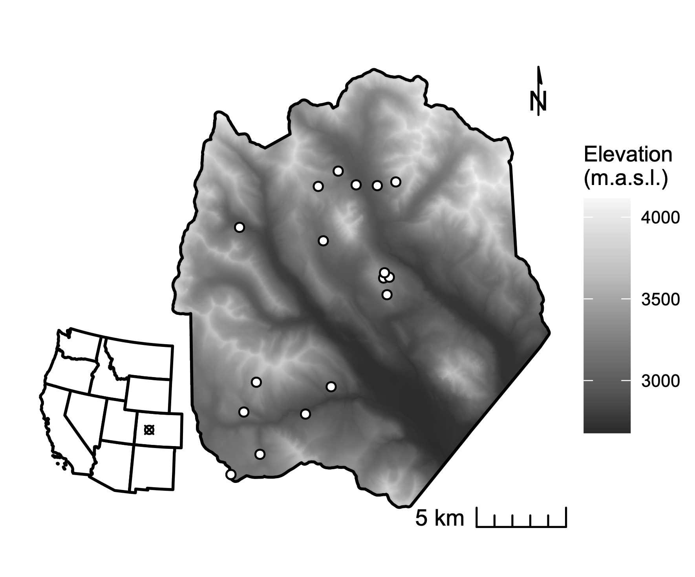
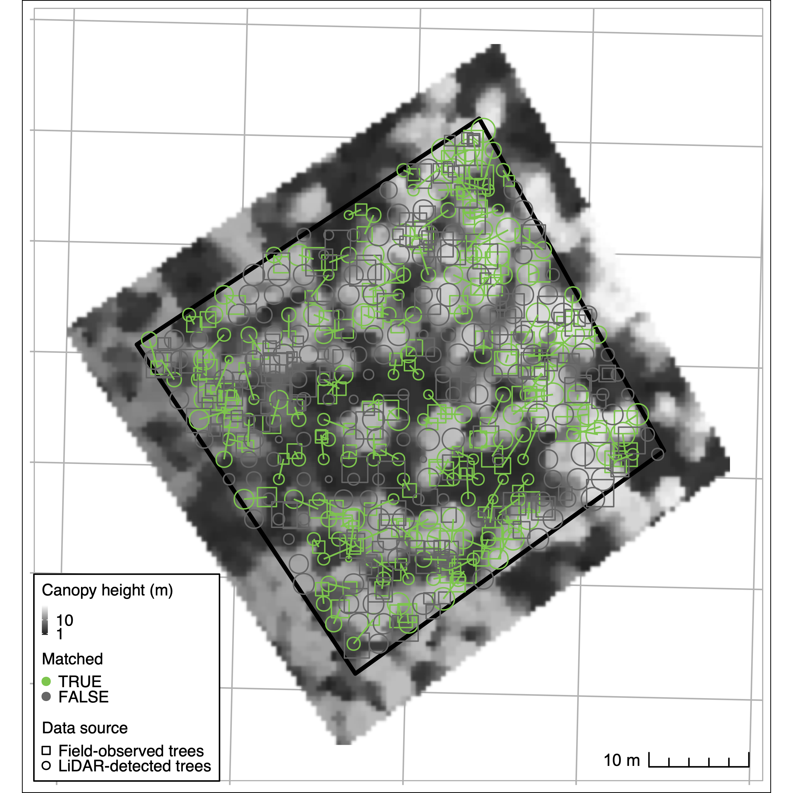
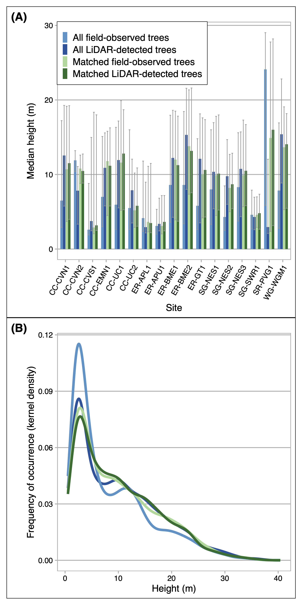
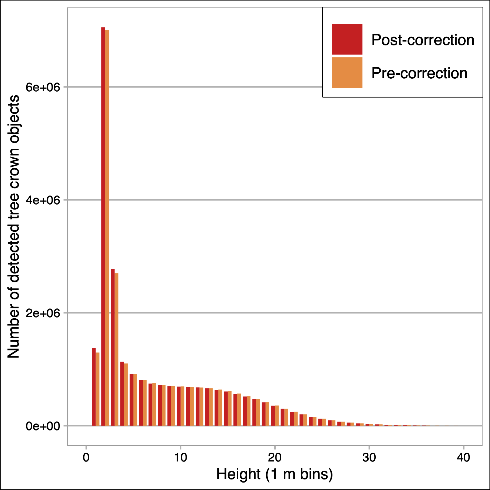
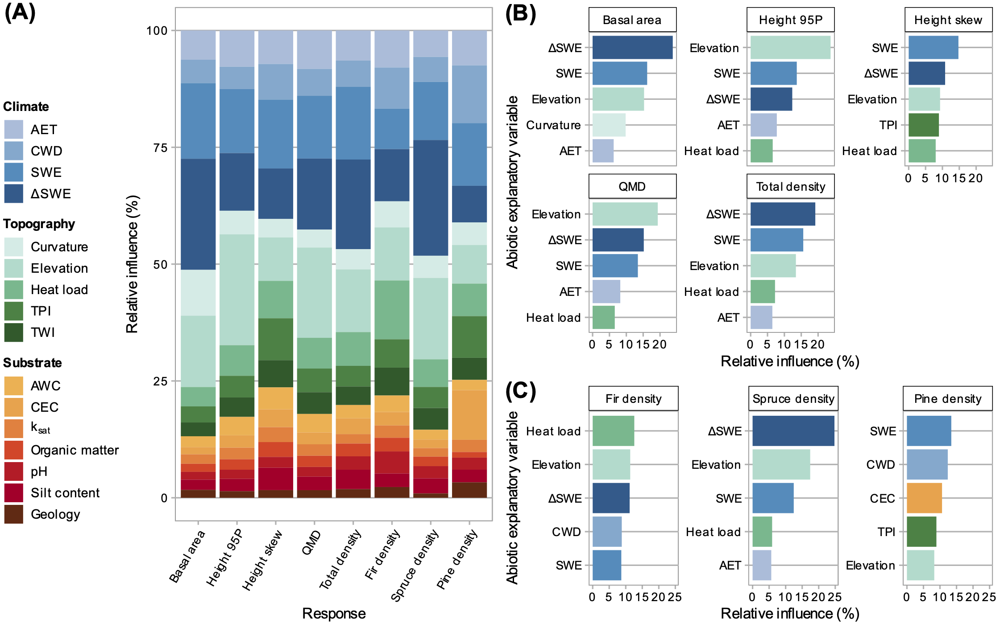
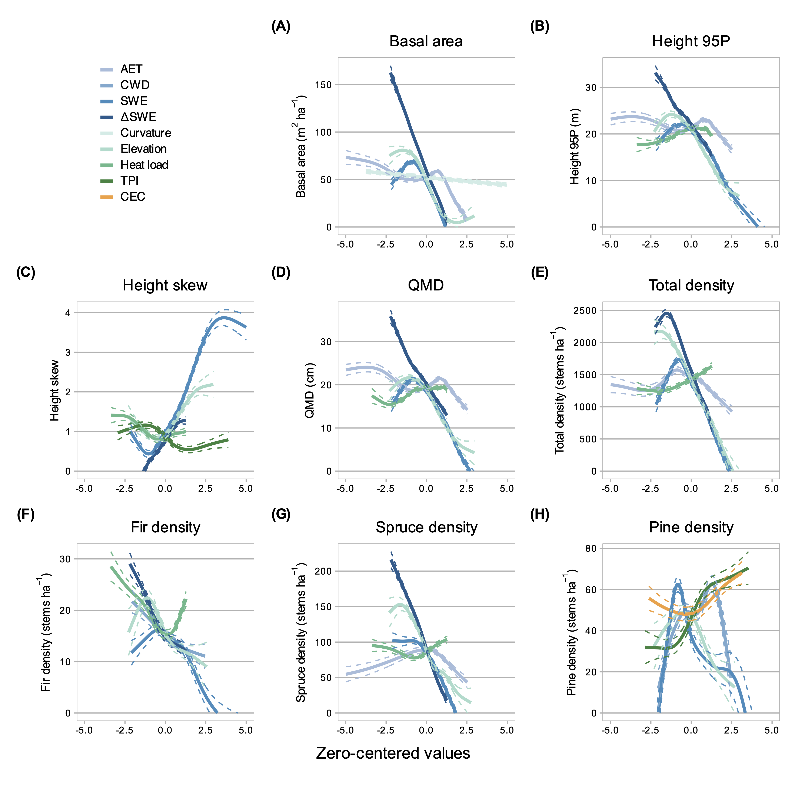
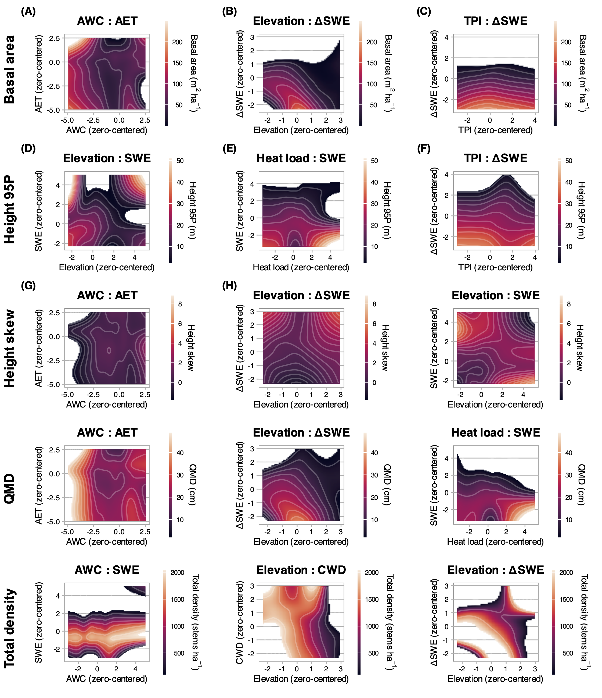
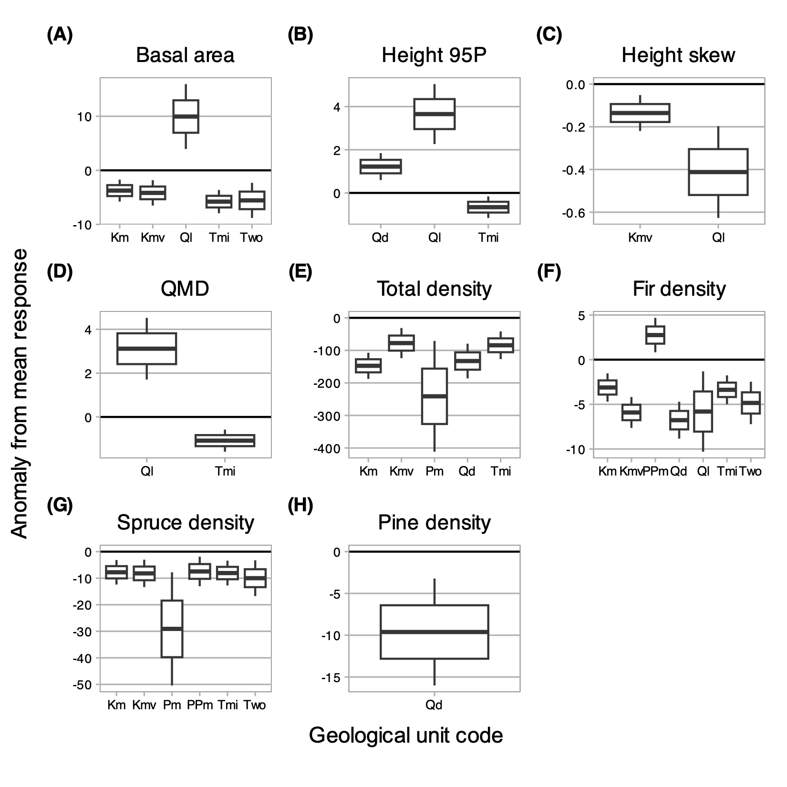

```{r setup, include=FALSE}
knitr::opts_chunk$set(echo = TRUE)
```

```{r config, include=F}
config <- config::get(file=file.path('config', 'config.yml'))
devtools::load_all()
load.pkgs(config$pkgs)
```

```{r source, echo=F, include=F}
source('./inst/notebooks/tables_figures/table1.R')
source('./inst/notebooks/tables_figures/table2.R')
source('./inst/notebooks/tables_figures/table3.R')
```

# Abstract

Understanding the abiotic drivers of high-elevation forest physiognomy is essential for forecasting how these systems will respond to emerging environmental pressures. At broad scales, climate factors such as temperature and climatic water deficit (CWD) often emerge as the strongest constraints on forest structure and composition. However, at finer scales, such as that of a watershed, other locally varying topographic and edaphic constraints may mediate the effects of synoptic climate. In this study we quantified the relative influence of climate, topographic, edaphic, and geologic factors on conifer stand structure and composition, and their functional relationships, at the watershed scale. We used waveform LiDAR data to derive spatially continuous stand structure metrics within an upper montane–subalpine domain in the Colorado Rocky Mountains. We fused these with a species-level classification map to estimate tree species abundance. We applied generalized additive and generalized boosted models to evaluate the covariability of structural and compositional metrics with abiotic variables. Peak snow water equivalent (SWE), snow disappearance rate (∆SWE), and elevation explained the majority of variability across structural metrics, with nonlinear relationships. The highest stand density, basal area, maximum canopy height, and quadratic mean diameter (QMD) occurred in sites with low peak SWE (around one standard deviation below mean), but with long snow residence times. Stand density decreased linearly with increasing elevation, while other structural metrics showed non-monotonic relationships with maxima between 3000 m and 3200 m and asymptotic declines with increasing elevation. Substrate properties were less influential. Our methods contribute an important advance in reproducible individual tree detection (ITD) and quantification of forest structure, and our inferential results contribute to the baseline understanding required for predicting future forest change.

# 1. Introduction

As climate warming accelerates, high-elevation forests face increasing stress exposure, which could induce long-term changes in their structure, composition, and function [@vanmantgem_climatic_2013; @macias-fauria_warminginduced_2013; @mcdowell_darcy_2015; @kueppers_warming_2017; @conlisk_declines_2017; @mcdowell_pervasive_2020;  @hankin_lethal_2024]. Because these forests regulate snow accumulation, runoff, and surface-to-atmosphere water fluxes, such changes will likely have large effects on the timing and quantity of water released into the major basins of the Western U.S. [@milly_hydrologic_2011; @foster_resolution_2020]. Forecasting how these systems will respond to emerging environmental pressures depends first upon understanding the abiotic drivers of high-elevation forest physiognomy under steady-state conditions. However, several gaps exist in this baseline understanding.

Forest structure and composition emerge from complex interactions between a variable abiotic environment and trait-driven mechanisms of organismal response [@whittaker_consideration_1953; @langenheim_vegetation_1962; @prentice_concepts_1986; @prentice_pattern_1990; @mcdowell_pervasive_2020]. In the large corpus of work that has considered these interactions, climate factors (namely, radiation, moisture, or proxies thereof) frequently emerge as the dominant drivers of community diversity and structure [@shreve_vegetation_1915; @whittaker_consideration_1953; @delcourt_dynamic_1983; @urban_landscape_1987; @stephenson_climatic_1990; @urban_forest_2000; @swenson_ecological_2007; @moles_global_2009; @zhang_regional_2016]. However, several issues complicate interpretation of these dynamics. First, temperature and moisture tend to covary closely along the same gradients of elevation, aspect, and latitude, and so cannot be easily disentangled [@stephenson_climatic_1990; @urban_forest_2000]. Such interdependence may obscure underlying vegetation-environment dynamics: e.g. temperature partially drives atmospheric demand and influences stomatal regulation, contributing both positive and negative feedbacks to plant-available moisture [@peters_contrasting_2019]. The asynchrony of precipitation input and atmospheric demand in many regions can also lead to seasonal biases in estimates of plant-available water and energy [@stephenson_climatic_1990]. Further, at least one study has found that edaphic properties may explain a greater share of variation in the abundance of trees than climate [@delgado-baquerizo_influence_2020].

As difficult as it is to isolate the influence of specific abiotic drivers of emergent forest properties at broad scales, the task is perhaps even more daunting in a mountainous watershed, where microclimate, substrate, and vegetation physiognomy can vary widely with small changes in position [@dobrowski_climatic_2011; @adams_topography_2014; @barnard_topoclimate_2017]. Site-species associations are often attributed to functional strategies developed in response to mircro-scale radiative [@morin_processbased_2007; @korner_worldwide_2004; @rehfeldt_empirical_2006] and hydrologic [@whittaker_vegetation_1964] regimes. Structural properties such as stem diameter, basal area, and maximum tree height are thought to decline with increasing elevation, with temperature as the key limiting control [@monk_biomass_1988; @king_tree_2013]. But aspect also modulates radiative forcing, so the same properties also tend to decline with increasing vapor pressure deficit along a northeast-to-southwest gradient in the Northern Hemisphere [@mcnab_topographic_1993; @bolstad_forests_2018]. Elevation also influences precipitation, with snow input typically increasing upslope. However, local orographic lift, rain shadowing, and shading by adjacent landforms further modulate these processes. At the same time, wind exposure limits attainable tree height [@larjavaara_maintenance_2010] and modifies water availability via snow redistribution and ablation [@hiemstra_observing_2006]. Soil properties such as parent material, texture, pH, and depth vary widely in mountains and directly constrain plant-available water and nutrients [@bruckner_plotscale_1999; @meyer_influence_2007]. All of these factors and their system of interactions pose constraints to which trees must respond.

The preponderance of research describing the relationships between the abiotic environment and forest structure and composition comes from Eastern North American deciduous forests and the tropics, with far less information from Western North America, where one might expect more pronounced topoclimatic variability. Among the few studies that have addressed such questions in this region, @kane_water_2015 found that actual evapotranspiration (AET) and climatic water deficit (CWD) explained the greatest proportion of variance in canopy cover and 95th percentile height in a Sierra Nevada domain, consistent with the theory of radiation-moisture primacy. @fricker_more_2019 reported that CWD and mean annual precipitation (MAP) explained the majority of variability in maximum tree heights across four Sierra Nevada forest types. But they also detected a non-linear elevational influence on canopy height, with bimodal maxima at 1200 and 2300 m.a.s.l., potentially pointing to an "ameliorative" effect of radiation on the adiabatic lapse rate. @greenberg_limitations_2009 found a unimodal relationship between elevation and stem density in the Sierra Nevada, with peak density around 1900 m.a.s.l. and minima toward the paired extremes of low elevation--high radiation and high elevation--low radiation. 

Underlying these findings is an important constraint in high-elevation forests: trees may be limited by water in some positions and by energy in others. Although definitions of water-energy limitation vary [@hawkins_energy_2003; @whittaker_geographical_2007; @dudney_energy_2023], we adopt the general proposition [@dudney_energy_2023; @roebroek_global_2020] that in water-limited locations, vegetation productivity is more sensitive to moisture than to radiation, so that a marginal increase in temperature or photosynthetically active radiation (PAR) fails to yield a corresponding productivity increase. In energy-limited locations, a marginal increase in temperature or PAR does yield a productivity increase. Water-limited conditions often arise when potential evapotranspiration (PET) is greater than available moisture. Energy-limited conditions often arise when irradiance is insufficient to raise plant metabolic temperatures or to drive photosynthesis [@roebroek_global_2020]. These conditions may vary in time, so that a site may be perennially water-limited or only intermittently so [@denissen_widespread_2022; @faybishenko_statistical_2023]. 

Mapping the mosaic of dominant ecohydrological controls on forest productivity in a landscape has recently become an exciting problem in ecology and geophysics, but it has also proven an elusive quarry [@greenberg_limitations_2009; @pelletier_which_2018; @roebroek_global_2020; @faybishenko_statistical_2023]. One major challenge has been the difficulty of acquiring representative measurements of forest properties, particularly in complex, inaccessible terrain [@hurtt_potential_2004; @antonarakis_using_2011; @lydersen_topographic_2012; @antonarakis_imaging_2014]. Most prior work has relied on plot or transect observations that do not represent the full range of variability in forests [e.g. @parker_size_1984; @knowles_age_1983]. Even within mature closed-canopy forests, stand density, age-class distribution, allometry, and species dominance can vary widely over space. Additionally, subalpine disturbance and recovery dynamics operate on such long timescales that it can be difficult to distinguish transient post-disturbance characteristics from long-term average site potential. Drawing inferences about such properties from plot observations alone can yield substantial error.

Light Detection and Ranging (LiDAR) helps to overcome some of these limitations by enabling measurement of forest structure on a spatially continuous basis [@mallet_fullwaveform_2009]. In particular, full-waveform LiDAR data can provide spatially rich information through the vertical forest profile [@mallet_fullwaveform_2009; @zhou_waveformlidar_2019]. Waveforms appear to yield higher accuracy than discrete returns in both individual-scale and continuous-estimate methods, particularly for characterizing mid-canopy and sub-canopy structure [@anderson_waveform_2016; @adams_another_2011; @chauve_advanced_2009]. In addition, imaging spectroscopy has increasingly been used to quantify species abundance and compositional patterns [@plourde_estimating_2007; @anderson_integrating_2008; @falco_ecoimaging_2024]. Integrating these datastreams can improve the dimensionality and detail of remote-sensing ecosystem representation [@anderson_integrating_2008; @chadwick_integrating_2020; @marrs_machine_2019; @falco_ecoimaging_2024].

Only a few studies have used LiDAR to evaluate forest structure and/or composition along multiple abiotic gradients in North American forests [@kane_water_2015, @bolstad_forests_2018, @greenberg_limitations_2009, @fricker_more_2019, and @falco_ecoimaging_2024]. These projects used lower-density discrete LiDAR returns, which yielded valid canopy structural metrics (canopy height and cover, e.g.) and statistical proxies of maximum density, but not detailed characterizations of the sub-canopy. To our knowledge, no prior study has (a) exploited the higher granularity of waveforms to estimate a suite of ecohydrologically important structural properties through the vertical forest profile, (b) intgrated these estimates with species composition, and (c) characterized their associations with underlying environmental gradients on a spatially continuous basis. 

To address this gap, we pursued two objectives: 

1. To accurately predict conifer forest stand structure and composition across a Southern Rocky Mountain, USA, watershed;
2. To quantify the relative influence of climate, topographic, edaphic, and geologic factors on conifer stand structure and composition, and their functional relationships. 

We expected variables related to moisture availability (CWD, AET, SWE, soil AWC) and radiation (elevation, heat load) to predominate among multiple interacting factors in explaining stand structural and compositional variation. Further, we expected spruce-fir to dominate north-facing slopes and higher elevation positions, and pine to dominate lower-elevation south-facing slopes.

# 2. Methods

<!-- 	We used full-waveform LiDAR acquired over Colorado’s East River watershed to quantify forest stand structure through the vertical profile and integrated these metrics with individual-scale species data derived from co-acquired imaging spectrometry. We assessed the accuracy of structural and compositional estimates against field inventory measurements. We then used inferential models to quantify the relative influence of abiotic factors on the spatial variability of stand structure and composition. -->

## 2.1. Study area
The study domain comprised upper montane-subalpine conifer forests in Colorado’s East River watershed (38°55’ N, 106°56’ W; Fig. 1). The East River is a headwater tributary of the Colorado River, the principal freshwater source for one in 10 people in the U.S. [@reclamation_colorado_2012]. The 750 km^2^ catchment includes six major drainages discharging to perennial streams. Mean annual air temperature is 1.9 º C, with a mean monthly maximum and minimum of 11.2 º C and –7.1 º C respectively, measured 1980--2023 at the NOAA Crested Butte weather station (GHCND USC00051959) at 2700 m near the center of the watershed [@berkeleyearth_breakpoint_2022]. Mean annual precipitation is 1400 mm y^–1^, approximately 85 percent snow [@carroll_modeling_2022]. Beyond these synoptic trends, the domain’s 1420 m of elevational relief and pronounced gradients in slope, aspect, insolation, and hillslope position produce highly variable local climatic conditions [@usgs_dem_2017]. In the domain's forests, slopes range from 0.5º to 49º, with a median of 17º. Aspects are well distributed around the compass, albeit with a slight southwestern bias. Cretaceous Mancos shale underlies 34 percent of the forested domain; Middle-Tertiary granodioritic laccoliths, dykes, and sills underly 24 percent; and the coal-bearing sandstone-silt deposits of the cretaceous Mesa Verde Formation another 21 percent [@streufert_geology_1999]. The remainder comprises minor sandstone and mudstone formations and younger glacial and colluvial landslide deposits. Available water capacity (AWC) in the top 100 cm of soil ranges widely, from 0.02 to 0.19 cm H~2~O cm soil^-1^ [@soilsurvey_ssurgo_2023].

The covariability of vegetation and abiotic factors has been previously studied in this watershed. [@langenheim_vegetation_1962]'s extensive survey of the domain revealed an affinity for north-facing slopes and limestone parent material among conifer species. @wainwright_watershed_2022 found that conifer stands were associated with steep, mid-elevation hillslopes with less fractured bedrock. They also found elevation, aspect, and geologic substrate to be the primary factors associated with plant sensitivity to early snowmelt and growing-season drought. @uhlemann_surface_2022 showed that bedrock properties can be reliably estimated as a function of geomorphological features and plant functional types. Further, a recent study mapping the watershed's dominant plant species through imaging spectroscopy revealed broad heterogeneity in forest species distributions, phenological dynamics, and leaf functional traits, strongly influenced by topographic wetness, solar insolation, and slope [@falco_ecoimaging_2024]. 

Within the watershed's forests, the dominant tree species are Engelmann spruce (*Picea engelmannii*), subalpine fir (*Abies lasiocarpa*), lodgepole pine (*Pinus contorta var. lasiocarpa*), and quaking aspen (*Populus tremuloides*), with occasional Douglas fir (*Pseudotsuga menziesii var. glauca*) and a few known sentinel limber pine (*Pinus flexilis*). Natural histories of subalpine forests elsewhere in Colorado describe species distribution patterns that largely hold in this domain [@peet_latitudinal_1978; @peet_forest_1978]. Engelmann spruce and subalpine fir tend to co-occur in high densities throughout the subalpine zone (~2700--3400 m.a.s.l.) and only sparsely in the upper montane zone (~1850--2700 m.a.s.l.) [@alexander_ecology_1987; @falco_ecoimaging_2024]. At middle and high elevations up to treeline, the longer-lived spruce often dominate the canopy (up to 75 percent of canopy basal area), while fir may occupy up to the same proportion of the understory [@peet_latitudinal_1978; @alexander_ecology_1987]. Fir tend to be dominant in the lower end of the subalpine zone [@alexander_ecology_1987]. Lodgepole pine also occur intermixed with spruce and fir on dry, southerly slopes in the lower subalpine zone [@veblen_age_1986]. Near the lower spruce-fir range limits, lodgepole often establish as post-disturbance pioneers and mature to even-aged monospecific stands, which are later replaced by the former species [@whipple_age_1979; @falco_ecoimaging_2024]. Quaking aspen occur throughout the domain but are not the focus of this study. 

Mining-related harvest impacted some parts of the watershed during the 19th and early 20th centuries, with a limited footprint enduring today. But there are extensive swaths of forest where no tree removal occurred, and mature stands of uneven age and size structure are well distributed. All forests in this analysis sit on U.S.D.A. Forest Service land, and 22 percent are in management-restricted wilderness. We suggest that because of their low timber value, long fire return intervals, and relative lack of recent management, they offer a valid basis for investigating abiotic influences on subalpine conifer forest structure.

## 2.2 Full-waveform LiDAR

Between June 12 and 26, 2018, the National Science Foundation National Ecological Observatory Network (NEON) Airborne Observation Platform (AOP) [@kampe_neon_2010] surveyed approximately 330 km^2^ of the watershed (Fig. 1) [@chadwick_integrating_2020; @goulden_post_2020]. The AOP collected discrete-range and full-waveform LiDAR returns using an Optech Gemini discrete LiDAR sensor and waveform digitizer with a pulse repetition frequency between 33 and 100 kHz. Discrete-return point density in the post-processed dataset ranged between 1 and 9 returns m^-2^, which was insufficient for characterizing subcanopy structure. We therefore elected to exploit the higher information content of the full waveforms, with a nominal density between 1 and 4 pulses m^-2^.

We followed a standard preprocessing approach to prepare the waveforms for analysis. First, we deconvolved the target-response signal from its interactions with the outgoing pulse, atmospheric scattering, and system noise. We used the Gold deconvolution algorithm [@zhou_waveformlidar_2019], but refactored it for parallel processing in the R statistical computing environment. The output approximates the true distribution of scattering phenomena along the laser pulse's path. We then applied adaptive decomposition to fit a sum of Gaussian models to the return pulse components: 

$$f(x,\theta) = \sum_{(i=1)}^{n} A_i \times exp\biggl[-\frac{(x-\mu_i)^\lambda}{(2\sigma_i^2)}\biggr]$${#eq:eqn1}

where $A_i$ is the amplitude of waveform component $i$, $\mu$ is the bin location of $i$ (measured as a point in time, ns), $\sigma$ is the standard deviation of $i$, and $\lambda$ is a penalty that minimizes the model residual over a user-specified number of iterations. Fitting was accomplished using the function *nlsLM* in the R package *minpack.lm*. 

We ran the deconvolution and decomposition procedures on the full set of 1.4 $\times$ 10^9^ waveforms on 256 cores on the University of California, Berkeley's high-performance computing cluster.  From the fitted functions, we extracted characteristic metrics, including pulse location, peak amplitude and width, front slope, and time to median intensity. A negligible fraction of returns (~0.5 percent) either had no detectable peaks or represented backscatter records that could not be fit to a Gaussian. Where peaks could not be identified, the waveforms were dropped from the set. Where the returns could not be fit, characteristic metrics were estimated from the deconvolved returns directly, without decomposition.

We used the geolocation matrices provided with the NEON data to position the decomposed functions in space and used the R package *rlas* to discretize this information along with the characteristic metrics [@roussel_rlas_2023]. We normalized the discretized points to the Earth surface by differencing their z-values against a digital elevation model (DEM) derived from the discretized point cloud. We then decimated the high-density returns to obtain a dataset of 5.72 $\times$ 10^9^ points with a uniform density of 15.3 points m^-2^ across the domain.

## 2.3 Field census

Between 2018 and 2022, we established 25 conifer forest demography plots in the East River watershed and surrounding drainages, stratified along six topographic gradients (Table S1; Fig. S1). Each plot was 1600 m^2^ and located in contiguous forest at least 100 m from edges and major compositional transitions. To mitigate unobserved management and disturbance effects, we selected stands with no evidence of recent harvest or major disturbance based on (a) visual inspection for cutting and (b) stability of the Landsat Normalized Difference Vegetation Index (NDVI) record (1980--2018). We used a survey-grade GNSS receiver (Trimble Geo 7X, Trimble, Inc.) to georeference all plot locations *in situ*. Estimated planimetric accuracy of plot corner locations was $\pm$ 0.3 m.

We conducted a field census in the 25 plots (Table S2), labeling all trees $\geq$ 1.0 cm diameter at breast height (DBH, measured at 1.3 m above ground) with a permanent aluminum tag and identifying tagged trees to species. We then measured DBH using a standard metric diameter tape (for stems $\gt$ 7.0 cm DBH) or calipers ($\leq$ 7.0 cm) and stem heights with a Nikon LaserPro II laser hypsometer (for stems $\gt$ 5 m in height) or a rigid metric tape measure ($\leq$ 5.0 m). To maximize precision, we repeated hypsometer measurements on each stem until measurements converged within 0.5 m. Expected vertical accuracy on hypsometer measurements was $\pm$ 0.75 m. We geolocated stems using the GNSS receiver or by measuring the direction and distance from a previously geolocated reference tree with a digital compass and rigid metric tape. For geotagged trees, mean planimetric accuracy was 1.01 m (s.d = 0.70 m). Seventeen of the 25 plots lay within the overflight footprint of the 2018 NEON AOP acquisition [@goulden_neon_2020; @goulden_post_2020; @chadwick_integrating_2020]. These contained 5828 observed trees, of which 4355 were living at the time of inventory. 

## 2.4. Tree crowns, species composition, and stand structure

### 2.4.1 Tree crown detection
We followed the tree-centric schema in @dalponte_individual_2019 to generate an individual tree crown (ITC) map and gridded estimates of conifer forest structure and composition across the watershed. The ITC map comprised point objects describing the position, height, and stem diameter of all trees $/gt$ 1.3 m height in conifer stands. The gridded data comprised continuous estimates of conifer forest structure metrics at the 100m grid scale. To generate these products, we developed an automated procedure to train and test eight individual tree detection (ITD) algorithms. The procedure iterated through many parameter permutations for each algorithm, computing performance metrics at each iteration and optimizing performance against field inventory data. We then selected the optimal algorithm and parameter set to apply to the watershed's remaining conifer forest area. 

To implement this schema, we first extracted the discretized LiDAR data within a 5 m buffer around the boundaries of each field plot.^[The buffer ensured that LiDAR points associated with trees along plot boundaries were included in the operation; however, any tree objects detected in the buffer zone beyond the plot boundaries were removed.] We then attempted to detect tree crown objects from the discretized data using algorithm $A_i$ forced with parameter set $\lambda_{j,k:l}$, where $\lambda_j$ is one of a set of parameters taking user-specified values required for the algorithm to proceed, and $k:l$ is a vector of values on that parameter (Table S3). For each iteration $A_i,\ \lambda_{j,k:l}$, we applied the automated matching procedure in @eysn_benchmark_2015 and @pang_nystrombased_2021 to link detection results to reference observations from field inventory. This provided an objective function against which to evaluate the performance of each algorithm--parameter permutation. We opted for automated matching  because (1) our computational scale---up to 2800 runs per algorithm per site---made manual evaluation infeasible, and (2) it enabled us to enforce clear, objective, reproducible rules for algorithm selection.

The matching procedure began by selecting the tallest detected tree ("target") and searching for candidate matches among reference trees within specified Euclidean distance limits (Table S4). The reference candidate with the least ∆XY was chosen as a tentative match to the target. The candidates were then queried a second time. If a candidate with greater ∆XY proved closer in height to the target, and its ∆XY was at most 2.5 m more than the ∆XY of the tentative match, it was selected as the match. However, since an optimal match also depends on other nearby *detected* trees, the target was then compared against other detected neighbors. If another detected tree was closer in horizontal and vertical distance to the matched reference, the pairing was discarded. This process was repeated on all remaining detected trees in descending order of height, until all reference trees had been evaluated. Matches were then removed from the set, and the process was repeated until no further matches could be found under the search criteria. 

For each run of $\lambda_{i,j:k}$ on $A_i$ we tallied the number of detected trees, true positives (TP, or successful matches), false positives (FP, or commission errors), and false negatives (FN, or omission errors). We used these values to compute root mean square (RMS) performance statistics across the 17 plots (Table 1). We then selected the algorithm and parameter permutation with the maximum RMS *F1* score across all $\lambda_{i,j:k}$. *F1* is a proportion representing the harmonic mean of precision (the proportion of all tree detections that were correctly matched) and recall (the proportion of all possible matches that were correctly matched). Perfect detection and match rates would yield an *F1* of 1.0, while perfect failure would yield 0.0. We chose *F1* as the optimization statistic for its balanced sensitivity to over- and under-detection. 

Of the eight algorithms tested, Layer Stacking [@ayrey_layer_2017] yielded the highest *F1* across training and testing sets (Table 1, Table S5, Table S6). For the remainder of the LiDAR-surveyed domain, we extracted the discretized waveform data over conifer forests by finding their intersection with conifer-classified pixels from a species map developed through a support vector machine classifier on the 2018 NEON hyperspectral acquisition [@falco_vegetation_2024; @falco_ecoimaging_2024]. We forced the Layer Stacking algorithm with the optimal parameter permutation and ran it on the conifer-filtered LiDAR data. The result was a set of points describing the locations and heights of all tree crowns $\ge$ 1.3 m height in the watershed's conifer forests. We then estimated the DBH of each delineated object using an allometric function of stem height with coefficients fit to binned field observations, following @jucker_allometric_2017:

$$\hat{DBH} = exp[-0.1361 + 1.2082\ log(H)] \times exp(0.0105)$$ {#eq:eqn2}

where $H$ is tree height above ground and $\sigma^2$ is the mean square error of the regression. Per @jucker_allometric_2017, the last term equals $\frac{\sigma^2}{2}$, an approximation of theoretical model error $\epsilon$ assuming $\epsilon$ is normally distributed, imposed for unbiased prediction (see Fig. S3 for more detail).

### 2.4.2. Species composition
We fused the tree crown product with the forest species classification map [@falco_vegetation_2024]. First, we ran a marker-controlled watershed segmentation on a canopy height model derived from the discretized waveforms at 0.5 m resolution, using the Layer Stacking ITC objects as controls [@plowright_foresttools_2024]. This produced polygons demarcating the estimated crown perimeters of every tree object. Because the NEON passive imaging spectrometer received reflectance signals only from light-exposed portions of tree canopies, attempting to align species information with detected mid- and subcanopy objects yielded unacceptably poor agreement. We therefore filtered the LiDAR-detected trees to match the hyperspectral targets as nearly as possible by removing all objects below the 90th percentile height in each cell of a 100 m grid. We then overlaid the remaining polygons on the classification raster and assigned each object to a single tree species according to a majority vote [@dalponte_individual_2019]. If less than 50 percent of pixels within a crown polygon belonged to any one species, we labeled the object "NA." 

### 2.4.3. Stand structure
From the fused product, we computed continuous area-based stand structural metrics by summarizing object-level predictions at specified grid scales across the watershed (Fig. 5). Structural metrics included total density, stand basal area, quadratic mean diameter (QMD), diameter and height percentiles, and skewness of height, all computed at the level of a grid cell. Density (stems ha^-1^) was the sum of the number of trees over grid cell area for all trees and per species. We computed basal area (m^2^ ha^-1^) as: 

$$BA = \frac{\sum_{i=1}^{n}\pi (DBH/2)^2}{grid\ cell\ area}$$ {#eq:eqn3}

and QMD (cm) as:

$$QMD = \sqrt{\frac{1}{n}\sum_{i=1}^{n}{DBH^2}}$$ {#eq:eqn4}

where $n$ is the number of trees in the cell. Skewness of height was computed as the third central moment of the distribution of stem heights. Larger positive values signified a larger proportion of trees in smaller height classes than a normal distribution. More negative values signified a larger proportion of trees in larger height classes. 

To further restrict the analysis to intact conifer forest stands, we further masked each raster, excluding pixels whose total density was less than than 100 stems ha^-1^, plus a 100 m buffer around roads, developed areas, and the outer perimeter of the NEON AOP LiDAR acquisition. A hardware failure on June 20, 2018, rendered the waveform data irretrievable [@goulden_post_2020]. This gap is visible as an empty north-south swath in the forest structure products and is excluded from analysis, along with a 100 m buffer around its perimeter to minimize edge effects.

## 2.5. Abiotic explanatory variables

### 2.5.1. Topography 
We generated six topographic variables from the NEON 1 m DEM [@goulden_neon_2020] at the 100 m grid scale: elevation, slope angle (º), folded aspect, heat load, topographic position index (TPI), and topographic wetness index (TWI) (see Table S1 for variable definitions and equations).
Heat load (unitless index) was calculated from folded aspect and slope angle using the method in [@mccune_equations_2002]. We computed the topographic position index (TPI), a morphometric measure of hillslope position, as the difference between a target pixel's elevation and the mean elevation within 9-pixel (1000 m) neighborhood, normalized to the s.d. of elevation [@dereu_application_2013]. TPI values are more positive when a target point is higher than its neighborhood, and more negative when the target is lower. Topographic Wetness Index (TWI) ($\log(m^2\ m^{-1})$) is an estimate of the relative capacity of an area to accumulate water through surface or subsurface flow. We selected this as a proxy for subsurface moisture conditions. We used the R package *dynatopmodel* to calculate TWI as the log ratio between a pixel’s upslope contributing area and its own slope angle (Quinn et al. 1995, Metcalfe et al. 2018).

### 2.5.2. Climate
To estimate relative spatial patterns of snow accumulation (m), we retrieved snow water equivalent (SWE) data produced by Airborne Snow Observatories, Inc. (formerly NASA/JPL Airborne Snow Observatory; ASO) from snow-on flights on March 31, 2018, April 4, 2019, and April 21, 2022 [@deems_lidar_2013; @painter_airborne_2016; @painter_aso_2018; see also https://data.airbornesnowobservatories.com/)]. The SWE product was generated from aerial measurements of snow depth, spectral albedo, and radiative forcing, combined with modeled snow density from iSnobal [@painter_airborne_2016]. We also produced an estimate of the relative velocity of snow disappearance (% day^-1^). In each flight year, we differenced the snow-on SWE estimates and SWE estimates from subsequent low-snow flights in late spring of each year (May 24, 2018; June 10, 2019; and May 18, 2022, respectively), and normalized the result to the snow-on values for percent change. We then divided these percentages by the day interval between paired flights. While the ASO data may not have captured peak snow depth or maximum snow-free extent in each season, averaging across three years of flights enabled us to approximate the dominant spatial patterns of depth and disappearance across the domain.

We also retrieved the estimates of mean annual AET and CWD generated by the Basin Characterization Model (BCM) for the Upper Colorado Basin from 1985 to 2012 at 270 m resolution [@buto_catchmentflowline_2017]. The BCM has been widely used in ecological and management applications [@flint_finescale_2013]. AET is the depth of water (mm) evaporated from the surface or transpired by plants within each pixel. CWD is the difference between PET and AET (mm), where PET is the total depth of water that can be evaporated or transpired given prevailing atmospheric conditions. Under non-limiting moisture conditions, AET equals PET and CWD is 0; positive CWD values signal a moisture deficit [@buto_catchmentflowline_2017].

### 2.5.3. Substrate
To evaluate edaphic influences on forest structure and composition, we calculated continuous estimates of soil properties from the U.S. Department of Agriculture (USDA) Natural Resources Conservation Service (NRCS) Soil Survey Geographic Database (SSURGO) [@soilsurvey_ssurgo_2023]. SSURGO contains geospatial information on soil properties predicted via an ensemble of regression, classification, and machine-learning operations on *in situ* soil measurements and environmental predictor variables. We retrieved spatial and attribute data from the database using the R library *FedData* [@bocinsky_feddata_2024]. The hierarchical data structure contains polygons demarcating map units at 1:12000 scale. Each map unit is made up of one to three major components and potentially several minor components. A component is a field-classified soil type with common characteristics. While the components are not mapped, SSURGO reports their proportional contribution to the makeup of a map unit. Each component is also associated with detailed data from its constituent horizons. 

We aggregated horizon-scale data to generate a unique observation per component and aggregated these to map units. We calculated horizon depth--weighted means for available water capacity (AWC, 'awc_r'), cation exchange capacity (CEC, 'cec_r'), hydraulic conductivity (k_sat_, 'k_sat_r'), pH ('ph_r'), and silt content ('silt_r') in the top 100 cm of soil. We calculated the horizon depth--weighted mean of percent organic matter (OM, 'om_r') in the top 30 cm of soil. We took these variables to be independent estimates of soil constraints on tree growth, and the depths to be those in which the selected variables likely exert the strongest biophysiological effect. We then aggregated the component-scale estimates to the map unit, weighting the mean values by the proportional occupancy of each component. We converted the vector data to raster format using the *rasterize* function in the R package *terra* [@hijmans_terra_2024].

We characterized the underlying geological substrate using the Colorado Geological Survey vector database "R-37: Geology and Mineral Resources of Gunnison County, Colorado" [@streufert_geology_1999]. We rasterized the vector database, which had been created through digitization of the original sheets used to prepare the U.S. Geological Survey MI-16 Geologic Map of Colorado [@tweto_geologic_1979].

## 2.6. Inferential modeling

To quantify relationships between spatially continuous stand structural metrics and abiotic variables, we fit generalized additive models (GAM) and generalized boosted models (GBM). All data were first (dis-)aggregated to the 100 m pixel scale and aligned to a uniform grid using bilinear interpolation (continuous) and nearest-neighbor resampling (categorical). Because of expected spatial autocorrelation in both response and explanatory variables, we also included a tensor product smooth of X and Y pixel coordinates in all models.

In the GAM approach, we estimated each structural metric as the sum of nonlinear spline functions of the explanatory variables, using the *gam* method in R's package *mgcv* [@wood_generalized_2017]. We examined the main effects of each explanatory variable, along with two-way interactions between a subset of variables (Table S7). In the GBM approach, we used the stochastic gradient boosting framework in R's *caret* and *gbm* libraries [@kuhn_building_2008; @ridgeway_gbm_2024]. We estimated variable influence by multiplying the number of times a variable was selected for splitting by the squared increase in deviance explained at each split, and then averaging this value over the ensemble of decision trees. We pursued both approaches in tandem because of their complementary strengths. The GAM strategy allowed us to interpret partial-effects functions for individual and interacting explanatory variables. While partial-dependence plots can be constructed from the GBM, their interpretability is usually limited, especially when variable interactions exist [@friedman_multiple_2003; @elith_working_2008]. On the other hand, the GBM allowed us to quantify feature importance, which can be difficult to achieve with the GAM. We assumed that convergence between inferential strategies would give us greater confidence in the results, while divergence could provide points of departure for further investigation. 

We initially explored a large set of potential explanatory variables and interactions and used these to estimate a preliminary run of GAMs for variable screening. We identified pairs of variables with an absolute-value Pearson's correlation coefficient $\ge$ 0.7 and iteratively dropped highly correlated variables from the models, computing the Akaike Information Criterion (AIC) score at each step. We preserved the feature sets that produced the lowest AIC and fitted final GAMs. We used the restricted maximum likelihood estimator (REML) to select smoothing parameters, because it tends to be less prone to overfitting than generalized cross-validation (GCV) (Wood et al. 2023), and we implemented double-penalty regularization for feature selection by specifying 'select=TRUE' in the *mgcv* specification. This applied an additional shrinkage penalty to each smooth, allowing terms flattened into the null space of the original REML penalty to be removed (Marra and Wood 2011). 

We then fitted GBMs to each response variable using the same response distributions as in the final GAMs. We did not apply regularization in the GBMs, and we allowed interaction depth to vary rather than specifying two-way interactions. We estimated GBM parameters through a full factorial design with 10-fold cross validation. The design matrix randomized interaction depth (1 to 5 features), number of decision trees (2000 to 10,000 trees in increments of 2000), and shrinkage rate (0.1 to 0.01 in increments of 0.02). 

# 3. Results

## 3.1. LiDAR vs. field inventory

The optimal Layer Stacking algorithm extracted 4196 trees across the 17 plots (Table 1). Of these, 55 percent were successfully matched to field trees (Fig. 2). The root mean square distance between matched trees was 2.45 m in the horizontal dimension and 1.46 m in the vertical dimension. Agreement was strong across all size classes. Underdetection and undermatching were most prevalent in trees below 8 m in height, while some overdetection occurred in canopy-intermediate trees, between 15 m and 20 m in height (Fig. 3).

The median height of all trees detected in training was 8.8 m (IQR: 3.1--15.1 m), versus 6.7 m (IQR: 2.8--13.1 m) in the field inventory. Maximum canopy height, estimated at the 95th percentile, was 24.4 m in detected trees versus 23.8 m in field inventory. Estimated QMD of detected trees was 20.7 cm (s.d. 13.6 cm), versus 18.6 cm (s.d. 12.7 cm) measured in the field. Agreement was strongest in higher-density, uneven-aged sites (i.e., where median height was smaller), and poorer in sites with lower density or a paucity of understory trees (Fig. 3).

For composition, we compared species classifications for top-of-canopy tree objects with their matched field trees. Across species, overall classification accuracy was 0.73 and mean *F1* was 0.62. Per-species performance in this independent sample was similar to but not as strong as the performance that @falco_ecoimaging_2024 achieved in generating the species classification product, where mean *F1* for tree species was 0.87 (Table 2).

## 3.2 Domain-wide structure and composition
Applying the optimal ITD algorithm and parameters to conifer forest across the full domain produced 2.375 $\times$ 10^7^ individual trees. Based on underdetection patterns in training, we assumed that the total was a modest underestimate. We applied a correction to this value by binning plot-level data into 1-m height increments and computing the difference in frequency of occurrence per bin between field-observed and LiDAR-detected trees. We performed the same binning on detected trees for the full domain and scaled the number of trees per bin in this dataset by the plot-level frequency differentials (Fig. 4). The corrected estimate of the total number of conifer trees was 2.392 $\times$ 10^7^. Stand densities ranged from 100 to 2041 stems ha^-1^. The median height of all LiDAR-detected trees in the watershed was 4.8 m, and 95th percentile height was 21.7 m (Fig. 5). Height skewness ranged from -1.8 to 8.8; allometry-estimated QMD was 17.0 cm (s.d. 8.3 cm); and basal area ranged from 0.03 to 248.8 m^2^ ha^-1^ (Fig. 6).

The spatial distributions of spruce and fir densities were similar, although their maximum densities differed by a factor of two (Fig. 5). (N.B.: the order of magnitude difference between these values and total density is largely a result of filtering to top-of-canopy tree objects during species assignment). Pine density ranged from 2 to 283 stems ha^-1^, and its occurence was concentrated on low-elevation slopes in the southern portion of the domain.

## 3.3 Abiotic factors associated with stand structure
Climate and topographic factors had the strongest influence on stand structure and composition: 36.6%--51.2% of variable influence and 33.4%--44.1%, respectively (Fig. 7). Substrate factors (soil and geology) were slightly less influential, collectively accounting for 13.2%--25.2% of influence. Considered individually, SWE, ∆SWE, and elevation predominated (Fig. 7). Other topoclimatic variables related to the water and energy balance (heat load, AET, CWD, TPI) played a smaller, though still significant role. The five most important variables for any response together accounted for 51.8--71.3 percent of relative variable influence (Fig. 7, panel B). However, lower-ranked variables accounted for up to 48.2 percent of cumulative relative influence, pointing to the existence of a complex system of controls on forest structure and composition. The X-Y coordinate bivariate smooth was a significant factor in the GAMs, indicating the existence of latent spatial structure in the explanatory features. 

GAMs explained a similar percentage of deviance (PDE) across the five full-forest models (Table 3). For models of species-resolved density, PDE was considerably lower, with a nadir at 22.2% for fir (*A. lasiocarpa*). All GAM models were convergent and full rank. Tests for $k$ indicated sufficient knots in the basis functions for all parameters (Table S7), and examination of residual plots indicated low bias in model fits (see optimal tuning parameters in Table S8).

The effects of explanatory variables were generally coherent between the two modeling strategies. The top five in each GBM also covaried strongly with the responses in GAMs, based on interpretation of partial-effects plots (Fig. 8). Variables falling below the top five usually had slopes near zero in the GAMs, indicating a null relationship and/or that the smooths had been selected out of the model. (GAM partial-effects plots for all explanatory variables appear in Fig. S3). In rare cases, a variable with apparent leverage in a GAM was not highly influential in the corresponding GBM. 

### 3.3.1 Climate effects
The snow variables, SWE and ∆SWE were the most influential factors in GBMs of total stand density and basal area, and ranked among the top five for every full-forest structure response (Fig. 7). In GAMs, multiple measures of stand structure showed a similar nonlinear relationship with SWE. The highest density, basal area, maximum canopy height, and QMD occurred near 0.3 m SWE (~1 s.d. below mean), and all of these structural metrics declined as SWE increased. Height skew and species-resolved densities were exceptions to this pattern. Height skew followed an approximately sigmoid increase with SWE, such that stands with more small trees were associated with high snow accumulation, up to a threshold around 2.5 s.d. above the mean. Fir, spruce, and pine densities were highest around average SWE and declined steeply beyond this maximum. In the zone of lower than average snow depth, fir and spruce densities varied little, but pine density increased sharply with increasing SWE (Fig. 7).

Basal area, maximum height, and QMD were highest in positions with longer snow residence times (i.e., lower ∆SWE values), following a linear function. Total density was highest around 0.37 % d^-1^ (~ 1 s.d. below mean ∆SWE) and declined toward high and low ∆SWE extremes. As snow melt rate increased across stands, they tended to contain more small trees, but this relationship became asymptotic at 0.96 % d^-1^ (1 s.d. above mean ∆SWE) (Fig. 7).

The remaining two climate variables, AET and CWD, were somewhat less influential than snow factors. AET ranked among the five most influential variables for several responses. The relationships were nonlinear but generally declined from lower to higher AET. For basal area, maximum height, and QMD, local maxima existed near 3.3 x 10^4^ mm and 5.9 x 10^4^ mm AET ($\pm$ 2.5 s.d. from mean). CWD was an important explainer of fir and pine density. Fir densities declined linearly as water deficit increased, while pine densities peaked near 3.4 x 10^4^ mm (2 s.d. above the mean) and declined toward the high and low water deficit extremes.

### 3.3.2 Topographic effects 
Elevation appeared among the top five covariates for every structural metric and was the most influential factor explaining maximum height and QMD. Total density decreased linearly with increasing elevation. Stands with smaller-statured trees tended to occur at higher elevations, while those most strongly skewed toward larger trees occurred near the domain's mean elevation of 3200 m. All other structural metrics showed non-monotonic relationships, with maxima between 3000 m and 3200 m and asymptotic declines as elevation increased. Heat load was the most influential covariate for fir density and ranked among the most influential for all other responses except basal area. Functional forms varied. Maximum height and QMD increased with heat load, while total density increased exponentially. The TPI--height skew relationship suggested that stands with more small trees occurred on low- and toeslopes, while stands with more large trees occurred on upper slopes and midslope ridges. Although TPI did not emerge as a top-ranked feature in the other GBMs, it did exert a modest influence on basal area, QMD, and total density in GAMs: all of these structural metrics were highest on mid-slopes (Fig. S3).

The primary topographic factors (elevation, heat load, TPI) explaining stand structure also interacted with climate factors in important ways (Fig. 9). For example, elevation modified the effects of snow loss rate for all structural metrics. Specifically, basal area and QMD were highest at mid-elevation sites with slow snow disappearance rates. These structural values decreased as the rate of snow loss increased, but the effect was stronger toward higher elevations (Fig. 9). Height skew showed a similar relationship: stands with more large trees occurred at slow-melting, mid-elevation sites. Conversely, the highest densities occurred at the extremes: high elevation—high ∆SWE and low elevation—low ∆SWE positions.

### 3.3.3 Substrate effects
Soil factors accounted for at most 22% of cumulative influence in any GBM. CEC was a top-five feature in the GBM for pine density, although its partial effect in the GAM was weaker than that of other variables. Soil AWC exerted a modest influence on maximum height and QMD, along a bimodal function with minima at 0.06 and 0.15 cm H~2~O cm^-1^ soil, approximately -2 s.d. and +1 s.d. from the mean. Soil AWC interactions with AET and SWE also had a strong influence on basal area, QMD, and total density (Fig. 9). For example, basal area was greatest in sites with high AET and low soil AWC. Basal area decreased through the midrange of AWC and increased again toward high AWC, but this effect was considerably stronger in sites with high AET (Fig. 9). Total density increased with AWC along a stable ridge between mean and -1 s.d. SWE.

Although geology was among the least influential variables across all models, there were select instances where lithologic parent material had an effect on forest structure and composition (Fig. 10). On landslide deposits (Ql), basal area was 10 m^2^ ha^-1^ greater, QMD 5 cm greater, and maximum height 4 m greater than average. Total density was 240 stems ha^-1^ below average on the Gothic Formation's Pennsylvanian-Permian sandstone and shale (Pm). Most structural variables tended to be lower than average on granodioritic laccoliths (Tmi).

# 4. Discussion

Our results from demonstrate strong direct, interactive, and often nonlinear associations between climate, topographic, and substrate properties and conifer forest basal area, maximum canopy height, height skew, QMD, stand density, and species composition. By deriving multiple spatially continuous estimates of conifer forest structure and composition, we were able to quantify these relationships in the equivalent of more than 19,000 ha-scale plots. Not only did this sample size far exceed what is feasible with ground-based methods alone, it also included end members of structural and abiotic gradients that are usually not represented in field studies.

## 4.1 Continuous estimation of forest structure

We used a fully automated approach to optimize ITD through the vertical profile from discretized full-waveform LiDAR, validating detection with tree inventory data from mixed-age stands. Our rates of detection (0.96), matching (0.55), and commission error (0.51) between field-observed and model-detected trees compared favorably with those from prior studies. In the original paper describing the Layer Stacking ITD algorithm, @ayrey_layer_2017 reported detection rates of 0.66--0.89 and commission errors of 0.22--0.53 in conifer forests. They manually matched trees through visual observation and enforced a minimum DBH threshold of 10 cm, while we automated matching and allowed trees as small as 1 cm DBH to be delineated. In their benchmarking analysis of eight tree-detection algorithms, @eysn_benchmark_2015 reported a maximum match rate of 0.36 and an extraction rate of 0.55 with 1.6 m ∆Z accuracy and 0.9 m ∆XY accuracy in a mixed-age conifer site, a substantial underdetection rate compared to our results. [@pang_nystrombased_2021] reported a match rate of 0.70 on an extraction rate of 1.03 across 10 sites of varying composition. However, their analysis used a minimum height threshold of 4.2 m, while ours was 1.3 m. (Note: neither @eysn_benchmark_2015 nor @pang_nystrombased_2021 used the Layer Stacking algorithm for ITD). Our performance statistics confirm the viability of predicting individual-scale tree attributes over a large domain while training on only a small proportion of its trees (Objective 1). This viability also depended in part on our stratified field sampling design, which yielded training samples well distributed across multiple environmental and structural gradients. Further, that we were able to extract and match a large proportion of true sub-canopy trees with performance comparable to efforts using stricter height thresholds underscores the advantage of full waveform data [@anderson_waveform_2016]. Our results support Dalponte et al.'s (2016) argument in favor of tree-centric approaches to quantifiying forest characteristics, in part because they allow for feature estimation on the same epistemological basis as a field inventory.

The Layer Stacking algorithm's 4% underdetection rate presumably yielded a low density bias, particularly in smaller size clases, which in turn could contribute to high QMD and low basal area biases. However, we would expect this secondary effect to be minor because small trees have a weaker influence on QMD and basal area than they do on density (which weights small and large trees equally). While we corrected the total count of trees (§3.2), we were unable to correct the gridded products because we derived those estimates from individual detections. 

ITD overestimated median height by 2.1 m across plots and overestimated maximum canopy height (at the 95th percentile) by 0.6 m. This was an unusual result: LiDAR canopy height estimates are often smaller than field measurements because of the low probability of laser pulses striking the uppermost point on a crown. Our overestimates were likely the result of three factors: (1) vertical uncertainty in ground returns and in the DEM used to normalize the discretized waveform points, (2) error in hypsometer measurements within the expected vertical accuracy range of $pm$ 0.75 m, and (3) underdetection of smaller trees. In the subset of older, even-aged sites with sparse understories, we substantially underestimated median height, likely because overlapping lower branches of large trees were incorrectly differentiated as smaller individuals (Fig. 3, panel A). Allometry-based QMD was negligibly larger (+ 1.8 cm) than QMD from field data. While QMD is weighted toward larger trees, underestimates of the number of trees in a stand and overestimates of large tree heights likely both explain this difference.

One novel contribution of this analysis was our workflow optimizing tree-crown detection from massive waveform LiDAR data (code available at github.com/hmworsham/er-forest-structure and github.com/hmworsham/rwaveform). A critical challenge in large-scale tree mapping is justifying the selection of algorithm and optimal parameters for a given site and vegetation type [@eysn_benchmark_2015]. We addressed this challenge by leveraging a statistical learning--type workflow, systematically iterating through multiple algorithms and parameter sets and testing against an objective loss function. While we acknowledge that other ITD algorithms exist, and that others among those we did test may have proven optimal in other domains, we suggest that our workflow offers an example of reproducible ITD for the discipline.

## 4.2 Species composition

Species classification accuracy was highest for spruce and lowest for fir. The largest source of error was the misclassification of fir as spruce. As these species co-occur in high-density, closed-canopy stands, spectral mixing at the interfaces of intersecting crowns likely accounted for much of this confusion. Further uncertainty derived from positional error in geolocating tree crowns in the field, detecting crowns from LiDAR, and delineating crown polygons. While positional matching fidelity was high for top-of-canopy trees, any error from misalignment between field-observed and LiDAR-derived objects would have propagated into the species assignment. Similarly, to the extent that crown polygons were over- or undersegmented, pixels associated with adjacent trees of another species could have been improperly included in the majority vote. Nevertheless, the spatial pattern of single-species density distributions cohered with expectations: spruce and fir co-occurred throughout the watershed up to treeline; spruce density exceeded fir density in the canopy top; and pine were largely restricted to lower elevation slopes and to areas where disturbance is known to have occurred within the last 100 years [@alexander_ecology_1987; @falco_ecoimaging_2024; @whipple_age_1979].

## 4.3 Abiotic constraints on stand structure and composition

At the scale of this analysis---hectare units across a 700 km^2^ watershed---topoclimatic factors related to the water and energy balance predominated among the multiple interacting influences on conifer stand structure and composition. Every structural metric except pine and fir density was most strongly associated with SWE, ∆SWE, and elevation. These variables integrate key aspects of the energy and water balance, but in different ways. 

## 4.3.1 Snow

The dominant role of snow in explaining structural and compositional variability in a subalpine forest system is a finding that has not been reported elsewhere in the literature. Snow had both positive and negative effects on stand structure. SWE quantified peak snow water---the net of wintertime snow input, ablation, and intermittent melt fluxes. ∆SWE, the relative rate of snow disappearance, primarily indexed spring and early summer radiation load (although these metrics partially interact, such that high SWE can be associated with low ∆SWE, as deeper masses of snow self-insulate and melt more slowly). The behavior of SWE relationships with basal area, maximum height, QMD, and total density points to the existence of a snow-related water-energy limitation threshold in the domain. The rising limb of the SWE curves in low-snow areas coheres with other findings that peak SWE enhances annual tree growth in water-limited regions by providing a reservoir that can delay soil drydown [@coulthard_snowpack_2021; @hu_longer_2010; @gleason_black_2022]. This subsidy may have a multiplying effect, as greater snowpack magnitude and persistence have been shown to enhance conifers' capacity to use summer monsoon rain [@berkelhammer_persistence_2020]. However, in more energy-limited areas, the opposite effect often prevails. In the falling limb of the SWE curves (Fig. 9), deeper snow may impose temperature constraints on photosynthesis and metabolism, contracting the growing season and/or inhibiting seedling establishment [@littell_douglasfir_2008; @coulthard_snowpack_2021]. To the extent that these snow dynamics do signify a water-energy limitation threshold, our results confirm recent evidence that water-energy limitation is a function of asynchronous and spatially heterogeneous patterns of moisture availability and radiative forcing [@pelletier_which_2018; @wainwright_watershed_2022].

The linear relationships between ∆SWE and basal area, maximum height, and QMD suggest that longer snowpack persistence (independent of peak depth) may enable the development of larger-statured trees. Above ∆SWE of 0.37% d^-1^, longer snowpack duration (smaller ∆SWE) was associated with higher stand density, consistent with the water-subsidy hypothesis. Below the 0.37% d^-1^ threshold, longer snowpack persistence may have imposed an energy constraint on density. The interactive effect of elevation and ∆SWE on stand density lends support to this interpretation (Fig. 9): the lowest stand densities appeared along a high elevation--long snow persistence frontier (where temperature was likely the dominant constraint on tree productivity) and along a low-elevation--short persistence frontier (where low water was likely the dominant constraint). At the same time, the highest densities occurred along the high elevation--short persistence frontier (where higher radiation driving faster snowmelt likely ameliorated the temperature constraint) and along the low elevation--long persistence frontier (where a durable water subsidy likely ameliorated the moisture constraint). 

While the interpretation above focuses on the effects of snow dynamics upon stand structure, the mechanistic relationships between these factors run in both directions, with potential feedbacks. For example, by shading snow from incoming shortwave radiation, trees can slow snowmelt, but as longwave radiating bodies they can hasten it [@lawler_quantification_2011]. The net effects depend in part on stand density and scale [@bonner_isolating_2022; @lundquist_lower_2013; @veatch_quantifying_2009]. In our results, stand density in sites with short snow persistence (i.e., ∆SWE greater than 0.37% d^-1^) likely had a direct positive effect on snowpack duration, such that snow disappeared more slowly in areas of higher density due to shading and wind sheltering. Over time, a persistent water subsidy may have further enhanced stand density development, creating a positive feedback. 

Species composition appeared to mediate snow-density relationships. Spruce and fir densities had similar unimodal relationships with SWE and negative linear relationships with ∆SWE, although the effects were greater for spruce than for fir (Fig. 8). The pine density-SWE relationship departed from these patterns. This was consistent with our expectations that pine would dominate xeric positions, while spruce-fir would dominate higher-elevation positions with greater snow input and longer residence times. *P. contorta* is a relatively drought-tolerant species and competes well on high-radiation, low-moisture sites, but it is shade-intolerant and competes poorly where spruce and fir are abundant [@veblen_age_1986].

### 4.3.2 Topography
Along the elevation gradient, the maxima of the partial-effects curves for maximum height, QMD, basal area, and density all occurred between 3000 and 3200 m.a.s.l. This result matches a prior report of maximum conifer density at approximately the same elevation in this watershed [@carroll_modeling_2022; @carroll_declining_2024]. It also broadly coheres with findings of a non-linear elevational influence on maximum canopy height [@fricker_more_2019] and maximum density [@greenberg_limitations_2009], although our maximum occurred roughly 1000 m higher than in those studies, squarely within the subalpine zone. Whether energy or moisture contributes more to this band of high site potential is uncertain. The adiabatic process tends to produce both warmer and drier conditions at lower elevations and colder, wetter conditions at higher elevations, although these trends can be mediated by other topoclimatic factors. Prior work in this watershed has identified a water-energy limitation threshold in low-precipitation years within this elevational range [@carroll_modeling_2022; @carroll_declining_2024]. Moreover, the domain's highest summer groundwater losses [@carroll_declining_2024] and maximum annual AET (this study) occur around 3100 m, suggesting that stands in this band are able to sustain a larger evapotranspirative flux during the growing season than elsewhere. This elevation range may therefore support the domain's most ecohydrologically enabling conditions.

This said, other topographic factors also produced favorable site conditions. Maximum canopy height, QMD, and total density increased nonlinearly with heat load. The greatest canopy height and QMD occurred where high heat load coincided with high SWE---another combination of ecohydrologically enabling conditions (Fig. 9). Similarly, basal area and maximum canopy height were greatest at low- to midslope topographic positions with slow snow disappearance rates (Fig. 9). These TPI values were overwhelmingly concentrated between 3000 and 3300 m.a.s.l., near the high-potential elevation band.

### 4.3.3 Substrate
Other researchers have reported moderate effects of soil characteristics such as horizon thickness, pH, moisture, and parent material on several measures of conifer stand structure [@bruckner_plotscale_1999; @meyer_influence_2007; @fricker_more_2019]. The substrate factors we expected to be influential---available water content and geologic parent material---were tertiary to climate and topographic factors. Our geological categories captured broad differences in geochemistry, fracturing potential, and substrate age, but they did not differentiate all of the important lithologic constraints on tree growth. For instance, there was no dataset available quantifying fine-scale groundwater storage or flow in this domain, although there is evidence that large trees root into decomposing saprolite and can reach down to 20 m into fractured bedrock to access subsurface reservoirs [@mccormick_widespread_2021; @nardini_bedrock_2024]. Developing such a dataset with ecohydrological models or gravimetric remote sensing (e.g. GRACE-FO) could improve our understanding of the variation in stand structure not explained by climate or surface features. 

# Conclusions

To our knowledge, this paper is the first to evaluate abiotic influences on a complement of conifer forest structural and compositional characteristics on a spatially continuous basis at watershed scale. We have made original methodological contributions in developing a worfklow for systematically training and validating a large suite of ITD algorithms and parameter permutations against an objective loss function. This approach could be useful for benchmarking new ITD algorithms and validating spaceborne LiDAR acquisitions, including NASA's GEDI products. 

Our inferential analyses demonstrate that stand structure and composition are associated with a complex system of interactions dominated by snow and elevation. The primacy of snow dynamics is an important finding not otherwise captured in prior work. In some cases, our inferences were limited. For instance, with instantaneous stand structural metrics, we did not account for disturbance or stand development processes. Nor did we infer the directionality of snow-structure relationships. Further *in situ* measurement of site soil moisture, interannual tree growth, subsurface water storage, and snowpack dynamics could help to clarify these processes.

Over the past two decades, Southern Rocky Mountain forests have experienced warmer and drier conditions than in any prior period in the last millennium, and they have experienced high canopy water loss and mortality [@williams_rapid_2022]. Given the evident importance of snow for multiple structural and compositional factors, a low-to-no snow future could yield widespread changes in these forests' physiognomy and function [@siirila-woodburn_lowtono_2021]. The results we have presented provide an important foundation for predicting how these systems may respond to synoptic environmental change in the future. 

# Acknowledgements 
The authors thank RMBL for assistance with field site access, research permitting, and GNSS equipment use. We also thank Hilary Henry, Sophia Bagshaw, Sarah Hettema, Jessica Katz, and Asa Elliott for field assistance, and Maggi Kelly, Dennis Baldocchi, Marcos Longo, and Ian Breckheimer for productive discussions.

# CRediT authorship contribution statement
**H. Marshall Worsham:** Conceptualization, Data curation, Formal analysis, Investigation, Methodology, Visualization, Writing -- Original draft, Writing -- review and editing. **Haruko M. Wainwright:** Funding acquisition, Writing – Review and editing. **Nicola Falco**: Data curation, Methodology, Validation, Writing – Review and editing. **Thomas Powell**: Conceptualization, Investigation, Methodology, Writing - Review and editing. **Lara M. Kueppers**: Conceptualization, Funding acquisition, Project administration, Supervision, Writing - Review and editing.

# Funding sources
This work was supported by the U.S. Department of Energy (DOE) Lawrence Berkeley National Laboratory Watershed Function Scientific Focus Area; the U.S. DOE Office of Science Environmental System Science program [grant number DE-SC0023029]; the Colorado Mountain Club Foundation; the Energy and Resources Group, UC Berkeley; and the Rocky Mountain Biological Lab.

# Data availability statement
Code for the analytical workflow and for reproducible tables and figures is available at github.com/hmworsham/er-forest-structure. Functions for waveform LiDAR processing, which relied heavily on [@zhou_waveformlidar_2019], are at github.com/hmworsham/rwaveform. Original source data, as well as intermediate and final datasets produced in the course of analysis, are publicly available from the U.S. DOE ESS-DIVE data repository on publication.

# Appendix A. Supplementary information


\clearpage

\newpage

# Tables

**Table 1.** Summary statistics for the best-performing runs of six individual tree delineation (ITD) algorithms. Parameters and values for each run appear in Table S1. Reported values are root mean squares (RMS) computed across the 17 training plots. Results for the best performing algorithm, Layer Stacking, appear in bold.

```{r tbl1, echo=F}
tbl1
```

\clearpage

\newpage

**Table 2.** Classification performance metrics by species. *F1* is a proportion representing the harmonic mean of precision (the proportion of true positives among all predicted species assignments) and recall (the proportion of predicted assignments to a species out of all trees that truly belong to that species).

```{r tbl2, echo=F}
tbl2
```

\clearpage

\newpage

**Table 3.** Training error and cross-validation (CV) error from generalized boosted models (GBM) and percent deviance explained (PDE) from generalized additive models (GAM). GBM error values are reported in the units of the response variable. GAM PDE is reported as a percentage (%).

```{r tbl3, echo=F}
tbl3
```

\clearpage

\newpage

# Figures
## Figure 1

**Figure 1.** The study domain spans the footprint of a June 2018 NEON AOP acquisition in the East River watershed in western Colorado. White points mark the locations of 0.16 ha conifer forest inventory plots. Shading is by elevation.
\clearpage

\newpage


**Figure 2.** Crown identification results for one selected training plot (CC-UC2). The background greyscale image is a canopy height model from waveform LIDAR. Squares denote field-observed trees; circles denote trees detected from LiDAR. Successful matches appear linked in green and unmatched trees unlinked in gray. Here, 55 percent of trees were successfully matched, with 0.44 and 0.37 omission and commission errors, respectively. 

\clearpage

\newpage


**Figure 3.** Summary comparisons between LiDAR-detected tree objects and field reference trees. Panel A compares median height (y-axis) of all LiDAR-detected trees (light blue), all field-observed trees (dark blue), LiDAR-detected trees successfully matched to field trees in the training procedure (light green) and their corresponding field matches (dark green) across 17 forest plots. Panel B depicts the kernel density estimate of height distributions across all training plots. Lines that appear closer together in the y-dimension indicate stronger agreement.

\clearpage

\newpage


**Figure 4.** Height distribution of trees detected across the full domain. The first bin contains trees $\ge$ to 1.3 m and $\lt$ 2 m in height. Remaining bins are in 1 m height increments, left inclusive. Orange bars show the number of trees per bin as originally estimated; red bars show the number of trees after a density correction factor was applied.

\clearpage

\newpage 


**Figure 5.** Maps of basal area (A), 95th percentile height (B), height skew (C), quadratic mean diameter (D), total stand density (E), fir density (F), spruce density (G), and pine density (H) for conifer forest pixels at 100 m resolution across the full forested domain. Data are masked to areas with conifer forest density exceeding 100 stems ha^-1^. (I) shows a true-color RGB composite image from the USDA NRCS National Aerial Imaging Program (NAIP) data acquired in 2019 (I). 

\clearpage

\newpage


**Figure 6.** Frequency distributions of basal area (A), 95th percentile height (B), height skew (C), quadratic mean diameter (D), total stand density (E), fir density (F), spruce density (G), and pine density (H) for conifer forest pixels at 100 m resolution across the full forested domain.

\clearpage

\newpage


**Figure 7.** Relative variable influence in generalized boosted models (GBM) for all predictor variables (A), for the five most influential variables for each response computed through the full vertical profile (B), and for density of species-classified top-of-canopy trees (C). Variable definitions appear in Table S1. In (A), variable categories are clustered by color group (climate=blue, topography=green, substrate=orange-red-brown). Shading within color groups is arbitrary. In (B) and (C), predictors are ranked in order of their relative contribution to variance explained, averaged over all splits. Colors in B and C correspond to those in A.

\clearpage

\newpage


**Figure 8.** Generalized additive model (GAM)-determined partial effects on forest structure for the five most important variables identified for each response through generalized boosted models (GBM). Panels correspond to the eight structural and compositional metrics modeled: basal area (A); 95th percentile height (B); height skew (C); quadratic mean diameter (QMD) (D); total density (E); and the densities of fir (F); spruce (G); and pine (H). All values of explanatory variables are zero-centered to facilitate comparison. The relationships shown were all significant in GAMs.

\clearpage

\newpage


**Figure 9.** Contour plots depicting the partial effects of two-way variable interactions on basal area (A), 95th percentile height (B), height skew (C), QMD (D), and total density (E). The interactions shown had the strongest effects on the respective response variables in GAMs, as measured by the range of response conditioned on the interaction, and are ordered rowwise by effect magnitude. Shading corresponds to the response variables, and grey contour lines are at 5% intervals on the responses. Regions beyond the observed ranges of response variables are removed.

\clearpage

\newpage


**Figure 10.** Box plots describing significant (p < 0.01) coefficients for geological substrates influencing forest structure and composition from generalized additive models (GAMs). A-E represent structural metrics computed through the full vertical profile; F-H represent density of species-classified top-of-canopy trees. Y-axis values are anomalies from mean in the units of the structural metric. In each box, the central line is the estimate, the upper and lower boundaries mark $\pm\ one s.e. from the estimate, and whiskers extend to two s.e. The line at y=0 emphasizes the mean reference. X-axis symbols are: KJde = Dakota Sandstone, Km = Mancos Shale, Kmv = Mesa Verde Formation (sandstone-siltstone-coal), Pm = Gothic Formation (sandstone-shale), PPm = Maroon Formation (red sandstone-mudstone-conglomerate), Qd = glacial drift, Ql = landslide deposits, Tmi = Middle-Tertiary granodioritic laccoliths, dikes and sills, Two = Wasatch Formation (claystone-shale).

\clearpage

\newpage

# References

