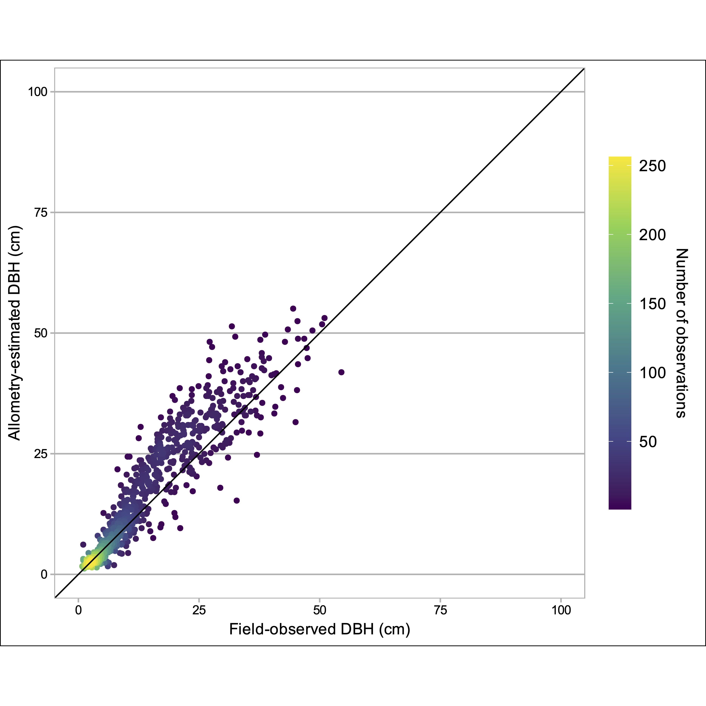

```{r setup, include=FALSE}
knitr::opts_chunk$set(echo = F, warning=F, message=F)
```

```{r config, include=FALSE}
config <- config::get(file=file.path('config', 'config.yml'))
devtools::load_all()
load.pkgs(config$pkgs)
```

```{r source}
source('./inst/ms/si_tables.R')
```

## Supplementary tables 

**Table S1.** Algorithms, parameters, and vectors of values applied on those parameters in ITD training and validation. 

```{r tbls1}
tbls1
```

\clearpage

\newpage

**Table S2.** Performance statistics for each parameter permutation used to force the LayerStacking individual tree detection (ITD) algorithm.

```{r tbls2}
tbls2
```

\clearpage

\newpage

**Table S3.** Basis functions (Call), initial k (k') and estimated degrees of freedom (edf) for each variable and 2-way interaction in GAMs. k' and edf values are reported separately for each response variable.

```{r tbls3}
tbls3
```

\clearpage

\newpage

<!-- **Table S4.** Full list of explanatory variables considered in model selection. -->

<!-- ```{r tbls4} -->
<!-- tbls4 -->
<!-- ``` -->

<!-- \clearpage -->

<!-- \newpage -->

**Table S4.** Optimal tuning parameters for GBMs under the full-factorial design.

```{r tbls5}
tbls5
```

\clearpage

\newpage

## Supplementary figures 

**Figure S1.** We selected inventory plot locations to capture six topographic gradients. We chose sites situated at the lowest and highest values of each gradient as they appear in the forested portions of the watershed and then optimized for an even distribution of sites between end-members. On this standard, a perfectly distributed set of sites would follow a straight line from the lowest to highest values with a slope equal to $\frac{max(value) - min(value)}{N sites}$. Here, each facet depicts the distribution of sites along one of the topographic gradients as points, ordered from the lowest to the highest value. Solid lines are linear fits to the range of each topographic metric, and equations and R^2^ correspond to the fitted lines.


\clearpage

\newpage

**Figure S2.** Raster images of abiotic explanatory variables. For Geology (P), the numeric scale [1-9] corresponds denotes the following lithologic groups: [1] Dakota Sandstone, [2] Mancos Shale, [3] Mesa Verde Formation (Sand/Silt/Coal), [4] Gothic Formation (Sand/Shale), [5] Maroon Formation (Red Sand/Mud/Conglomerate), [6] Glacial Drift, [7] Landslide Deposits, [8] Middle-Tertiary Granodioritic Laccoliths, [9] Wasatch Formation (Claystone-Shale).


\clearpage

\newpage

**Figure S3.** To estimate DBH for each LiDAR-detected tree object, we used a simple linear model fit to DBH and height measurements from field inventory. We first split the raw DBH values into 1 cm DBH bins and then fit the function to the mean height and DBH in  each bin. For error estimation we implemented a training and testing scheme with 80%-20% splits over 100 randomization folds. At each step, we fit model parameters to the training set and predicted $\hat{DBH}$ on the testing set using the fitted model scaled by its $\sigma^2/$. We computed the relative error (%) and RMSE between field-measured DBH and allometry-estimated DBH in the testing set at each step and averaged them. For an additional validation step, we predicted DBH on 800 out-of-sample inventory measurements on conifer trees in plots within the watershed that were not otherwise used in this analysis. Training-testing RMSE was 5.0 cm, and bias was 3.3%. On the out-of-sample validation set, RMSE was 5.4 cm, and mean validation bias was +17.8%. Fig. S3 shows the agreement between field-observed and allometry-estimated DBH values on out-of-sample validation data. Shading is by the number of observations (trees), and the diagonal line is 1:1.



\clearpage

\newpage

**Figure S4.** Partial-effects plots for all univariate explanatory variables in generalized additive models for each response (A-H).


